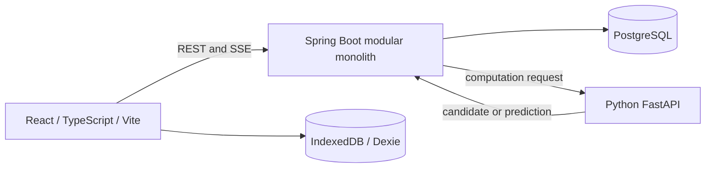
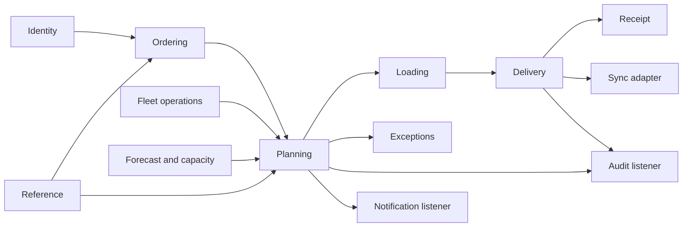
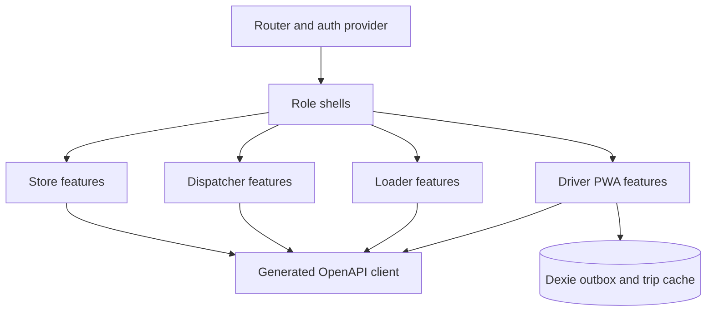
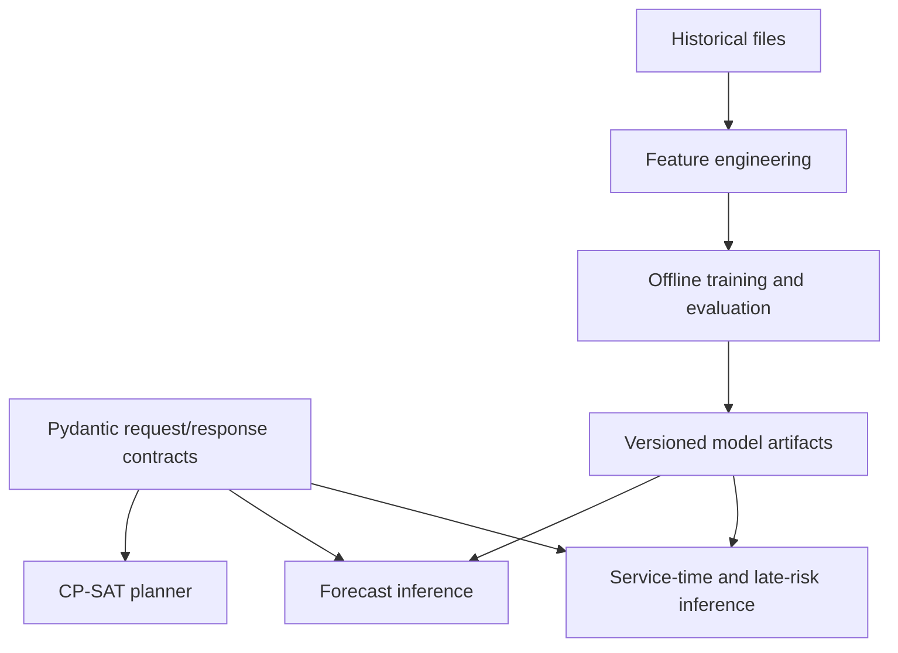
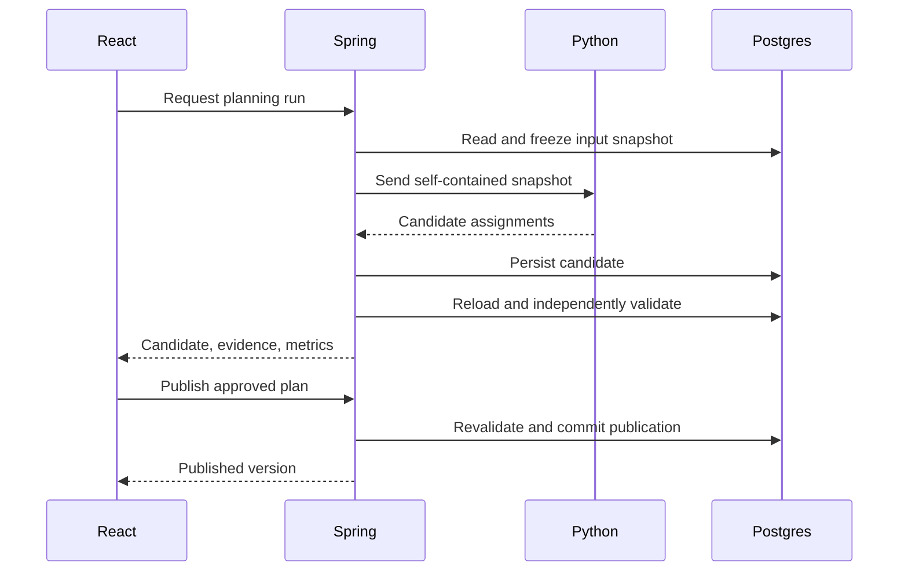
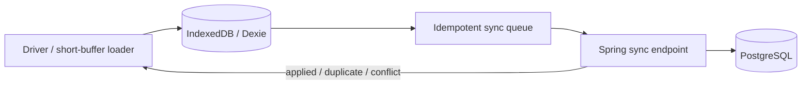
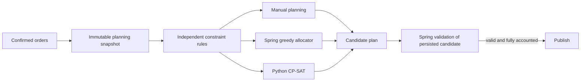
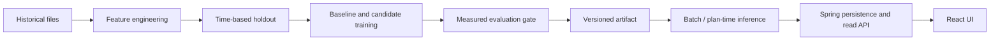
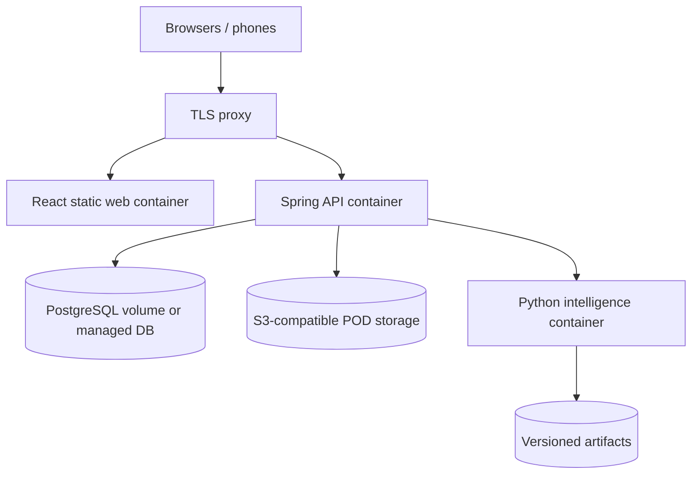
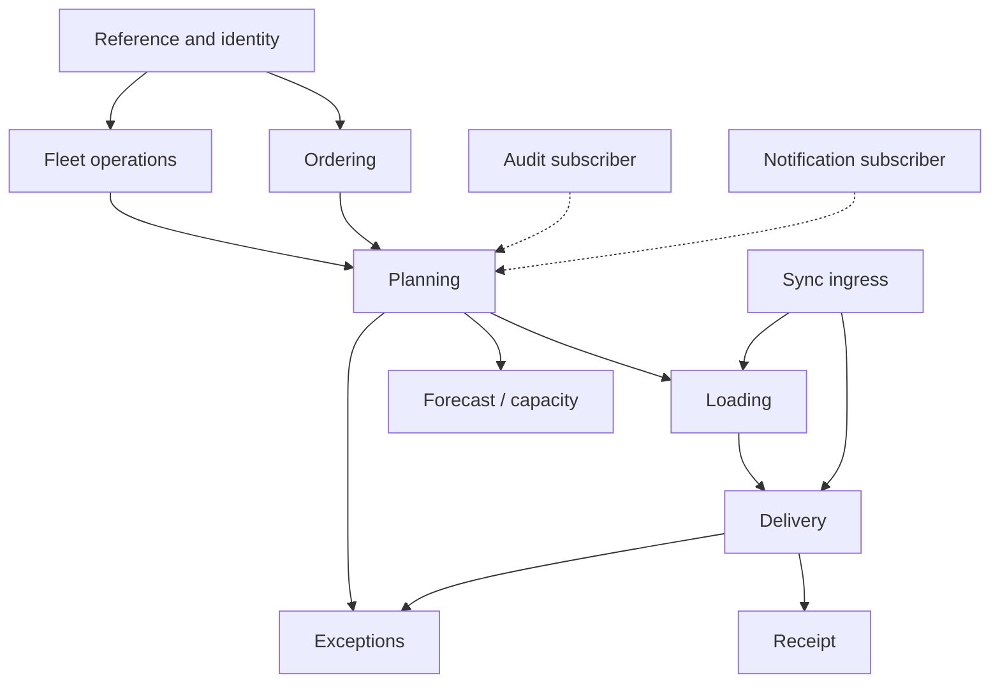

# TechTrithalon — Waypoint Operations Technical Reference

This document explains **how the system works and why it is designed this way**. For build order, ownership within the 9-member team, checklists, and exit gates, use the [Waypoint Implementation Plan](./IMPLEMENTATION_PLAN.md).

**Source labels:** **Verified** = measured in supplied data or observed in Figma metadata; **Decision** = chosen architecture or domain policy; **Proposed** = design pending implementation/evaluation. The reference dataset currently contains **17 CSV files**; this update directly rechecked the seven operational/peak-day file counts listed in §4. Other historical statistics are carried from the previous analysis and remain subject to the project’s seed/test assertions.

## 1. Product Overview

Waypoint Group runs 120 retail outlets across three brands (Fresh, Style, Tech) from two depots (Peliyagoda, Kandy) using 60 vehicles. The three brands compete for the same fleet. On a normal day the fleet cannot serve everything, so a dispatcher must decide what gets deferred and be able to explain why.

The platform connects four roles across a seven-stage workflow:

```
Store manager      Dispatcher        Loader      Driver      Store manager   Dispatcher
place order  →  close + plan  →     load    →  deliver  →  confirm receipt → plan capacity
```

---

## 2. Roles and End-to-End Workflow

| Role | Main actions | Primary device |
|---|---|---|
| Store manager | Place/confirm order; confirm receipt or report issue | Phone or desktop |
| Dispatcher | Close, allocate, defer, publish, monitor, plan capacity | Desktop |
| Loader | Load reverse stop order; report shortfalls and hand off | Tablet or phone |
| Driver | Follow stops, record outcomes and POD, sync offline work | Phone |

The seven stages and requirement links are in §3. The store flow below is one representative journey.

```
Dashboard: "Next cutoff 16:00 · 2h 14m left"
   │
   ├─ Place order ─► items/units ─► ambient and/or chilled ─► review volume & weight
   │                 ─► Confirm ─► CONFIRMATION SCREEN
   │
   ├─ My orders ─► timeline: confirmed → planned → loaded → in transit → delivered
   │               planned shows ETA · deferred shows reason + new expected date
   │
   └─ Confirm receipt ─► line by line: received / short / damaged ─► raise issue
```

**A Fresh outlet may place two orders for the same delivery day** — one ambient, one chilled. The booklet states this explicitly, the data confirms it, and the UI must not prevent it. This is a common modelling mistake: one order per outlet per day is *wrong*.

---

## 3. Requirements Traceability

Every requirement from the competition booklet, mapped to where it is satisfied.

### Workflow requirements

| Stage | Role | Requirement | Satisfied by |
|---|---|---|---|
| Place order | Store manager | Capture and confirm before the 16:00 cutoff | F3 in the [Implementation Plan](./IMPLEMENTATION_PLAN.md) · `ordering` module §10 |
| Close orders | Dispatcher | Bring confirmed orders into one queue | F4 · planning snapshot §15 |
| Plan and allocate | Dispatcher | Assign to vehicles and trips; identify deferred | F5/F6/F9–F12 first; F7/F8 automate later · §15–§24 |
| Load | Loader | Load to stop sequence; flag shortfalls | F13 · `loading` module §25 |
| Deliver | Driver | Record each stop, including offline | F14/F15 · §26, §27 |
| Confirm receipt | Store manager | Confirm what arrived, report issues | F16 · §28 |
| Plan future capacity | Dispatcher | Use forecasts for vehicles and reefer capacity | F19/F20 baseline before release · §30, §31 |

### Operating constraints

The ten booklet rules, plus separately named time-budget and workshop rules, are specified as first-class checks in the constraint engine (§16) and verified by the independent validator (§20).

| ID | Constraint | Engine rule | Test |
|---|---|---|---|
| R1 | One trip = one brand + one district | `SAME_BRAND_DISTRICT` | §34 |
| R2 | Chilled requires reefer; reefer may carry ambient | `TEMPERATURE_COMPATIBILITY` | §34 |
| R3 | `van_only` outlets require a van | `VEHICLE_ACCESS` | §34 |
| R4 | Vehicle serves only its home depot's outlets | `DEPOT_AFFINITY` | §34 |
| R5 | Whole orders — never split | `WHOLE_ORDER` validated within a candidate plan | §34 |
| R6 | Trip volume ≤ cap **and** weight ≤ cap | `TRIP_CAPACITY` | §34 |
| R7 | ≤ 2 trips per vehicle per day | `TRIP_COUNT` with per-plan trip-slot uniqueness | §34 |
| R8 | Delivery window; mall window intersection; early arrival waits | `DELIVERY_WINDOW` | §34 |
| R9 | Weekly fuel quota per vehicle | `FUEL_QUOTA` | §34 |
| R10 | Operates Mon–Sat; `calendar.is_operating` | `OPERATING_DAY` | §34 |
| R11 | Fresh 270 min / Style+Tech 480 min daily budgets | `TIME_BUDGET` | §34 |
| R12 | `in_workshop` vehicles cannot be allocated | `VEHICLE_AVAILABILITY` | §34 |

> R11 and R12 are split out as their own rules rather than folded into R7 and R4, because the UI surfaces them separately (the Review Allocation screen shows `213 / 270 min` and a `Fresh budget 03:30–08:00` label) and because they fail for different reasons and need different remediation text.

### System-quality requirements

| Requirement | Satisfied by |
|---|---|
| Responsive web app; driver and loader usable on phones | §11 responsive strategy; §26 |
| Offline field work with reconciliation | §27 |
| Explain deferral decisions | §21 explainability |
| Identify outlets already skipped | §22 deferral fairness; `deferral` history §12 |
| Flag loading shortfall before departure | §25 |
| Proof of delivery | §26 |
| Anticipate demand ahead of paydays and festivals | §30 forecasting |
| Predict service time and lateness | §32 |

---

## 4. Dataset Analysis

**Verified from supplied datasets in the prior analysis.** Values below are carried from that audit; this restructuring did not recompute every CSV statistic. Distinguish measured values from the S1 capacity bounds, which are lower bounds rather than a solved allocation.

Measured directly from `dataset/data/`. These are the numbers to seed and assert against — **do not** take them from prose.

### Outlets — `General Data/outlets.csv` (120 rows)

| Brand | Peliyagoda | Kandy | Total |
|---|---:|---:|---:|
| Fresh | 49 | 31 | 80 |
| Style | 16 | 9 | 25 |
| Tech | 10 | 5 | 15 |

**District → depot is a fixed 1:1 mapping.** No district is shared between depots. This is a load-bearing invariant: `R4` (depot affinity) reduces to a district comparison, and the optimizer decomposes cleanly into two independent per-depot problems (§19).

- **Peliyagoda** — Colombo 24, Gampaha 15, Kalutara 10, Galle 9, Kurunegala 8, Matara 6, Puttalam 3
- **Kandy** — Kandy 20, Matale 8, Badulla 6, Nuwara Eliya 6, Kegalle 5

Access attributes:
- `dock_type` — `rear_dock` 68, `street` 40, `mall_bay` 12
- `parking_constraint` — `normal` 95, `van_only` **13**, `mall_dock` 12
- 12 outlets carry a `mall_window`: `09:00-11:00`, `10:00-12:00`, or `10:30-12:30`

Delivery windows:
- Fresh: `03:00-08:00`, `04:00-07:45`, `05:00-07:30`, `05:30-08:00` — all close at or before **08:00**
- Style / Tech: `09:00-17:00` for non-mall outlets; mall outlets carry the narrow windows above

> **The mall window and the outlet window are two separate constraints.** For a mall outlet the effective window is their **intersection**. The validator must compute the intersection, not pick one. This is a documented source of subtle bugs — see `DELIVERY_WINDOW` in §16.

### Vehicles — `General Data/vehicles.csv` (60 rows)

| Type | Temp | Peliyagoda | Kandy | Total |
|---|---|---:|---:|---:|
| truck | ambient | 27 | 13 | 40 |
| truck | reefer | 7 | 5 | 12 |
| van | ambient | 2 | 2 | 4 |
| van | reefer | 2 | 2 | 4 |
| | | **38** | **22** | **60** |

- **16 reefer** (12 trucks + 4 vans) · **8 vans** (4 of them reefer)
- Trucks: 3,610–7,200 kg · 19.4–38.0 m³
- Vans: 1,040–1,200 kg · 7.0–9.0 m³
- `weekly_fuel_quota_l` 340–620 L · all diesel · `km_per_l` varies per vehicle

> **The van squeeze is structural.** 13 `van_only` outlets, 8 vans total, 4 of them reefer — 2 reefer vans per depot. A `van_only` outlet needing chilled goods has exactly **two** eligible vehicles in the entire network. This is the most common source of hard infeasibility and the optimizer must schedule these orders first (§19).

### Service allowances — `General Data/service_allowance.csv`

Planning allowance per stop, by brand × dock type. **Not** an observed duration.

| Brand | rear_dock | street | mall_bay |
|---|---:|---:|---:|
| Fresh | 15 | 16 | 18 |
| Style | 38 | 46 | **59** |
| Tech | 43 | 55 | 55 |

Style and Tech handling is 3–4× Fresh. A two-stop Style mall trip burns 118 handling minutes before any travel — which is why Style/Tech get 480 minutes and Fresh gets 270.

### District travel — `General Data/district_travel.csv`

| District | Depot | Road class | Depot→district (min) | Inter-stop (min) | Depot→district (km) |
|---|---|---|---:|---:|---:|
| Colombo | Peliyagoda | urban | 24 | 8 | 12 |
| Gampaha | Peliyagoda | suburban | 37 | 9 | 28 |
| Kalutara | Peliyagoda | suburban | 64 | 12 | — |
| Galle | Peliyagoda | highway | 103 | 9 | — |
| Kurunegala | Peliyagoda | suburban | 127 | 19 | — |
| Matara | Peliyagoda | highway | 137 | 10 | — |
| Puttalam | Peliyagoda | suburban | 173 | 24 | — |
| Kandy | Kandy | urban | 16 | 6 | — |
| Matale | Kandy | suburban | 35 | 11 | — |
| Kegalle | Kandy | suburban | 53 | 13 | — |
| Nuwara Eliya | Kandy | hill | 111 | 20 | — |
| Badulla | Kandy | hill | 186 | 23 | — |

> **Badulla is 186 minutes out and Fresh windows close by 08:00.** Leaving at the 03:30 window open, a vehicle arrives at 06:36 with 84 of its 270 minutes left. Puttalam (173) is nearly as bad. These districts are permanently single-trip for Fresh and are where the planner will strain first.

### Calendar — `General Data/calendar.csv` (910 rows)

- **2024-01-01 → 2026-06-28**; 770 operating days
- Non-operating: 130 Sundays + 10 festival/public holidays on weekdays
- Festivals: `thai_pongal`, `new_year`, `vesak`, `poson`, `esala`, `deepavali`, `christmas`
- `festival_ramp` rises 0→1 over the nine days before a festival — a ready-made forecasting feature
- `iso_year` + `iso_week` are the mandated grouping keys; persist them on the order row (§12)

### Operational history — `Training Data/`

- `deliveries_train.csv` — **92,307 orders**: `attempted` 90,351 · `deferred` 1,543 · `not_run` 413
- `route_legs_train.csv` — **91,894 legs**; actual times appear only here
- Temperature split: ambient 57,172 · chilled 35,135
- **Routes per vehicle-day: 1 → 12,560 · 2 → 6,319 · never 3** — `R7` confirmed empirically
- **≈ 120 orders per operating day** across both depots (92,307 / 770). This is the number that makes CP-SAT trivially fast (§19).

Derived baselines — these are the honest numbers to show in the UI and to sanity-check the ML work:

```
service_min = leave_outlet_time − max(arrival_time, window_open_time)
            → mean 19.0 · median 15 · p10 8 · p90 32

is_late     = arrival_time > window_close_time
            → 19.6% of all delivered stops
```

### The peak-day scenario (S1) — the system's acceptance test

`Test Data/task2b_peak_day_*.csv` is a real infeasible day. It is the single best end-to-end test fixture available and the §34 S1 acceptance fixture makes it a mandatory CI gate.

- **85 orders**, all Peliyagoda · Fresh 75 · Style 5 · Tech 5
- Fleet: **28 available, 10 `in_workshop`**
- Available: 22 ambient trucks · **3 reefer trucks** · 2 ambient vans · **1 reefer van**
- Total demand 409.9 m³ / 68,139 kg · chilled 26 orders, **181.6 m³ / 32,780 kg**
- 6 `van_only` orders (all Colombo, 3 chilled) · 10 `deferred_yesterday` · 5 outlets at `days_since_last_served = 5`

**Aggregate capacity is 759.2 m³ per trip against 409.9 m³ of demand — which looks comfortable and is a trap.** The constraint binds on refrigerated capacity, three independent ways:

| Available reefer | Type | Volume | Weight |
|---|---|---:|---:|
| VEH003 | truck | 26.4 m³ | 5,510 kg |
| VEH006 | truck | 33.4 m³ | 6,840 kg |
| VEH007 | truck | 19.4 m³ | 3,610 kg |
| VEH036 | **van** | 7.0 m³ | 1,040 kg |
| | | **86.2 m³** | **17,000 kg** |

1. **Reefer volume.** Two trips each = 172.4 m³ against 181.6 m³ chilled. **Short 9.2 m³.** Weight is fine (32,780 of 34,000 kg) — volume is the cut.
2. **The reefer van is captive.** The three chilled `van_only` orders total 6.01 m³ / **1,095.7 kg**, and VEH036 caps at 1,040 kg — they do not fit one trip, so serving all three requires VEH036 to use both trips. That leaves three reefer trucks (158.4 m³) for the remaining 175.6 m³. **Relaxed lower bound: 17.2 m³** — nearly double the naive volume-only figure; whole-order and time constraints can increase it.
3. **Trip count and time.** Chilled spans 7 districts and `R1` locks a trip to one district. Colombo chilled (51.59 m³) and Gampaha (48.06 m³) each exceed any single reefer, so each needs two trips. Minimum 9 trips against 8 available. Separately, one trip per district costs 1,253 minutes against a 4 × 270 = 1,080-minute reefer budget.

**Ambient meanwhile has enormous slack** — 22 ambient trucks give 5,940 Fresh minutes against ~1,871 needed.

> **Verified capacity finding:** refrigerated volume, trip count, and time are binding in S1, while ambient capacity has slack. The ~17.2 m³ figure is a capacity lower bound after reserving the reefer van, not a proven optimum for whole orders with district and window constraints. The allocator should prioritize chilled coverage and measure the feasible result; any claim that all deferred orders must be chilled needs a validated plan.

### What lives where

| Data | Home | Why |
|---|---|---|
| Outlets, vehicles, calendar, district travel, service allowance | **PostgreSQL** (seeded from CSV, versioned by Flyway) | Operational reads on every planning run; must be transactionally consistent with plans |
| Orders, plans, trips, stops, deferrals, deliveries, audit | **PostgreSQL** | Operational source of truth |
| `deliveries_train.csv`, `route_legs_train.csv` (184k rows) | **File storage** (`data/`, parquet after first load) | Training data. Never loaded into the transactional DB — it has no operational reader and would bloat backups |
| Forecast results, prediction outputs | **PostgreSQL** | Small, operationally read, must be auditable |
| Model artifacts | **File storage / artifact registry**, versioned | Binary, immutable, referenced by ID from Postgres |

---

## 5. Figma Audit

**Current access check:** Figma metadata for file `nfP1ZRvqcF2cJ4cWeZqyvT` was queried during this update. It returned one top-level page, `412:8554 Dispatcher`; page metadata was accessible. Detailed screen counts, tokens, and component inventory below come from the earlier full audit, not a fresh pixel-by-pixel verification. Other role screens may exist in another file that has not been supplied.

**Verified live at the time of writing.** Full node tree pulled via `get_metadata` and byte-compared against the previous audit — **identical, nothing has changed**. Four screens additionally verified visually via `get_screenshot`. The old file `3fk8mzlfxN7XIBHD85FTXp` remains inaccessible; `nfP1ZRvqcF2cJ4cWeZqyvT` is the live one.

### Document structure

The document has **one page**, canvas `412:8554`, named "Dispatcher". Every pixel-built screen belongs to the dispatcher role. The file's own reference section states the intended full scope:

| Role | Screens named with written rationale | Built as hi-fi frames |
|---|---:|---:|
| **Dispatcher** | 21 | **21** + ~150 interaction-state variants |
| Store manager | 10 | **0** |
| Loader | 6 | **0** |
| Driver | 16 | **0** |

All four personas exist (`Dilani Mendis` dispatcher, `Kamal Jayawardena`, `Kasun Perera`, `Shanika Munasinghe`), and all 53 planned screens have a title, a problem tag (P1–P7) and a one-paragraph rationale. **The thinking exists for four roles; the pixels exist for one.**

> **This is a scoping fact, not a criticism.** The file is named "Planning (Confirmed Orders)". If Store Manager / Loader / Driver live in another Figma file, share it and §5 extends in minutes. If they do not exist yet, the 32 written rationales are a genuinely strong brief — §5 specifies how to build those screens from the existing design system without inventing a new visual language.

### Dispatcher screens (all built)

| Group | Screens |
|---|---|
| **Step 1 · Confirmed Orders** | 1A Confirmed Orders · 1B Selection & bulk actions · 1C Map split view |
| **Step 2 · Generate Plan** | 2A Generating plan (5-stage progress) · 2B Plan ready |
| **Step 3 · Review Allocation** | 3A Review allocation · 3B Drag to rebalance · 3C Vehicle plan review (drawer) · 3D Change vehicle (modal) |
| **Step 4 · Resolve Exceptions** | 4A Exceptions triage · 4B All resolved · **4A+ Defer order (reason required)** |
| **Step 5 · Confirm & Send** | 5A Confirm & send · 5A+ Send confirmation (modal) · 5B Plan sent |
| **Deferred Orders** | 6 Deferred Orders |
| **Shell** | Dashboard · Orders + Order Detail · Live Operations · Fleet · Exceptions · Profile · Capacity Forecast · Capacity Decision (W47–W48) · Login |

Plus ~150 interaction-state frames: search and filter on every list, three sort orders on Confirmed Orders, six per-vehicle allocation drill-downs, six live-vehicle states, six fleet detail screens, five exception detail screens, CSV export preview, notification/profile/logout flows, and a 12-screen defer sequence with running "exceptions remaining" counters.

### What the screens tell us about the backend

This is the most valuable part of the audit — the design already specifies behaviour the API must support.

**Review Allocation (3A)** — per-vehicle card showing, for `VEH014`:
```
VEH014  [Reefer 5T]              2 trips · 98 km
Kasun Perera · Colombo
  Trip 1   Fresh · Colombo · 6 stops
  Trip 2   Style · Gampaha · 4 stops
  Volume  ████████░░   34.2 / 38 m³
  Weight  ███████░░░   2,840 / 5,000 kg
  Time    ████████░░   213 / 270 min
  Fuel    ██░░░░░░░░   238 / 380 L left
  Fresh budget 03:30–08:00
```
Every one of those four bars is a named constraint from §3 — `R6` volume, `R6` weight, `R11` time budget, `R9` weekly fuel. **The design and the booklet's constraint model agree exactly.** The API response for a candidate plan must carry per-trip and per-vehicle utilisation against each limit, not just the assignment. Also note `Trip 1 Fresh` + `Trip 2 Style` on one vehicle — the design correctly models the two separate time budgets sharing one two-trip ceiling.

Footer: *"180 orders allocated across 14 vehicles · 6 orders couldn't be placed automatically."* — the served/deferred split is a first-class result of the planning run, not a UI afterthought.

Controls: `Sort: utilisation`, filter chips `All / Lorry / Reefer / Van`, `Re-optimise`, `This route / All routes` map toggle.

**Exceptions triage (4A)** — four exception categories that map 1:1 onto the constraint engine:

| Figma chip | Constraint rule |
|---|---|
| `Van-only access` | `R3 VEHICLE_ACCESS` |
| `No refrigerated vehicle` | `R2 TEMPERATURE_COMPATIBILITY` |
| `Capacity overflow` | `R6 TRIP_CAPACITY` |
| `Window conflict` | `R8 DELIVERY_WINDOW` |

Each exception carries a ranked suggested fix (`SUGGESTED FIX · BEST OF 3`) with `Apply` / `Choose vehicle` / `Defer` actions, and there is a live **"Impact of applying all 4"** panel showing deltas (orders allocated 181→185, deferred 1→1, vehicles 14→15, avg utilisation 87%→88%). **This requires dry-run re-simulation of the plan** — §18.

**Defer order (4A+)** — the degradation screen, and it is strong:
- A **`2nd skip`** badge — repeat-deferral protection already designed in
- Five required reason codes, mapping to `R2` / `R6` / `R8` / `R3` / free text
- A "What this means" consequence panel: *"OUT031 will be skipped two runs in a row — it was also deferred on Sat 27 Sep · Days since last served becomes 4 on the delivery day · The order moves to the Wed 30 Sep run and is protected as first priority"*
- Toggles: **notify the store manager** and **protect on the next run**
- Audit line: *"Recorded as Dilani Mendis · Mon 28 Sep 16:42"*

This specifies the deferral domain model almost completely (§12, §22).

**Capacity Forecast** — KPI cards (fleet capacity/day, refrigerated capacity/day, weeks over capacity, peak chilled overshoot) plus two bar charts, total and chilled volume per day across W41–W50, with over-capacity weeks rendered red against a capacity line. §30, §31.

**Capacity Decision (W47–W48)** — forecast snapshot, a "what the dispatcher should review" checklist (weight and volume, temperature, fuel and route count, people and depot), and a proposed action. **The screen carries the label `FORECAST SNAPSHOT · illustrative; verify with supplied datasets`** — the designer has explicitly flagged these as placeholder numbers. Replacing them with computed values is part of capacity decision support (F20 in the old feature numbering).

**Live Operations** — active vehicle list with driver, current trip, current stop (`Dehiwala (2 of 6)`), progress (`4 / 18 orders`), **`Last update · 2 min ago`**, and status badges `In Transit` / `Delayed` / `Completed`, plus a route map. **That "2 min ago" label is the real-time requirement** — it rules out any need for WebSocket (§29).

### Design tokens — extracted from Figma variables, authoritative

These are the actual published variables, not estimates from screenshots.

```
COLOR
  brand/primary          #ffc20e      text/on-brand        #111111
  bg/sidebar             #151515      text/brand           #8a5a00
  bg/sidebar-raised      #202020      text/on-dark         #e8e8e8
  border/sidebar         #2b2b2b      text/on-dark-muted   #a3a3a3
  bg/surface             #ffffff      text/primary         #111827
  bg/subtle              #f6f6f8      text/secondary       #6b7280
  bg/muted               #e6e7eb      text/tertiary        #9aa1ac
  border/default         #e4e6eb
  status/success         #22c55e
  status/warning         #b45309      status/warning-soft  #fef0dc
  status/danger          #ef4444      status/danger-soft   #fde6e6

TYPOGRAPHY   families: Geist · Geist Mono · Plus Jakarta Sans
  Display/L       Plus Jakarta Sans ExtraBold 32/40  ls −2
  KPI/M           Plus Jakarta Sans Bold      20/26  ls −1
  Heading/S       Geist SemiBold              15/22
  Body/M          Geist Regular               14/20
  Body/M Medium   Geist Medium                14/20
  Body/S Medium   Geist Medium                13/18
  Body/S Strong   Geist SemiBold              13/18
  Caption         Geist Regular               12/16
  Caption Medium  Geist Medium                12/16
  Overline        Geist SemiBold              11/16  ls 6
  Mono/S          Geist Mono Medium           12/18
  Button/L        Geist SemiBold              16/24

SPACE    2 · 4 · 6 · 8 · 10 · 12 · 16 · 20 · 24 · 28 · 32
RADIUS   xs 6 · md 12 · lg 16 · full 999
ELEVATION/1   0 1 2 #0B12200D , 0 1 3 #0B12200A
```

> **Note the semantic status colours are a deliberate three-state system** — success/warning/danger each with a soft background variant for chips. Build these as CSS custom properties generated from one token file (§5), never hand-typed into components.

### Published component library

The file has a real component library (`Reference components` section), not just flattened screens:

**Atoms** — Type Badge · Checkbox · Toggle · Button · Filter Chip · Nav Item · Avatar · Kbd · Icon Button · Input · Select
**Patterns** — App Sidebar & Top Bar · Planning Stepper · Order Table / Order Row / Order Table Header · Order Search · Generate Plan Button
**Icons** — a published grid; the heavily-used set is `arrow-right`, `chevron-down/right/left`, `alert`, `sparkles`, `calendar`, `clock`, `check-circle`, `box`, `more`, `info`, `check`, `depot`, `deferred`, `pin`, `fleet`, `snowflake`, `van`, `trend`, `command`, `x`, `table`, `map`

Instance counts confirm consistent reuse — the sidebar nav items appear 147× each across the file, `Planning Stepper` 76×, `Type Badge` 108×. This is a design system being used as a system, which means the React component inventory can map onto it almost one-for-one (§5).

Classification per the brief: **A** = designed, implement faithfully · **B** = designed but missing states · **C** = not designed, required · **D** = optional enhancement.

### Dispatcher

| Capability | Figma | Class | Action |
|---|---|---|---|
| Login | `DISPATCHER / Login` | **A** | Implement as designed; extend to four roles (§14) |
| Dashboard | `Dashboard` | **A** | KPI cards, attention lists, planning status |
| Confirmed Orders queue | 1A/1B/1C + search/filter/3 sorts | **A** | Needs server-side pagination + filter contract (§13) |
| Map split view | 1C | **B** | Designed, but the dataset has **no outlet coordinates** — see §5 |
| Generate Plan progress | 2A (5 stages) | **A** | Stages must map to real pipeline stages (§15), not a fake timer |
| Plan ready summary | 2B | **A** | — |
| Review allocation | 3A + 6 vehicle drill-downs | **A** | Utilisation bars need the per-trip metrics contract (§13) |
| Drag to rebalance | 3B | **B** | Needs an impact-preview + revalidation round trip (§18) before the drop commits |
| Vehicle plan review drawer | 3C | **A** | — |
| Change vehicle modal | 3D + 4 selected/confirmed states | **A** | Needs candidate-vehicle ranking from explainability (§21) |
| Exceptions triage | 4A + 4 category screens + 5 detail screens | **A** | Categories map to rules — §5 |
| "Impact of applying all N" | 4A panel | **A** | Requires dry-run simulation API (§23) |
| Defer with reason | 4A+ + 12-screen defer sequence | **A** | Fully specifies the deferral model |
| Confirm & send | 5A/5A+/5B | **A** | Publication + versioning (§24) |
| Deferred Orders | 6 + filters + assign flows | **A** | — |
| Live Operations | Live Ops + 6 live-vehicle states | **A** | SSE feed (§29) |
| Fleet | Fleet + 6 detail + 3 status filters | **A** | Workshop status is an input to planning (`R12`) |
| Capacity Forecast | Capacity Forecast | **A** | Replace illustrative numbers with computed (§31) |
| Capacity Decision | Capacity Decision | **B** | Marked "illustrative" in the file itself; needs real gap computation |
| Profile / notifications / logout | Profile + 4 states | **A** | — |
| Global search (⌘K) | 7 per-page search states | **A** | Client-side filter is sufficient at this data scale |
| **Plan version / stale-plan banner** | — | **C** | Required by §24; no screen exists |
| **Validation failure on manual edit** | — | **C** | Required by §18; the "what rule blocked this" surface |
| **Empty / loading / error states** | partial | **B** | Systematic pass needed (§5) |
| **Unauthorized (403) state** | — | **C** | Required by §14 |

### Store manager · Loader · Driver

All screens are **class C** — rationale exists, pixels do not. The rationale titles are the build specification:

**Store manager (10)** — Home · Place Order · Order Review · Order Confirmation · My Orders · Order Detail (status + ETA) · Deferral Notice · Confirm Receipt · Report Issue · Profile
**Loader (6)** — Home (today's trips by vehicle) · Trip (load in stop sequence with zone/weight/volume) · Order Loading (scan or tap, report problem) · Trip Completion (hand over with departure time) · Issues · Profile
**Driver (16)** — Home · Home collapsed/expanded · Trip Overview · Route · Stop Details · Order Delivery · Delivery Confirmation · Report Issue · Issue Recorded · Stop Completed · Trip Completed · Deliveries/Detail · Notifications · Login/Profile · **Offline Sync** · **Back online (reconcile)**

> The two driver offline screens are already *named and rationalised* in the file. They need designing, but the intent is recorded — build them against §27's state list.

### Additional UI required by the architecture (class C), with justification

| Screen / state | Why it is required | Where it fits |
|---|---|---|
| **Stale plan banner** (loader + driver) | A plan can be republished while a loader is mid-load. Without this they work from a dead plan — the booklet names this failure explicitly | Top of Loader Trip and Driver Trip Overview |
| **Plan version diff** (loader) | After a republish, show what changed rather than forcing a restart | Modal from the stale banner |
| **Manual-edit rejection** (dispatcher) | §18 forbids invalid published plans; the dispatcher must see *which named rule* blocked a drag | Inline on 3B, using the existing exception-card pattern |
| **Offline banner + queue depth** (driver) | §27; "Offline · 4 actions queued" | Persistent header strip |
| **Sync conflict resolution** (driver) | §27; when a server state contradicts a queued action | Full screen, reached from the sync banner |
| **403 / wrong-role** | §14 RBAC | Shared across roles |
| **Empty / loading / error** for every list | A judge or user on a fresh system hits these first | §5 — systematic, one component set |
| **Forecast uncertainty band** | §30 — forecasts must not render as exact truth | Extends the existing Capacity Forecast charts |

All of these reuse the existing design system (§5, §5). **No new visual language is needed and none should be invented.**

### The map problem — an honest finding

Three screens render maps with route polylines (1C Map split view, 3A Review Allocation, Live Operations). **The dataset contains no outlet latitude/longitude.** `district_travel.csv` provides district-level distances and free-flow times only; `outlets.csv` has no coordinates.

Options, in order of preference:

1. **District-cluster visualisation** (recommended) — render a schematic district map with outlets grouped by district and trips drawn as depot→district spokes. Honest, uses only data we have, visually close to the design, zero external dependency.
2. **Geocode the 120 outlets once** into a committed static file, then use a real map (MapLibre + free tiles). Defensible — 120 rows, one-time, versioned — but it introduces invented data that the rest of the system does not use, and travel time would still come from `district_travel.csv`, not the map. **The map would be decorative.**
3. Drop the map entirely. Loses fidelity for no gain.

**Recommendation: option 1 for v1, documented as a deliberate departure.** Revisit only if real outlet coordinates become available. Do not let a decorative map pull a mapping stack into the architecture.

### Principle

**The Figma is the source of truth for UI.** Components are derived from the published library (§5), not invented. Where a screen does not exist (class C, §5), it is composed from existing components so the visual language stays consistent.

### Token pipeline

```
Figma variables (§5)
        │  extracted once, committed as JSON
        ▼
packages/design-tokens/tokens.json
        │  build step
        ├──→ tokens.css        CSS custom properties on :root
        ├──→ tokens.ts         typed constants for TS consumers
        └──→ tailwind.preset.js
```

Rules:
- **No hex literal, spacing number or font stack appears in a component file.** Ever.
- Status colours are semantic (`--status-danger`), never positional (`--red-500`).
- The token file is regenerated, not hand-edited; a drift check runs in CI (§35).

### Component inventory, derived from Figma

**Primitives** (direct Figma equivalents)

| Component | Figma source | Notes |
|---|---|---|
| `Button` | `Button` | variants: primary (brand), secondary, ghost, danger; sizes sm/md/lg |
| `IconButton` | Atoms | — |
| `Input`, `Select`, `Checkbox`, `Toggle` | Atoms | wired to React Hook Form |
| `Avatar`, `Kbd` | Atoms | `Kbd` used by the ⌘K search |
| `Icon` | Icons grid | single sprite/registry; names match Figma exactly |
| `TypeBadge` | `Type Badge` | brand/temperature/vehicle-type badge |
| `StatusBadge` | derived | `In Transit` / `Delayed` / `Completed` / `Over` / `Critical` — semantic status tokens |
| `FilterChip` | `Filter Chip` | the four exception categories, the vehicle-type filters |

**Layout and shell**

| Component | Figma source |
|---|---|
| `AppShell` | `App / Sidebar & Top Bar` |
| `RoleSidebar` + `NavItem` | `Nav Item` (147 instances) |
| `TopBar` | depot switcher · ⌘K search · help · notifications · profile |
| `PageHeader` | title + subtitle + right-aligned actions |
| `SystemStatusPill` | sidebar footer "All systems operational" |

**Domain patterns**

| Component | Figma source | Backed by |
|---|---|---|
| `PlanningStepper` | `Planning Stepper` (76 instances) | plan run status §24 |
| `OrderTable` / `OrderRow` / `OrderTableHeader` | `Order Table` pattern | §13 paged list |
| `OrderSearch` | `Order Search` | — |
| `VehicleAllocationCard` | 3A vehicle card | per-trip metrics §13 |
| `UtilisationBar` | 3A volume/weight/time/fuel bars | one component, four bindings |
| `ConstraintChip` | order-row constraint markers | `van_only`, `chilled`, `mall window`, `2nd skip` |
| `ExceptionCard` | 4A | rule code + suggested fixes §21 |
| `ImpactPanel` | "Impact of applying all 4" | dry-run API §23 |
| `DeferDialog` | 4A+ | reason codes, toggles, consequence text |
| `MetricCard` | Dashboard + Forecast KPIs | — |
| `CapacityChart` | Forecast bar charts | threshold line + uncertainty band §30 |
| `TripCard`, `StopTimeline` | Live Ops, driver screens | — |
| `Drawer`, `Modal`, `ConfirmDialog` | 3C, 3D, 5A+ | one overlay primitive |

**States** — these do not exist in Figma and must be built as a set (§5)

`EmptyState` · `LoadingSkeleton` (table, card, chart variants) · `ErrorState` (with retry) · `ForbiddenState` · `OfflineBanner` · `SyncStatusIndicator` · `StalePlanBanner` · `Toast`

### Composition rule

A page file should read as composition, not markup:

```tsx
export function ConfirmedOrdersPage() {
  const { data, isLoading, error } = useConfirmedOrders(filters)
  if (isLoading) return <LoadingSkeleton variant="table" />
  if (error)     return <ErrorState error={error} onRetry={refetch} />
  if (!data.items.length) return <EmptyState {...emptyConfirmedOrders} />
  return (
    <>
      <PageHeader title="Confirmed orders" subtitle={…} actions={<GeneratePlanButton />} />
      <FilterBar chips={orderFilterChips} />
      <OrderTable rows={data.items} onSelectionChange={…} />
    </>
  )
}
```

If a page contains raw `div` soup with Tailwind utility strings repeated across files, the component layer is incomplete. **Phase 1 of the [Implementation Plan](./IMPLEMENTATION_PLAN.md) builds the components needed by the first feature.**

### The states pass

Every list and detail surface must implement all five of: loading · empty · error · forbidden · offline (where applicable). This is tracked as an explicit checklist item in each feature's definition of done ([Implementation Plan](./IMPLEMENTATION_PLAN.md)), not left to discretion.

---

## 6. Important Features

**Status legend:** verified facts are in §5–§5; rows here describe proposed or required product behavior. This is a reference, not a build checklist. See the [Implementation Plan](./IMPLEMENTATION_PLAN.md) for order and gates.

### Feature ID crosswalk from the previous plan

Older examples use F1–F20. Their current build phases are: F1→2; F2→3; F3→4; F4→5; F5→6; F6→7; F7→5/9; F8→9; F9→7/10; F10→10; F11→8/10; F12→11; F13→12; F14→13; F15→14; F16→15; F17→16; F18→18; F19→17; F20→19. The [Implementation Plan](./IMPLEMENTATION_PLAN.md) uses phase numbers as its primary tracker.

### Core Features

| Feature | What it does | Why / role | Owner | Dependencies | Test |
|---|---|---|---|---|---|
| **Authentication and RBAC** | Signs in four roles and scopes reads/writes | Prevents one role accessing another role’s work; **All roles** | Spring identity + React shell | Users/roles; sessions | Role and outlet/depot/driver access tests |
| **Store order creation** | Creates, reviews, and confirms an order | Makes demand explicit before cutoff; **Store manager** | Spring ordering + React store | Reference data; auth | Cutoff and two-temperature order E2E |
| **Confirmed orders** | Shows the closed planning queue | Replaces the spreadsheet and defines the day’s demand; **Dispatcher** | Spring ordering read model + React | Orders; auth | Date/depot/filter and access integration |
| **Planning snapshot** | Freezes orders, fleet, quota, and rule inputs | Makes planning reproducible; **Dispatcher** | Spring planning + PostgreSQL | Confirmed orders; reference | Immutability and hash change tests |
| **Constraint validation** | Evaluates R1–R12 with named evidence | Blocks infeasible assignments; **Dispatcher** | Spring planning rules | Reference; trip-time model | Every rule and boundary fixture |
| **Manual allocation** | Assigns orders to vehicle trip slots | Keeps planning usable without Python; **Dispatcher** | Spring planning + React board | Validator; snapshot | Invalid edit rollback and manual-plan E2E |
| **Automatic allocation** | Builds a candidate by greedy or CP-SAT | Improves coverage and deferral choices; **Dispatcher** | Spring greedy + Python CP-SAT | Manual plan model; validator | S1 and fallback/contract tests |
| **Plan review** | Shows trips, limits, and editable assignments | Lets dispatcher judge a candidate; **Dispatcher** | React planning + Spring metrics | Candidate plan; validator | Utilisation and edit integration |
| **Exceptions** | Groups rule failures and operational issues | Directs remediation to a responsible person; **Dispatcher** | Spring exceptions + React | Validator; loading/delivery events | Category, resolution, and role tests |
| **Deferrals** | Records skipped orders with reasons and next run | Prevents silent loss of demand; **Dispatcher; store manager** | Spring planning + notifications | Snapshot; validator; history | Reason-required and notice E2E |
| **Plan publication** | Validates and activates a plan version | Creates a trusted execution handoff; **Dispatcher; loader; driver** | Spring planning + PostgreSQL | Assignments or deferrals for all orders | Publish race, rollback, and version tests |
| **Loader workflow** | Loads reverse stop order and flags shortfalls | Supports correct unloading and predeparture correction; **Loader** | Spring loading + React | Published plan | LIFO, shortfall, stale-version E2E |
| **Driver workflow** | Records arrivals, outcomes, and trip completion | Captures actual execution on a phone; **Driver** | Spring delivery + React PWA + React Native app (§8.1) | Published loaded trip | Phone journey and ownership tests |
| **Proof of delivery** | Attaches compressed photo/signature evidence | Resolves delivery disputes; **Driver; store manager** | React capture + object storage + Spring | Driver outcome; upload policy | Offline upload, size/type, ownership |
| **Receipt confirmation** | Confirms actual quantities and discrepancies | Closes the order lifecycle; **Store manager** | Spring receipt + React | Delivery record | Discrepancy and status E2E |
| **Live operations** | Shows stop progress, issues, and last update | Closes dispatcher visibility gap; **Dispatcher** | Spring live read model + React/SSE | Delivery/loading events | SSE scope and polling fallback |
| **Offline synchronization** | Persists driver commands and retries safely | Keeps delivery usable without coverage; **Driver** | `packages/field-core` (Dexie on web, SQLite on mobile) + Spring sync | Driver commands; idempotency table | Offline reload, duplicate replay, conflict E2E |
| **Capacity forecast** | Shows future demand beside capacity | Supports fleet planning before orders arrive; **Dispatcher** | Python forecast + Spring forecast + React | History; fleet; calendar | Time split and capacity reconciliation |

### Planning Intelligence

| Feature | What it does | Why / role | Owner | Dependencies | Test |
|---|---|---|---|---|---|
| **Independent constraint validator** | Reloads persisted plans and checks every hard rule | Makes publish independent of optimizer output; **Dispatcher** | Spring planning | R1–R12; persistence | Corrupt candidate rejected at publish |
| **Greedy fallback allocator** | Builds deterministic feasible candidate | Preserves automatic planning when Python is down; **Dispatcher** | Spring planning | Validator; priority policy | Golden fixture and Python outage |
| **CP-SAT optimizer** | Searches vehicle/trip assignments | Improves served orders and fairness; **Dispatcher** | Python planning | Contract; greedy baseline | Feasibility, S1, deterministic seed |
| **Explainable allocation** | Stores structured rejection evidence | Makes assignment decisions reviewable; **Dispatcher** | Spring planning + React | Rules; candidate search | Rule evidence matches rejected vehicles |
| **Binding-resource detection** | Computes capacity lower bounds | Exposes reefer/van/time bottlenecks; **Dispatcher** | Spring pre-planning analysis | Snapshot; fleet | S1 numerical bounds |
| **Candidate vehicle ranking** | Orders feasible alternatives with impacts | Speeds manual correction; **Dispatcher** | Spring planning | Rules; metrics | Ranking and exact feasibility |
| **Dry-run simulation** | Evaluates changes on detached candidate | Shows consequences before commit; **Dispatcher** | Spring planning | Validator; plan copy | No DB mutation; preview/apply agreement |
| **Impact preview** | Shows before/after metrics and violations | Makes edits understandable; **Dispatcher** | React planning + Spring simulation | Dry-run simulation | Delta reconciliation |
| **Re-optimization** | Re-solves a trip or subset with pins | Repairs affected work without reshuffling all; **Dispatcher** | Python solver + Spring validation | CP-SAT; snapshot | Pinned assignments unchanged |
| **Plan versioning** | Keeps each published revision | Provides an operational history; **Dispatcher; loader; driver** | Spring planning + PostgreSQL | Publication | Concurrent republish and version tests |
| **Stale-plan detection** | Compares held version to current plan | Stops loading/delivery from stale lists; **Loader; driver** | Spring + React | Versions; client cache | Mid-load republish E2E |
| **Fairness protection** | Flags repeated skips and protected orders | Avoids starving one outlet; **Dispatcher; store manager** | Spring deferrals | Deferral and delivery history | Two-run fairness fixture |

### ML / Data Features

| Feature | What it does | Why / role | Owner | Dependencies | Test |
|---|---|---|---|---|---|
| **Demand forecasting** | Predicts weekly depot/brand volume | Improves future fleet decisions; **Dispatcher** | Python forecasting + Spring persistence | Training orders; calendar | Time holdout vs seasonal naive |
| **Service-time prediction** | Estimates stop handling time for ETA | Improves arrival information; **Dispatcher; store manager** | Python ML + Spring prediction | Route-leg labels | MAE vs brand/dock baseline; no leakage |
| **Late-delivery risk** | Estimates probability of missing window | Prioritizes attention; **Dispatcher** | Python ML + Spring prediction | Arrival labels; planned features | Calibration and time holdout |
| **Forecast uncertainty** | Stores lower/median/upper demand | Distinguishes watch from certain gap; **Dispatcher** | Python forecast + Spring | Forecast model | Interval coverage test |
| **Model versioning** | Tracks artifacts, metrics, active version | Makes predictions auditable; **Dispatcher; maintainers** | Python artifacts + Spring metadata | Training/inference pipeline | Version and rollback tests |
| **Model evaluation** | Gates promotion against baseline | Avoids deploying weak models; **Maintainers** | Python evaluation | Time split; baseline | Holdout metric threshold |
| **Feature engineering** | Builds prediction-time-safe inputs | Keeps training and serving aligned; **Maintainers** | Python features | Dataset schemas | Train/inference parity; leakage check |
| **Historical baseline comparison** | Reports simple reference performance | Gives advanced models a real hurdle; **Dispatcher; maintainers** | Python evaluation | History labels | Reproducible baseline metrics |

### Advanced Features

| Feature | What it does | Why / role | Owner | Dependencies | Test |
|---|---|---|---|---|---|
| **What-if simulator** | Replans from an overridden snapshot | Quantifies fleet changes; **Dispatcher** | Spring scenario + Python solver | Automatic planning | No active-plan mutation; delta test |
| **Capacity gap analysis** | Compares forecast and feasible fleet bounds | Finds future shortfalls; **Dispatcher** | Spring forecast/fleet | Forecast; reference | Reconcile to fleet/time limits |
| **Fleet recommendations** | Shows options with calculated effects | Helps human capacity decisions; **Dispatcher** | Spring capacity | Gap analysis | Effect and closes-gap assertions |
| **Reefer bottleneck analysis** | Separates refrigerated and van-only demand | Exposes scarce-resource pressure; **Dispatcher** | Spring pre-planning | Fleet; orders | S1 lower-bound checks |
| **Forecast-vs-capacity visualization** | Plots demand bands against capacity | Makes risky weeks visible; **Dispatcher** | React forecast | Forecast; capacity | Data-to-chart component test |
| **Risk indicators** | Combines ETA, window, and issue signals | Focuses attention after departure; **Dispatcher** | Spring live/ML + React | Live events; predictions | Reason text and alert ordering |
| **Plan comparison** | Compares coverage, fuel, and balance strategies | Supports explicit trade-offs; **Dispatcher** | Python/Spring + React | Automatic planning | Same snapshot; metrics reconcile |
| **Optimization explanation** | Shows constraints, alternatives, and objective | Keeps solver decisions inspectable; **Dispatcher** | Spring explainability + React | Evidence; optimizer | Golden rationale cases |
| **Operational alerts** | Raises shortfall, delay, or failed-stop notice | Speeds intervention; **Dispatcher; store manager** | Spring events + notification | Execution events | After-commit delivery and scope |
| **Recovery/conflict handling** | Reconciles stale and duplicate field actions | Preserves real-world record; **Driver; loader; dispatcher** | Spring sync + Dexie | Offline outbox; versions | Conflict policy E2E |

### Detailed enhancement candidates from the existing architecture

**Gated behind the Phase 5 entry criteria in the [Implementation Plan](./IMPLEMENTATION_PLAN.md).** Each builds on a finished core rather than destabilising it. Nothing here is required for the system to be a working product.

### A · What-if scenario simulation — HIGH VALUE

*"What if VEH017 goes into the workshop?"* Re-run planning against a modified snapshot and show the delta.

```
Current   181 served ·  5 deferred · 814 km · 118 L
Scenario  176 served · 10 deferred · 846 km · 126 L
Δ          −5 served · +5 deferred · +32 km ·  +8 L
```

**Architecture impact:** minimal — a snapshot is already immutable and the solver already stateless. A scenario is a snapshot clone with overrides. **Scenarios never mutate the active plan** unless explicitly applied; they are stored with `is_scenario = true`. **Effort:** small. **Dependencies:** F8.

### B · Plan comparison across strategies — HIGH VALUE

Generate `balanced`, `coverage` and `fuel` plans (§19) and compare factually — orders served, deferred, distance, fuel, late-risk count, vehicles used, utilisation. **No "best" label**; the dispatcher decides. **Effort:** small (three runs, one comparison view). **Dependencies:** F8.

### C · Explainable planning — REQUIRED, already F10

Promoted into the core because the booklet requires explaining deferrals and the Figma already shows the surfaces.

### D · Operational risk indicators — HIGH VALUE

Combine ETA, window, predicted late probability, remaining stops, loading issues and route progress into a ranked "needs attention" list on Live Operations. **Every indicator states its reason** — *"predicted 23 min late at OUT044; window closes 08:00"*. **No unexplained red/green score.** **Effort:** medium. **Dependencies:** F17, F18.

### E · Forecast uncertainty — REQUIRED, already F19

### F · Pre-cutoff capacity early warning — HIGH VALUE

Before 16:00, project confirmed demand plus expected remaining demand against available fleet, **split by ambient / chilled / van-only** so the binding resource shows up early. Reuses the validator and the capacity calculator. **Effort:** small. **Dependencies:** F19, F20.

### G · Deferral fairness — REQUIRED, already F11

### H · Plan change impact preview — REQUIRED, already F9 (§23)

### I · Plan quality summary — HIGH VALUE

The eleven named metrics from §20 on the Confirm & Send screen. Explicitly **not** a single score. **Effort:** tiny — the metrics already exist. **Dependencies:** F12.

### J · Audit and decision history — REQUIRED, already §36

A timeline view per order and per plan is a small addition on top. **Effort:** small.

Discovered from the booklet, the dataset and the design — classified and justified.

| # | Feature | Class | Problem solved | Effort | Depends on |
|---|---|---|---|---|---|
| 1 | **Fuel-week dashboard** | HIGH | `R9` is weekly but no screen shows the week. A vehicle can quietly exhaust its quota by Thursday. Show per-vehicle committed vs quota across the ISO week | Small | F12 |
| 2 | **Outlet service history** | HIGH | The booklet's "identify outlets already skipped" need, as a first-class view: last served, deferral count, consecutive skips, trend | Small | F11 |
| 3 | **Seeded demo reset** | REQUIRED | A one-click "reset to day zero" so the walkthrough can be re-run cleanly. Needed for demos, E2E determinism and judge retries | Small | Phase 0 |
| 4 | **Plan diff between versions** | HIGH | When a plan is republished, show exactly what changed. Extends the loader diff (§24) to the dispatcher | Small | F12 |
| 5 | **Driver day summary** | OPTIONAL | End-of-shift recap: stops completed, issues raised, distance. Small, and it closes the driver's loop | Small | F14 |
| 6 | **Bulk defer with shared reason** | HIGH | When reefer capacity binds, the dispatcher defers 6 orders for one reason. Doing it six times is friction the Figma's 12-screen sequence actually reveals | Small | F11 |
| 7 | **Exception SLA ageing** | OPTIONAL | Flag exceptions open longer than N minutes before the loading window | Small | F11 |
| 8 | **Weather / road-condition surfacing** | OPTIONAL | `road_conditions.csv` has a `disruption_index` per district per date. Showing it on the planning screen explains why today is slower | Small | F7 |
| 9 | **Forecast accuracy tracking** | HIGH | Record forecast vs actual each week and show historical error. Makes the uncertainty band credible instead of decorative | Medium | F19 |
| 10 | **Multi-depot dispatcher view** | OPTIONAL | Both depots side by side. The depot switcher exists in the Figma top bar; a combined view is a natural extension | Medium | F12 |
| 11 | **Printable run sheet** | OPTIONAL | A paper fallback for a dead phone. Honest about the operating reality the booklet describes | Small | F12 |
| 12 | **Keyboard-first planning** | FUTURE | The Figma already shows ⌘K. Full keyboard navigation of the plan board would genuinely speed up a daily power user | Medium | F9 |

**Deliberately rejected:**

| Feature | Why not |
|---|---|
| Real GPS tracking and turn-by-turn navigation | No coordinate data (§5); the dataset's travel model is district-level. Would be invented data dressed as precision |
| Route optimisation beyond assignment | §19 — there is no routing problem to optimise |
| Push notifications | Requires app-store presence or web-push infrastructure; in-app plus SSE covers the need |
| Chat between dispatcher and driver | The booklet explicitly wants structured records, not more unstructured messages — this would recreate the problem being solved |
| An AI "plan score" | §20 — eleven explainable metrics beat one unarguable number |

---

## 7. System Architecture

**Decision:** Spring Boot is the only operational writer; Python receives snapshots and returns calculations. PostgreSQL holds operational truth. The diagrams below show boundaries and flow, while the later sections specify the details.

### Overall system architecture



### Spring modular monolith



### React frontend



### Python intelligence



### Request and data flow



### Offline field flow



### Planning and optimization flow



### ML and forecasting flow



### Deployment architecture



### Module dependency architecture



---

## 8. Architecture Decisions

Each row is a decision record. "Reconsider when" is the trigger that should make you revisit it.

| # | Decision | Alternatives rejected | Reconsider when |
|---|---|---|---|
| AD-1 | Modular monolith (Spring Boot), one deployable | Microservices; serverless functions | A module needs independent scaling or an independent release cadence — none does today |
| AD-2 | Monorepo, three stacks, native per-stack tooling | Polyrepo; Nx/Turborepo over all three | The web app is consumed by a second product, or Java/Python build times make CI unbearable |
| AD-3 | Spring Boot for the operational core | NestJS, FastAPI-as-backend, Django, .NET | The ML layer disappears and TypeScript is the stronger language — then NestJS becomes defensible (§8) |
| AD-4 | PostgreSQL, single operational source of truth | Mongo; a second analytics DB; event sourcing | Analytical query load starts hurting operational latency — then add a read replica, not a second store |
| AD-5 | Python intelligence service, stateless, HTTP | In-JVM optimization (OptaPlanner/Timefold); Python embedded via GraalPy | OR-Tools stops earning its place, or JVM-side solving proves materially simpler |
| AD-6 | OR-Tools **CP-SAT**, not OR-Tools routing | Greedy only; routing/VRP solver; MIP via a commercial solver | Trip composition stops being "one brand, one district" — then routing becomes real (§19) |
| AD-7 | Greedy allocator retained as fallback + oracle | CP-SAT only | Never remove it; it is the availability and correctness backstop (§19) |
| AD-8 | SSE for live updates | WebSocket; long polling; polling only | A genuinely bidirectional flow appears (e.g. dispatcher→driver live chat) |
| AD-9 | No message broker; scheduled jobs + DB job table | RabbitMQ, Kafka | Job volume outgrows a single instance, or cross-process fan-out is needed (§40) |
| AD-10 | No Redis at v1 | Redis for cache/session/locks | Session state needs sharing across instances, or a hot read path is measurably DB-bound |
| AD-11 | OpenAPI → generated TypeScript client | Hand-written TS interfaces; GraphQL; tRPC | Never — contract drift across a split-stack codebase is the thing this prevents |
| AD-13 | **Driver ships as both a PWA and a React Native (Expo) Android app**, sharing one field core | PWA only; native only | The APK proves unnecessary in field trials, or iOS distribution is required (add an iOS build — no architecture change) |
| AD-14 | Session auth with two transports: `HttpOnly` cookie for web, opaque bearer token for the native app | JWT everywhere; cookie-only | A third-party API consumer appears — then OAuth2 client credentials |
| AD-12 | Flyway migrations, SQL-first | JPA `ddl-auto`; Liquibase | `ddl-auto` is never acceptable beyond local spikes |

### The argument from the domain

Publishing a plan is one transaction. It writes a `plan` row, N `trip` rows, M `stop` rows, K `deferral` rows, an `audit_event`, and emits notifications. Every one must commit or none must. In a monolith that is `@Transactional` and a single database transaction. Split across services it becomes a saga with compensating actions, an outbox per service, and a new class of partial-failure bug — for a system with **two depots and ~120 orders a day**.

The same argument applies to the constraint engine: validating `R6` needs orders, vehicles and trips together; validating `R9` needs the vehicle's whole week. These are joins, not network calls.

### What we get instead of service boundaries

Module boundaries enforced *inside* the monolith (§10):

- Each module owns its tables. No other module writes them.
- Cross-module reads go through a published application service interface, never through another module's repository.
- Cross-module entity references are **by ID**, never by JPA association. `Trip` holds a `vehicleId`, not a `@ManyToOne Vehicle`.
- Cross-module notifications and SSE use after-commit Spring events. Audit rows are written in the state-change transaction so they cannot be lost after a successful commit.

**Optionally enforce this at build time with Spring Modulith** — it verifies the dependency rules in a unit test and generates module documentation. With several people on shared code this is cheap insurance and the one piece of "architecture tooling" worth adopting. If it feels like ceremony after a month, drop it; the conventions stand on their own.

### Honest trade-offs

| | Modular monolith | Microservices |
|---|---|---|
| Transactional integrity across the plan | Free | Sagas, outboxes, compensations |
| Local dev setup | One process + Postgres | N processes + broker + registry |
| Deployment | One artifact | N pipelines |
| Independent scaling | Not possible per-module | Possible |
| Independent release cadence | Not possible | Possible |
| Risk of accidental coupling | **Real** — must be actively managed | Enforced by the network |
| Onboarding a new developer | One codebase to understand | Smaller units, harder whole-system picture |

The one genuine cost is the last row of the top half: nothing physically stops a developer from reaching across a module. That is why §8's rules are explicit and why Spring Modulith is suggested. **The risk is managed, not ignored.**

### The one component that is genuinely separate

The Python intelligence service **is** a separate process — because it is a different language runtime with a different dependency tree, a different scaling profile (CPU-bound solving), and a genuinely different lifecycle (model artifacts version independently of the API). That separation is justified by a concrete constraint, not by architectural fashion. Everything else stays in the monolith.

### The argument

A vertical feature slice — the unit of work in the [Implementation Plan](./IMPLEMENTATION_PLAN.md) — touches:

```
apps/web/src/features/planning/...        React
apps/api/src/main/java/.../planning/...   Spring
apps/api/src/main/resources/db/migration/ Flyway
apps/intelligence/planner/...             Python
packages/api-client/                      regenerated OpenAPI client
```

In a monorepo that is **one branch, one PR, one CI run, one review**. In a polyrepo it is three or four PRs that must merge in order, with a generated client published to a registry in between. With slices shipping in parallel, that coordination cost becomes the dominant failure mode.

Second reason: **the OpenAPI contract**. The TypeScript client is generated from the Spring OpenAPI spec at build time (§13). In a monorepo, a breaking backend change fails the frontend type-check in the same CI run. In a polyrepo you find out after release.

### Tooling decision — and what to avoid

**Do not put Nx or Turborepo over this repository.** They are excellent for all-JavaScript monorepos and poor at orchestrating Gradle and Python. Use native tooling per stack and a thin task runner on top:

| Stack | Tool |
|---|---|
| Web | pnpm workspaces |
| API | Gradle (Kotlin DSL) — multi-project if the monolith is split into Gradle modules |
| Intelligence | uv (or Poetry) with a single project |
| Orchestration | A `Makefile` or `Taskfile.yml` with `make dev`, `make test`, `make up` |
| CI | Path-filtered jobs — §35 |

### Polyrepo — when it would have been right

If the three stacks had independent release cadences or separate consumers. Neither is true here: one product, one release.

For each significant choice: why it fits, what else was considered, why this one, when to reconsider.

### Frontend

| Choice | Verdict | Reasoning |
|---|---|---|
| **React + TypeScript** | Adopt | Stated preference; the Figma component library maps naturally to React components |
| **Vite** | Adopt | Fast dev server, simple config. Next.js is **not** appropriate here — we have a separate Spring API, so SSR/RSC/API-routes add a second server for no benefit |
| **TanStack Query** | Adopt | Server state is the overwhelming majority of state in this app. Caching, invalidation, retry, optimistic updates, and offline-friendly persistence come built in |
| **Zustand** | Adopt, narrowly | Only for genuine client state: planning board draft edits before commit, offline queue UI state, sidebar collapse. **Not** for server data |
| **React Hook Form + Zod** | Adopt | Order entry, defer-with-reason, receipt confirmation are all forms with real validation. Zod schemas are generated from OpenAPI where possible (§13) so client and server validation cannot drift |
| **PWA + Dexie (IndexedDB)** | Adopt, driver/loader | §27. Dexie over raw IndexedDB for a usable API and migrations |
| **React Native (Expo) + expo-sqlite** | Adopt, driver APK only | §8.1. Expo + EAS builds an Android APK without native toolchain setup |
| **TanStack Table** | Adopt | The Confirmed Orders table needs sorting, filtering, selection and virtualisation; the Figma shows all four |
| **Recharts** | Adopt | Capacity Forecast bar charts with a capacity threshold line. Lightweight, declarative, sufficient |
| Redux Toolkit | Reject | TanStack Query + Zustand covers this app's needs with far less ceremony |
| CSS-in-JS runtime | Reject | Tailwind + CSS custom properties generated from Figma tokens (§5) is faster and keeps tokens single-sourced |

> **Reconsider when:** the app needs SEO or server rendering (it does not — it is an authenticated internal tool), or if offline requirements extend to the dispatcher (they do not).

### Backend — why Spring Boot specifically

The brief asks not to answer "because enterprise". Here is the actual argument, tied to this system.

**What this system is:** a validation-heavy, transaction-heavy, audit-heavy domain with twelve named business rules, a multi-stage planning pipeline, role-scoped access, optimistic concurrency on a shared mutable plan, an offline reconciliation path, and multiple developers working on shared domain code.

| Capability this system needs | Spring Boot | NestJS | FastAPI | Django | .NET |
|---|---|---|---|---|---|
| Declarative transaction boundaries over complex object graphs | `@Transactional` + JPA, mature | TypeORM/Prisma — weaker for deep graphs | SQLAlchemy async — correct but error-prone | ORM strong, transactions good | EF Core, comparable |
| Optimistic locking on a concurrently-edited plan | `@Version`, first-class | Manual | Manual | `select_for_update` | `[ConcurrencyCheck]`, first-class |
| Declarative validation feeding a structured error contract | Bean Validation → one `@RestControllerAdvice` | class-validator, good | Pydantic, excellent | Forms/serializers | FluentValidation |
| Integration tests against real PostgreSQL | Testcontainers + `@SpringBootTest`, best-in-class | Testcontainers available, less idiomatic | Available | `pytest-django` + docker | Testcontainers good |
| Compile-time safety across 9 devs on shared domain code | Strong | Strong | **Weak** (runtime typing) | Weak | Strong |
| Build-time module boundary enforcement | **Spring Modulith** | None standard | None | Apps, loosely enforced | None standard |
| Method-level authorization | `@PreAuthorize`, mature | Guards, good | Dependencies, manual | Decorators | Policies, good |

**Why not FastAPI for the whole backend** — the tempting "one language with the ML layer" option. Rejected because it collapses the boundary that keeps this architecture honest: Python would then own both the operational source of truth and the intelligence layer, and the discipline of "Python never writes operational state" (§33) becomes unenforceable. It also trades away static typing on the domain core, which is where parallel work collides most.

**Why not NestJS** — genuinely the strongest alternative, and it would let us share types with the frontend directly instead of generating them. Rejected on the transactional/ORM story: this domain's hardest writes are deep multi-entity graphs under optimistic locking, and JPA handles that better than TypeORM or Prisma today. **If the ML layer were removed and TypeScript were the stronger language here, this decision should flip.**

**Why not Django** — excellent ORM, admin and batteries, but its fat-model/CRUD grain fits record management better than a multi-stage pipeline with an external solver and a pluggable rule engine. Same typing concern as FastAPI.

**Why not .NET** — technically an equal of Spring on nearly every row. The deciding factor is familiarity. If C# is the stronger language here, switching is defensible and little in this document changes except syntax.

**Confirmed stack:**

| Component | Choice | Note |
|---|---|---|
| Runtime | Java 21 | Virtual threads useful for SSE fan-out; records and pattern matching clean up the domain layer |
| Framework | Spring Boot 3.x | Spring Web MVC (not WebFlux — no reactive need, and it complicates JPA) |
| Persistence | Spring Data JPA + Hibernate | With `jOOQ` or plain `JdbcTemplate` for the handful of heavy read queries (§12) |
| Migrations | **Flyway**, SQL | Versioned, reviewable, `ddl-auto: validate` in all environments |
| Validation | Bean Validation (Jakarta) | Plus a domain-level rule engine for the twelve constraints (§16) |
| Security | Spring Security | Session cookie or JWT — §14 |
| API docs | springdoc-openapi | Generates the spec that generates the TS client |
| Testing | JUnit 5 · AssertJ · Testcontainers · MockMvc · Mockito (sparingly) | §34 |
| Modules | Spring Modulith (optional) | §8 |

> **Reconsider when:** the ML layer is dropped (→ NestJS), or Java depth turns out thinner than assumed (→ .NET or NestJS). Decide this before Phase 2, not midway through it.

### Intelligence layer

| Choice | Verdict | Reasoning |
|---|---|---|
| **Python 3.12** | Adopt | The only sane host for OR-Tools + scikit-learn + pandas |
| **FastAPI** | Adopt — **and here is the specific justification** | Planning is *interactive*: the dispatcher clicks "Generate Plan" and waits. That needs an interactive request/response with measured latency, which means a long-lived HTTP service, not a CLI invoked per request (JVM→process spawn per plan is slower and harder to operate). Forecast *training* stays a CLI/batch job — it does not need FastAPI |
| **OR-Tools CP-SAT** | Adopt | §19 — justified by problem structure, not novelty |
| **pandas + NumPy** | Adopt | Feature engineering over 92k training rows |
| **scikit-learn** | Adopt | Baseline models, pipelines, calibration, metrics |
| **LightGBM** | Adopt, conditionally | For service-time regression and late-risk classification — *if* it beats the sklearn baseline on held-out data. Gate it on measured improvement, not assumption (§32) |
| **pytest** | Adopt | §34 |
| **pydantic** | Adopt | The Spring↔Python contract is defined as pydantic models and mirrored in Java records (§33) |
| MLflow | Defer | A versioned artifact directory + a `model_version` column covers v1. Adopt if experiment volume grows |
| Celery / Airflow | Reject at v1 | §28 — scheduled jobs + a DB job table are sufficient |

### Infrastructure

| Choice | Verdict | Reasoning |
|---|---|---|
| **PostgreSQL 16** | Adopt | §12 |
| **Docker + Docker Compose** | Adopt | Complete local environment: postgres + api + web + intelligence, one command |
| **GitHub Actions** | Adopt | Path-filtered CI (§35) |
| Kubernetes | Reject at v1 | Three containers, one environment. Compose on a VM, or a managed container platform, is correct. §40 documents the path |
| Redis | Reject at v1 | §28 |
| S3-compatible object storage | **Adopt** when POD photos land (F14) | Photos must not go in PostgreSQL. MinIO locally, any S3 in production |

---

### 8.1 Driver client decision — PWA **and** React Native APK (revised)

**Status:** adopted (replaces "PWA only"). **Decided by:** project owner.

**Decision.** The driver experience is delivered twice from shared code:

| Client | Tech | Role |
|---|---|---|
| Driver **PWA** | React (in `apps/web`), service worker, IndexedDB via Dexie | Mandatory baseline. The competition requires a responsive web app usable on phones, so the PWA must be complete on its own |
| Driver **Android APK** | React Native with **Expo** (`apps/mobile`), built with EAS | Additive. Better camera, background sync, storage durability and an installable app for drivers on personal phones |

Dispatcher, store manager and loader stay web-only.

**What is shared, and where:**

```
packages/api-client     generated OpenAPI types + typed client   → web, mobile
packages/field-core     offline outbox, sync engine, command      → web PWA, mobile
                        schema, conflict policy, ETA helpers
                        (pure TypeScript, no DOM, no React Native)
packages/design-tokens  tokens → CSS variables (web) + TS constants (mobile)
```

`field-core` depends on a **storage port**, not a storage library:

```ts
interface OutboxStore {
  enqueue(cmd: FieldCommand): Promise<void>
  pending(): Promise<FieldCommand[]>
  markResult(id: string, result: SyncResult): Promise<void>
}
// web:    DexieOutboxStore      (IndexedDB)
// mobile: SqliteOutboxStore     (expo-sqlite)
```

The sync protocol, idempotency (`client_action_id`), plan-version staleness and conflict rules (§27) are therefore implemented **once** and tested once, then exercised by both clients. **The Spring sync endpoint does not change** — it is client-agnostic by design.

**Consequences.**

- Auth gains a bearer-token transport for the app (AD-14, §14). Cookies are unreliable in React Native.
- Screens are written twice (React DOM vs React Native primitives). Logic, types, tokens and API calls are not. Expected duplication is limited to the view layer.
- The PWA is built **first** (Phase 13). The APK follows in Phase 14A, after the shared field core and the sync endpoint are proven by the PWA.
- POD photos: the PWA compresses with a canvas; the app uses `expo-image-manipulator`. Both upload through the same signed-URL endpoint.
- CI adds a mobile job: typecheck, unit tests for `field-core` adapters, and an EAS preview build on demand (not on every PR).

**Rejected alternatives.** *PWA only*: weaker background sync and storage eviction risk on Android. *Native only*: fails the competition's web requirement and doubles the loader/store work. *Capacitor wrapping the PWA*: one codebase, but it keeps IndexedDB eviction and WebView camera limits — the main reasons for wanting an APK.

## 9. Repository Architecture

Evaluated against the brief's proposal and adjusted. **Revised for AD-13:** adds `apps/mobile` (React Native driver app) and the shared packages `packages/api-client`, `packages/field-core` and `packages/design-tokens`.

```
waypoint/
├── apps/
│   ├── web/                       React + TS + Vite
│   │   ├── src/
│   │   │   ├── app/               router, providers, role shells
│   │   │   ├── features/          VERTICAL slices — mirrors backend modules
│   │   │   │   ├── ordering/
│   │   │   │   ├── planning/
│   │   │   │   ├── loading/
│   │   │   │   ├── delivery/
│   │   │   │   ├── forecast/
│   │   │   │   └── ...
│   │   │   ├── components/        design-system components (§5)
│   │   │   ├── lib/               query client, api client wiring, offline
│   │   │   └── styles/            generated tokens + tailwind config
│   │   └── tests/
│   │
│   ├── api/                       Spring Boot
│   │   ├── src/main/java/lk/waypoint/
│   │   │   ├── WaypointApplication.java
│   │   │   ├── shared/            cross-cutting: errors, ids, events, time
│   │   │   └── <module>/          one package per module (§10)
│   │   ├── src/main/resources/
│   │   │   ├── db/migration/      Flyway V__*.sql
│   │   │   └── application*.yml
│   │   └── src/test/java/
│   │
│   └── intelligence/              Python
│       ├── waypoint_intel/
│       │   ├── api/               FastAPI app
│       │   ├── planning/          CP-SAT model
│       │   ├── forecasting/       demand pipeline
│       │   ├── prediction/        service time, late risk
│       │   ├── contracts/         pydantic models (mirror of §33)
│       │   └── features/          shared feature engineering
│       ├── notebooks/             exploration only, never imported
│       ├── models/                versioned artifacts (git-lfs or external)
│       └── tests/
│
├── packages/
│   ├── api-client/                GENERATED from OpenAPI — never hand-edited
│   └── design-tokens/             Figma tokens → CSS vars + TS consts (§5)
│
├── data/                          the supplied CSVs, committed
├── docs/
│   ├── IMPLEMENTATION_PLAN.md   ← this file
│   ├── architecture/              diagrams (Mermaid source + exports)
│   ├── adr/                       architecture decision records
│   └── ai-tool-disclosure.md
├── infrastructure/
│   ├── docker/                    Dockerfiles per app
│   └── compose/                   compose overrides per environment
├── docker-compose.yml
├── Taskfile.yml
└── README.md
```

### Deviations from the proposed structure, and why

| Change | Reason |
|---|---|
| `apps/web/src/features/` mirrors backend module names | A developer owning the "planning" slice works in two directories with the same name. Reduces the cognitive cost of vertical ownership |
| `packages/api-client` is **generated**, gitignored output committed only as a lockstep artifact | Prevents drift (§13). Treat it as build output, not source |
| `packages/design-tokens` added | §5 — tokens come from Figma and must not be hand-copied into components |
| `shared/` inside the API rather than a top-level package | Java cross-cutting code belongs in the Java project; a separate Gradle module adds build complexity for no isolation benefit |
| `infrastructure/` kept, `docker-compose.yml` at root | The root compose file is the documented one-command entry point |
| No `apps/intelligence` sub-services | One Python project with internal packages. Splitting planner and forecaster into separate deployables is unjustified (§28) |

How work moves through the repository. **Who does what is not specified here** — that allocation is yours to make. What follows is the repository hygiene that keeps parallel work from colliding, whatever the team shape.

### The unit of work is a vertical slice

A branch implements one feature slice from the implementation plan, across every layer it touches — React, Spring, Flyway, Python, tests. It is merged when the slice meets the definition of done ([Implementation Plan](./IMPLEMENTATION_PLAN.md)), not when one layer compiles.

This is the one workflow rule that matters. The alternative — "finish all frontend, then all backend, then integrate" — defers every integration risk to the end, which is where projects discover that the API shape and the screen never agreed.

### Avoiding collisions

| Risk | Mitigation |
|---|---|
| Several people in one entity graph | **Module ownership** (§10) — `planning` tables are written only by `planning` code. Cross-module access is through a published interface, so two slices rarely touch the same file |
| Flyway migration collisions | Timestamp-based names `V20261001_1430__add_deferral_evidence.sql`, never sequential integers |
| Design-system churn | Feature work *composes* primitives; it does not modify them. Changes to `components/` are their own slice, reviewed as such |
| API contract conflicts | The OpenAPI drift gate (§35) catches disagreement in CI rather than in a demo |
| Everyone editing `application.yml` | Per-module `@ConfigurationProperties` classes; the YAML stays thin |
| Two people re-deriving the same rule | Every constraint lives in exactly one class in `planning/domain/rules` (§16). If a rule is being re-implemented somewhere, that is the bug |

### Branching and review

- `main` is always deployable.
- Short-lived branches, one feature slice each, named `feat/f09-review-allocation`. If a branch touches two slices, split it.
- Squash merge.
- Required checks before merge: the path-filtered jobs, the OpenAPI drift gate, the Python↔Java contract test, and the S1 acceptance test (§34, S1 acceptance fixture).
- ADRs in `docs/adr/` for any decision that contradicts this document. The document is a baseline, not scripture — but deviations get written down so the next person understands why.

### Keeping the whole thing honest

| Cadence | Activity |
|---|---|
| Per slice | Figma fidelity check before marking done ([Implementation Plan](./IMPLEMENTATION_PLAN.md)) |
| Regularly | Run the full walkthrough end to end on a fresh `docker compose up`. If it has broken, fix that before starting the next slice |
| Per merge to main | CI runs the Compose smoke test on fresh volumes (§35) |

> The walkthrough check is the one worth protecting. A system where each slice passes its own tests but the end-to-end journey quietly broke three slices ago is the most common way this kind of project fails, and it is cheap to catch if someone runs the journey often.

---

## 10. Spring Boot Architecture

### Layering within a module

```
lk.waypoint.planning
├── api/              REST controllers · request/response DTOs · mappers
├── application/      use-case services · transaction boundaries · ports
├── domain/           entities · value objects · domain services · rules
└── infrastructure/   JPA repositories · external clients · adapters
```

Dependency direction is strictly inward: `api → application → domain`, with `infrastructure` implementing ports declared in `application` or `domain`.

### Where to apply the full four layers — and where not to

**Apply all four to:** `planning`, `ordering`, `delivery`, `loading`. These have real domain logic worth protecting.

**Keep flat (`api` + `infrastructure`, entities alongside):** `reference`, `audit`, `notification`. A table of service allowances does not need a hexagonal port.

> This is the "clean architecture, not ceremony" line. The test is simple: **if a module has no behaviour beyond reading and writing rows, it does not get a domain layer.** Applying the full structure uniformly produces dozens of pass-through interfaces that make the codebase harder to read, not easier.

### Transaction boundaries

- Transactions begin and end in `application` services. Controllers are never transactional; repositories never open their own.
- One use case = one transaction. "Publish plan" is one transaction writing plan, trips, stops, deferrals, audit.
- Domain events are published inside the transaction and handled with `@TransactionalEventListener(phase = AFTER_COMMIT)` so side effects (notifications, SSE pushes) never fire for a rolled-back write.
- Calls to the Python service happen **outside** any transaction — never hold a database transaction open across a network call to the solver.

### Shared infrastructure

`lk.waypoint.shared` contains:

| Concern | Contents |
|---|---|
| `error` | `ApiError` contract, `@RestControllerAdvice`, domain exception hierarchy (§13) |
| `id` | ID generation, human-reference generators (`ORD-1204`) |
| `time` | A `Clock` bean. **No production code calls `Instant.now()` directly** — this makes the 16:00 cutoff and all window logic testable |
| `events` | Domain event base types and publisher |
| `web` | Pagination envelope, sort/filter parsing, `@CurrentUser` resolver |
| `audit` hooks | Transaction-scoped audit writer; notification/SSE listeners dispatch after commit |

> The `Clock` rule is small and pays for itself immediately: every cutoff test, every window test and every "days since last served" test becomes deterministic.

### Timezone policy

All business times are **Asia/Colombo**. Store `timestamptz` in PostgreSQL. Set the JVM and container TZ explicitly. Outlet windows (`05:00`, `07:30`) are **local wall-clock times**, stored as `LocalTime` and combined with the plan date in the business timezone — never as instants.

Derived from the dataset, the booklet workflow and the Figma navigation — not from a generic template.

### The modules

| Module | Owns | Key tables |
|---|---|---|
| `identity` | Users, roles, sessions, authentication | `app_user`, `role` |
| `reference` | Seeded operational reference data | `outlet`, `vehicle`, `calendar_day`, `district_travel`, `service_allowance` |
| `ordering` | Order lifecycle up to confirmation; the 16:00 cutoff | `customer_order` |
| `fleetops` | Vehicle availability, workshop status, weekly fuel ledger | `vehicle_availability`, `fuel_ledger` |
| `planning` | Planning runs, snapshots, candidate and published plans, trips, stops, constraint engine, validator, explainability, deferrals | `planning_run`, `plan`, `trip`, `stop`, `deferral`, `constraint_violation` |
| `loading` | Load execution, shortfall reporting | `load_task`, `load_line`, `loading_issue` |
| `delivery` | Stop execution, proof of delivery, delivery issues | `delivery_record`, `pod_asset`, `delivery_issue` |
| `receipt` | Store-manager receipt confirmation and discrepancies | `receipt_confirmation`, `receipt_discrepancy` |
| `exceptions` | Operational exception queue and resolution across planning and execution | `operational_exception` |
| `forecast` | Demand forecasts, capacity gap analysis, capacity decisions | `demand_forecast`, `capacity_decision` |
| `intelligence` | Spring-side client for the Python service; prediction persistence and model metadata | `prediction`, `model_version` |
| `sync` | Offline command ingestion, idempotency, conflict resolution | `sync_command` |
| `notification` | In-app notifications and delivery to roles | `notification` |
| `audit` | Append-only decision and change history | `audit_event` |

### Dependency graph

```
                         identity ──────────┐
                            │               │ (every module: auth context)
                         reference ─────────┤
                            │               │
        ┌───────────────────┼───────────────┴────────────┐
        ▼                   ▼                            ▼
    ordering            fleetops                   intelligence
        │                   │                            │
        └─────────┬─────────┘                            │
                  ▼                                      │
              planning ◄─────────────────────────────────┘
                  │
       ┌──────────┼──────────┐
       ▼          ▼          ▼
   loading   exceptions   forecast ◄──── intelligence
       │
       ▼
   delivery
       │
       ▼
    receipt

   sync ──► loading, delivery        (ingests offline commands)
   audit, notification ◄── events from all modules (no inbound dependency)
```

**Rules:**
- `audit` writes through a narrow transaction-scoped interface; `notification` subscribes after commit. Neither becomes a dependency hub.
- `planning` is the only module allowed to write `plan`, `trip`, `stop`, `deferral`.
- `intelligence` is a **client**, not a brain. It holds no business rules; it marshals requests to Python and persists results.
- `sync` writes nothing itself — it validates, deduplicates, and delegates to `loading` and `delivery` application services.

### Cross-module reference example

```java
// planning/domain/Trip.java
@Entity
class Trip {
    @Id private Long id;
    private String vehicleId;      // reference.Vehicle — BY ID, no @ManyToOne
    private Brand brand;
    private String district;
    private int tripIndex;         // 1 or 2
    // ...
}
```

Planning reads vehicle capability through `reference`'s published service:

```java
// reference/application/VehicleQueryService.java  (published API)
public interface VehicleQueryService {
    VehicleCapability getCapability(String vehicleId);
    List<VehicleCapability> findByDepot(Depot depot);
}
```

This is the single most important convention in the backend. It is what makes the monolith modular rather than a ball of mud, and it is what lets people work in parallel without constant merge conflicts in a shared entity graph.

---

## 11. React Architecture

### Application shape

```
main.tsx
 └── Providers (QueryClient, Router, Auth, Offline, Toast)
      └── <RoleShell>                     resolves from session role
           ├── DispatcherShell            sidebar + top bar (desktop-first)
           ├── StoreManagerShell          responsive
           ├── LoaderShell                tablet-first
           └── DriverShell                phone-first, offline-aware
                └── <FeatureRoutes />
```

Routing by role group, with a guard that redirects on role mismatch and renders the 403 state (§5) rather than a blank screen.

### State management rules

| State kind | Tool | Example |
|---|---|---|
| Server data | TanStack Query | Confirmed orders, plan, fleet, forecast |
| Draft client state | Zustand store, feature-scoped | Unsaved planning board edits, selected orders for bulk action |
| Form state | React Hook Form | Order entry, defer reason, receipt confirmation |
| Offline queue | Dexie + a thin Zustand mirror for UI | Driver outbox depth and sync status |
| URL state | Router search params | Filters, sort, selected date, selected vehicle |

> **Put filters and sort in the URL, not in a store.** The Figma shows per-page filter and sort states; URL state makes them shareable, restorable and back-button-correct for free.

### Data fetching conventions

- One `queryKey` factory per feature; no ad-hoc key strings.
- Mutations invalidate by key prefix, never by refetching everything.
- Planning mutations (`move order`, `change vehicle`) are **not** optimistic — they must round-trip to the validator (§18). Optimistic updates are reserved for driver/loader actions where the client already knows the outcome.
- Every list endpoint is paginated server-side with a shared envelope (§13).

### Responsive strategy

The design is desktop-first for the dispatcher and the brief requires loader and driver to work on phones.

| Role | Primary target | Approach |
|---|---|---|
| Dispatcher | ≥1280 desktop | Fixed sidebar; tables; drawers and modals. Degrade gracefully to tablet; not phone-optimised |
| Store manager | 375 → 1280 | Single responsive layout, mobile-first |
| Loader | 768–1024 tablet | Large tap targets, single column, scan-friendly |
| Driver | 375 phone | **Phone-only layout.** Large targets, minimal typing, one primary action per screen, usable one-handed and while stopped |

Breakpoints come from the token file, not inline literals.

### Offline-aware components

Driver and loader screens read from a local-first data layer: queries resolve from Dexie when offline and reconcile when online. Components must handle three states explicitly — `synced`, `pending` (queued locally), `conflict` — and the design system provides a shared indicator for them (§5).

---

## 12. PostgreSQL and Data Model

Designed natively for PostgreSQL + JPA. This is **not** a translation of the previous Prisma sketch — the identity strategy, locking, state modelling and history tables are all reworked.

### Identity strategy

| Table class | Primary key | Reason |
|---|---|---|
| Reference (`outlet`, `vehicle`, `calendar_day`, `district_travel`, `service_allowance`) | **Natural key from the CSV** (`OUT001`, `VEH001`, date, district) | These IDs are user-facing (the Figma shows `VEH014`, `OUT031`), stable, and let seed data be idempotent on re-import |
| Operational (`customer_order`, `plan`, `trip`, …) | `bigint GENERATED ALWAYS AS IDENTITY` | Compact, index-friendly, ordered |
| User-visible operational references | separate `ref varchar UNIQUE` (`ORD-1204`) | The Figma exposes these. Generated by a sequence-backed formatter; never the PK |

> Avoid random UUID PKs on high-write operational tables — they fragment B-tree indexes. If a distributed ID is later required, use UUIDv7 (time-ordered), not v4.

### Reference tables

The SQL below is a schema sketch. Flyway migrations must create referenced tables and enum types before tables that depend on them; the ordering of snippets here is explanatory.

```sql
CREATE TABLE outlet (
  outlet_id          varchar(8)  PRIMARY KEY,      -- OUT001..OUT120
  brand              brand_enum  NOT NULL,
  district           varchar(32) NOT NULL REFERENCES district_travel(district),
  depot              depot_enum  NOT NULL,
  dock_type          dock_type_enum NOT NULL,      -- rear_dock | street | mall_bay
  parking_constraint parking_enum   NOT NULL,      -- normal | van_only | mall_dock
  mall_window_open   time NULL,                    -- split from "HH:MM-HH:MM"
  mall_window_close  time NULL,
  window_open        time NOT NULL,
  window_close       time NOT NULL,
  CONSTRAINT mall_window_pair CHECK (
    (mall_window_open IS NULL) = (mall_window_close IS NULL))
);
CREATE INDEX ix_outlet_depot_district_brand ON outlet(depot, district, brand);

CREATE TABLE vehicle (
  vehicle_id        varchar(8) PRIMARY KEY,        -- VEH001..VEH060
  type              vehicle_type_enum NOT NULL,    -- truck | van
  temp              temp_enum         NOT NULL,    -- reefer | ambient
  weight_cap_kg     numeric(10,2) NOT NULL,
  volume_cap_m3     numeric(10,3) NOT NULL,
  fuel_type         varchar(16)   NOT NULL,
  km_per_l          numeric(6,2)  NOT NULL,
  weekly_fuel_quota_l numeric(10,2) NOT NULL,
  depot             depot_enum    NOT NULL
);
CREATE INDEX ix_vehicle_depot_temp_type ON vehicle(depot, temp, type);

CREATE TABLE calendar_day (
  date          date PRIMARY KEY,
  dow           smallint NOT NULL,
  dow_name      varchar(3) NOT NULL,
  is_weekend    boolean NOT NULL,
  iso_year      smallint NOT NULL,
  iso_week      smallint NOT NULL,
  is_payday     boolean NOT NULL,
  festival      varchar(32) NULL,
  festival_ramp numeric(4,3) NOT NULL DEFAULT 0,
  is_holiday    boolean NOT NULL,
  monsoon       boolean NOT NULL,
  is_operating  boolean NOT NULL
);
CREATE INDEX ix_calendar_isoweek ON calendar_day(iso_year, iso_week);

CREATE TABLE district_travel (
  district varchar(32) PRIMARY KEY,
  depot    depot_enum NOT NULL,
  road_class varchar(16) NOT NULL,
  free_flow_kmh numeric(5,1) NOT NULL,
  depot_to_district_km  numeric(7,2) NOT NULL,
  depot_to_district_min integer NOT NULL,
  inter_stop_km  numeric(6,2) NOT NULL,
  inter_stop_min integer NOT NULL
);

CREATE TABLE service_allowance (
  brand     brand_enum NOT NULL,
  dock_type dock_type_enum NOT NULL,
  minutes   integer NOT NULL,
  PRIMARY KEY (brand, dock_type)
);
```

> `mall_window` is **split into two `time` columns at load time**, not kept as the raw `HH:MM-HH:MM` string. Parsing it at query time would be a recurring bug source in the `DELIVERY_WINDOW` rule.

### Ordering

```sql
CREATE TABLE customer_order (
  id            bigint GENERATED ALWAYS AS IDENTITY PRIMARY KEY,
  ref           varchar(16) NOT NULL UNIQUE,            -- ORD-1204
  outlet_id     varchar(8)  NOT NULL REFERENCES outlet(outlet_id),
  brand         brand_enum  NOT NULL,                   -- denormalised from outlet
  depot         depot_enum  NOT NULL,                   -- denormalised; planning filters on it
  district      varchar(32) NOT NULL,                   -- denormalised
  order_date    date NOT NULL,                          -- the date the order is FOR
  placed_at     timestamptz NOT NULL,
  confirmed_at  timestamptz NULL,
  temp_requirement temp_requirement_enum NOT NULL,      -- chilled | ambient
  units         integer NOT NULL,
  weight_kg     numeric(10,2) NOT NULL,
  volume_m3     numeric(10,3) NOT NULL,
  status        order_status_enum NOT NULL,
  iso_year      smallint NOT NULL,                      -- for forecasting grouping
  iso_week      smallint NOT NULL,
  placed_by     bigint REFERENCES app_user(id),
  version       integer NOT NULL DEFAULT 0,             -- @Version
  created_at    timestamptz NOT NULL DEFAULT now(),
  updated_at    timestamptz NOT NULL
);
CREATE INDEX ix_order_planning  ON customer_order(order_date, depot, status);
CREATE INDEX ix_order_outlet    ON customer_order(outlet_id, order_date DESC);
CREATE INDEX ix_order_isoweek   ON customer_order(depot, brand, iso_year, iso_week);
```

**Denormalisation is deliberate.** `brand`, `depot`, `district` are copied from the outlet because every planning query filters on them and the join would be on the hot path. They are immutable for the life of the order (an outlet never changes depot mid-order), so the usual denormalisation risk does not apply.

**Order status** — an explicit state machine, not a free enum:

```
         ┌──────────────────────────── deferred ◄──┐
         │                                 │       │ (re-planned next run)
 draft ──► confirmed ──► planned ──► loaded ──► in_transit ──► delivered
                 │            │                        │          │
                 │            └─► deferred             │          ▼
                 └─► cancelled                         └─► failed │ partial
                                                                   ▼
                                                        receipt_confirmed
```

Transitions are guarded by a single `OrderStateMachine` in `ordering/domain` — the only place a status is written. Illegal transitions throw a typed domain exception that surfaces as a 409 (§13).

### Planning — the core

```sql
-- A planning run is one attempt to produce a plan for (date, depot).
CREATE TABLE planning_run (
  id             bigint GENERATED ALWAYS AS IDENTITY PRIMARY KEY,
  plan_date      date NOT NULL,
  depot          depot_enum NOT NULL,
  status         run_status_enum NOT NULL,   -- snapshotting|analysing|solving|validating|ready|failed|superseded
  snapshot_id    bigint NOT NULL REFERENCES planning_snapshot(id),
  strategy       varchar(32) NOT NULL,       -- balanced | coverage | fuel  (§19)
  solver         varchar(32) NOT NULL,       -- cpsat | greedy
  solver_version varchar(32) NOT NULL,
  objective_json jsonb NOT NULL,             -- weights actually used
  started_at     timestamptz NOT NULL,
  finished_at    timestamptz NULL,
  failure_reason text NULL,
  triggered_by   bigint REFERENCES app_user(id)
);

-- An immutable snapshot of everything the run was computed against.
CREATE TABLE planning_snapshot (
  id            bigint GENERATED ALWAYS AS IDENTITY PRIMARY KEY,
  plan_date     date NOT NULL,
  depot         depot_enum NOT NULL,
  taken_at      timestamptz NOT NULL,
  order_ids     bigint[] NOT NULL,           -- exactly which orders were included
  fleet_json    jsonb NOT NULL,              -- vehicle availability + caps + remaining fuel
  constraints_json jsonb NOT NULL,           -- budgets, cutoff, operating-day flags
  reference_version varchar(32) NOT NULL,    -- reference-data version for reproducibility
  content_hash  varchar(64) NOT NULL         -- detects "nothing changed since"
);
CREATE INDEX ix_snapshot_date_depot ON planning_snapshot(plan_date, depot, taken_at DESC);

-- The plan itself. Versioned; only one published version is current.
CREATE TABLE plan (
  id            bigint GENERATED ALWAYS AS IDENTITY PRIMARY KEY,
  plan_date     date NOT NULL,
  depot         depot_enum NOT NULL,
  version       integer NOT NULL,            -- 1,2,3… business version
  status        plan_status_enum NOT NULL,   -- candidate | published | superseded | cancelled
  planning_run_id bigint REFERENCES planning_run(id),
  published_at  timestamptz NULL,
  published_by  bigint REFERENCES app_user(id),
  superseded_by bigint REFERENCES plan(id),
  metrics_json  jsonb NOT NULL,              -- §25 plan quality metrics
  lock_version  integer NOT NULL DEFAULT 0,  -- @Version, concurrent edit guard
  UNIQUE (plan_date, depot, version)
);
-- At most one published plan per date+depot:
CREATE UNIQUE INDEX ux_plan_published_single
  ON plan(plan_date, depot) WHERE status = 'published';

CREATE TABLE trip (
  id          bigint GENERATED ALWAYS AS IDENTITY PRIMARY KEY,
  plan_id     bigint NOT NULL REFERENCES plan(id) ON DELETE CASCADE,
  plan_date   date NOT NULL,                 -- denormalised; must match parent plan date
  vehicle_id  varchar(8) NOT NULL REFERENCES vehicle(vehicle_id),
  trip_index  smallint NOT NULL CHECK (trip_index IN (1,2)),   -- R7
  brand       brand_enum NOT NULL,           -- R1
  district    varchar(32) NOT NULL,          -- R1
  planned_depart  time NOT NULL,
  trip_minutes    integer NOT NULL,          -- computed by the §17 formula, stored
  distance_km     numeric(7,2) NOT NULL,
  fuel_litres     numeric(7,2) NOT NULL,
  status      trip_status_enum NOT NULL,     -- planned|loading|loaded|in_transit|completed
  UNIQUE (plan_id, vehicle_id, trip_index)
);
-- Candidate/published versions coexist; enforce vehicle-day slots within each plan
-- via UNIQUE(plan_id, vehicle_id, trip_index) above, and validate the active plan at publish.

CREATE TABLE stop (
  id          bigint GENERATED ALWAYS AS IDENTITY PRIMARY KEY,
  trip_id     bigint NOT NULL REFERENCES trip(id) ON DELETE CASCADE,
  order_id    bigint NOT NULL REFERENCES customer_order(id),  -- unique within a plan; publish validator enforces active whole-order ownership
  seq         smallint NOT NULL,
  planned_arrival time NOT NULL,
  eta_arrival     timestamptz NULL,
  UNIQUE (trip_id, seq),
  UNIQUE (trip_id, order_id)
);
```

> **Version-safe invariant:** candidate and historical plans must coexist. `UNIQUE(plan_id, vehicle_id, trip_index)` protects trip slots inside a plan; the independent validator checks one stop per order and two trips per vehicle inside that same plan before publication. `ux_plan_published_single` prevents two active plans for the same date/depot. A global unique order or vehicle/day index would incorrectly block candidate and superseded versions.

### Deferrals and violations

```sql
CREATE TABLE deferral (
  id         bigint GENERATED ALWAYS AS IDENTITY PRIMARY KEY,
  order_id   bigint NOT NULL REFERENCES customer_order(id),
  plan_id    bigint NULL REFERENCES plan(id),
  plan_date  date NOT NULL,
  depot      depot_enum NOT NULL,
  kind       deferral_kind_enum NOT NULL,     -- unavoidable | discretionary
  rule_code  varchar(48) NULL,                -- TEMPERATURE_COMPATIBILITY, TRIP_CAPACITY…
  reason_code varchar(48) NOT NULL,           -- matches the Figma 4A+ radio options
  binding_resource varchar(48) NULL,          -- reefer_volume | van_capacity | time_budget
  note_for_store text NULL,
  notify_store    boolean NOT NULL DEFAULT true,
  protect_next_run boolean NOT NULL DEFAULT true,
  evidence_json jsonb NOT NULL,               -- machine-readable candidate rejection detail §21
  decided_by bigint NOT NULL REFERENCES app_user(id),
  decided_at timestamptz NOT NULL
);
CREATE INDEX ix_deferral_order ON deferral(order_id, plan_date DESC);
CREATE INDEX ix_deferral_outlet_recent ON deferral(plan_date DESC, depot);

CREATE TABLE constraint_violation (
  id          bigint GENERATED ALWAYS AS IDENTITY PRIMARY KEY,
  plan_id     bigint NOT NULL REFERENCES plan(id) ON DELETE CASCADE,
  rule_code   varchar(48) NOT NULL,
  severity    severity_enum NOT NULL,         -- hard | soft | info
  entity_type varchar(24) NOT NULL,           -- order | trip | vehicle | plan
  entity_id   varchar(32) NOT NULL,
  message     text NOT NULL,
  actual_value   varchar(64) NULL,
  allowed_value  varchar(64) NULL,
  suggested_actions jsonb NOT NULL DEFAULT '[]'
);
```

`deferral` is **history**, never overwritten. "Was this outlet deferred yesterday?" and "days since last served" are derived from this table plus `stop`/`delivery_record` — not stored as mutable counters on the order. That keeps the fairness logic (§22) honest and auditable.

### Fleet operations

```sql
CREATE TABLE vehicle_availability (
  vehicle_id varchar(8) NOT NULL REFERENCES vehicle(vehicle_id),
  date       date NOT NULL,
  status     vehicle_status_enum NOT NULL,    -- available | in_workshop
  note       text NULL,
  PRIMARY KEY (vehicle_id, date)
);

CREATE TABLE fuel_ledger (                    -- R9: WEEKLY quota
  vehicle_id varchar(8) NOT NULL REFERENCES vehicle(vehicle_id),
  iso_year   smallint NOT NULL,
  iso_week   smallint NOT NULL,
  litres_committed numeric(10,2) NOT NULL DEFAULT 0,  -- from published plans
  litres_actual    numeric(10,2) NOT NULL DEFAULT 0,  -- from completed trips
  PRIMARY KEY (vehicle_id, iso_year, iso_week)
);
```

> **`litres_committed` vs `litres_actual` are separate on purpose.** Planning must check against what is already committed by published plans this week, while reporting needs what was actually burned. Collapsing them makes the `FUEL_QUOTA` rule wrong on any day but Monday.

### Execution, offline, audit

```sql
CREATE TABLE load_task (
  id bigint GENERATED ALWAYS AS IDENTITY PRIMARY KEY,
  trip_id bigint NOT NULL UNIQUE REFERENCES trip(id),
  plan_version integer NOT NULL,             -- stale-plan detection §24
  status load_status_enum NOT NULL,          -- pending|in_progress|completed|blocked
  started_at timestamptz NULL, completed_at timestamptz NULL,
  loaded_by bigint NULL REFERENCES app_user(id)
);

CREATE TABLE loading_issue (
  id bigint GENERATED ALWAYS AS IDENTITY PRIMARY KEY,
  load_task_id bigint NOT NULL REFERENCES load_task(id),
  order_id bigint NOT NULL REFERENCES customer_order(id),
  kind loading_issue_enum NOT NULL,          -- missing|damaged|short_quantity
  reported_qty integer NULL, note text NULL,
  reported_at timestamptz NOT NULL,
  reported_by bigint NOT NULL REFERENCES app_user(id),
  resolution  varchar(32) NULL
);

CREATE TABLE delivery_record (
  id bigint GENERATED ALWAYS AS IDENTITY PRIMARY KEY,
  stop_id bigint NOT NULL UNIQUE REFERENCES stop(id),
  outcome delivery_outcome_enum NOT NULL,    -- delivered|partial|refused|failed
  arrived_at timestamptz NULL,
  departed_at timestamptz NULL,
  received_by varchar(128) NULL,
  note text NULL,
  recorded_by bigint NOT NULL REFERENCES app_user(id),
  occurred_at timestamptz NOT NULL,          -- device clock (may be offline, in the past)
  recorded_at timestamptz NOT NULL           -- server receipt time
);

CREATE TABLE pod_asset (
  id bigint GENERATED ALWAYS AS IDENTITY PRIMARY KEY,
  delivery_record_id bigint NOT NULL REFERENCES delivery_record(id),
  kind pod_kind_enum NOT NULL,               -- photo | signature
  object_key varchar(256) NOT NULL,          -- object storage key, NOT bytes
  content_type varchar(64) NOT NULL,
  bytes integer NOT NULL,
  uploaded_at timestamptz NOT NULL
);

CREATE TABLE sync_command (                  -- offline idempotency §27
  client_action_id uuid PRIMARY KEY,         -- generated on the device
  user_id   bigint NOT NULL REFERENCES app_user(id),
  action_type varchar(48) NOT NULL,
  entity_type varchar(24) NOT NULL,
  entity_id   varchar(32) NOT NULL,
  plan_version integer NULL,
  payload   jsonb NOT NULL,
  occurred_at timestamptz NOT NULL,
  received_at timestamptz NOT NULL DEFAULT now(),
  result    sync_result_enum NOT NULL,       -- applied|duplicate|conflict|rejected
  result_detail jsonb NULL
);
CREATE INDEX ix_sync_user_time ON sync_command(user_id, occurred_at);

CREATE TABLE audit_event (                   -- append-only
  id bigint GENERATED ALWAYS AS IDENTITY PRIMARY KEY,
  type varchar(64) NOT NULL,                 -- plan.published, order.deferred…
  actor_id bigint NULL REFERENCES app_user(id),
  entity_type varchar(24) NOT NULL,
  entity_id varchar(32) NOT NULL,
  before_json jsonb NULL,
  after_json  jsonb NULL,
  reason text NULL,
  occurred_at timestamptz NOT NULL,
  recorded_at timestamptz NOT NULL DEFAULT now()
);
CREATE INDEX ix_audit_entity ON audit_event(entity_type, entity_id, occurred_at DESC);
```

> **`occurred_at` and `recorded_at` are separate throughout the execution path.** An offline driver's delivery happened at 05:42 and reached the server at 08:15. Collapsing them makes offline reconciliation unauditable and ETAs wrong. This field pair is the backbone of §27.

### Forecast and intelligence

```sql
CREATE TABLE demand_forecast (
  id bigint GENERATED ALWAYS AS IDENTITY PRIMARY KEY,
  depot depot_enum NOT NULL,
  brand brand_enum NOT NULL,
  iso_year smallint NOT NULL,
  iso_week smallint NOT NULL,
  total_volume_m3   numeric(10,2) NOT NULL,
  chilled_volume_m3 numeric(10,2) NOT NULL,
  total_lower_m3    numeric(10,2) NULL,      -- prediction interval §30
  total_upper_m3    numeric(10,2) NULL,
  model_version_id bigint NOT NULL REFERENCES model_version(id),
  generated_at timestamptz NOT NULL,
  UNIQUE (depot, brand, iso_year, iso_week, model_version_id)
);

CREATE TABLE model_version (
  id bigint GENERATED ALWAYS AS IDENTITY PRIMARY KEY,
  name varchar(48) NOT NULL,                 -- demand_forecast | service_time | late_risk
  version varchar(32) NOT NULL,
  artifact_uri varchar(256) NOT NULL,        -- file/object store, NOT the DB
  trained_at timestamptz NOT NULL,
  metrics_json jsonb NOT NULL,               -- holdout MAE/AUC etc
  is_active boolean NOT NULL DEFAULT false,
  UNIQUE (name, version)
);

CREATE TABLE prediction (                    -- operational predictions only
  id bigint GENERATED ALWAYS AS IDENTITY PRIMARY KEY,
  subject_type varchar(24) NOT NULL,         -- stop
  subject_id   bigint NOT NULL,
  kind prediction_kind_enum NOT NULL,        -- service_minutes | late_probability
  value numeric(10,4) NOT NULL,
  model_version_id bigint NOT NULL REFERENCES model_version(id),
  created_at timestamptz NOT NULL,
  UNIQUE (subject_type, subject_id, kind, model_version_id)
);
```

### What does **not** go in PostgreSQL

| Data | Where | Why |
|---|---|---|
| `deliveries_train.csv`, `route_legs_train.csv` (184k rows) | `data/` as CSV → parquet | Training-only. No operational reader. Would bloat backups and migrations for zero benefit |
| Model binaries | Object store / `models/`, referenced by `model_version.artifact_uri` | Large binaries in a transactional DB are an anti-pattern |
| POD photos | S3-compatible object storage, key in `pod_asset.object_key` | Same reason; also enables direct signed-URL upload from the device |
| Intermediate feature frames | Python process memory / parquet cache | Ephemeral |

### Concurrency and locking

| Situation | Mechanism |
|---|---|
| Two dispatchers editing the same candidate plan | `plan.lock_version` (`@Version`) → 409 with a structured conflict body (§13) |
| Order edited while being planned | `customer_order.version` |
| Two planning runs for the same date+depot | Advisory lock on `(plan_date, depot)` for the duration of the run; second caller gets 409 `PLANNING_RUN_IN_PROGRESS` |
| Publishing | `ux_plan_published_single` partial unique index makes a double-publish a database error, not a race |
| Offline command replay | `sync_command.client_action_id` primary key — the duplicate insert *is* the dedupe |

---

## 13. API Architecture

### Conventions

- Base path `/api/v1`. Version in the path; bump only on breaking change.
- Resource-oriented, with explicit action sub-resources for domain operations that are not CRUD (`POST /plans/{id}/publish`), because forcing `PATCH {status:"published"}` hides the business rules.
- Role-scoped read models rather than one fat resource: `GET /dispatcher/orders` and `GET /store/orders` return different shapes for different needs. This keeps authorization simple and payloads small.
- All times ISO-8601 with offset; all wall-clock windows as `HH:mm` strings with an explicit `timezone` field on the envelope.

### Contract strategy — generated, not hand-written

```
Spring controllers + DTOs
        │ springdoc-openapi
        ▼
   openapi.json   (committed, reviewed in PRs — a diff here IS an API change review)
        │ openapi-typescript / orval
        ▼
packages/api-client/   typed client + Zod schemas
        │
        ▼
   apps/web imports only from @waypoint/api-client
```

Rules:
- `packages/api-client` is **generated output**. A PR that hand-edits it fails CI.
- CI regenerates and fails if the committed `openapi.json` differs from the one the backend produces — this is the drift gate (§35).
- Frontend Zod schemas for forms derive from the generated schemas, so client-side validation cannot silently diverge from Bean Validation.

> This single pipeline is the main defence against the most predictable failure mode of a split-stack codebase: the frontend and backend quietly disagreeing about a field name until integration.

### Representative planning contracts

```http
POST /api/v1/planning/runs
{ "planDate": "2026-09-29", "depot": "PELIYAGODA", "strategy": "balanced" }
→ 202 { "runId": 412, "status": "SNAPSHOTTING" }

GET /api/v1/planning/runs/412
→ 200 {
    "runId": 412, "status": "SOLVING",
    "stages": [
      {"stage":"SNAPSHOT","status":"DONE","detail":"186 orders, 28 vehicles"},
      {"stage":"ANALYSIS","status":"DONE","detail":"chilled 181.6 m³ vs 172.4 m³ reefer"},
      {"stage":"FILTERING","status":"DONE","detail":"4,120 feasible pairings"},
      {"stage":"SOLVING","status":"RUNNING"},
      {"stage":"VALIDATION","status":"PENDING"}
    ]
  }
```

The five stages map **exactly** onto the Figma `2A · Generating plan` five-stage progress display. The UI shows real pipeline state, never a simulated progress bar.

```http
GET /api/v1/plans/981
→ 200 {
  "planId": 981, "planDate":"2026-09-29", "depot":"PELIYAGODA",
  "version": 1, "status": "CANDIDATE",
  "metrics": {
    "ordersPlanned": 180, "ordersDeferred": 6, "vehiclesUsed": 14,
    "chilledServedM3": 164.4, "chilledDeferredM3": 17.2,
    "distanceKm": 814, "fuelLitres": 118,
    "avgUtilisation": 0.87, "hardViolations": 0, "repeatDeferrals": 1
  },
  "vehicles": [{
    "vehicleId": "VEH014", "vehicleType":"truck", "temp":"reefer",
    "trips": [
      {"tripIndex":1,"brand":"FRESH","district":"Colombo","stops":6,"tripMinutes":101},
      {"tripIndex":2,"brand":"STYLE","district":"Gampaha","stops":4,"tripMinutes":112}
    ],
    "utilisation": {
      "volume": {"used":34.2,"limit":38.0,"unit":"m3"},
      "weight": {"used":2840,"limit":5000,"unit":"kg"},
      "freshMinutes": {"used":213,"limit":270,"unit":"min"},
      "styleTechMinutes": {"used":112,"limit":480,"unit":"min"},
      "fuel": {"used":142,"limit":380,"unit":"L","scope":"ISO_WEEK"}
    },
    "distanceKm": 98
  }],
  "deferred": [ … ]
}
```

> This response shape is dictated by the Figma `3A` card (§5): four utilisation bars with used/limit pairs, trip composition, distance. **The API was designed from the screen, which is the correct direction when the design is the source of truth.**

### List envelope

```json
{
  "items": [ … ],
  "page": { "number": 0, "size": 50, "totalElements": 186, "totalPages": 4 },
  "sort": [ { "field": "deliveryWindow", "direction": "ASC" } ],
  "appliedFilters": { "brand": ["FRESH"], "tempRequirement": ["CHILLED"] }
}
```

Filtering, sorting and pagination are parsed by one shared `shared/web` component so every list endpoint behaves identically — which is what makes the Figma's per-page filter/sort states cheap to implement.

### Error contract

One shape for every failure, produced by a single `@RestControllerAdvice`:

```json
{
  "type": "https://waypoint.lk/errors/constraint-violation",
  "title": "Plan change rejected",
  "status": 422,
  "code": "TEMPERATURE_COMPATIBILITY",
  "detail": "ORD-1204 requires a refrigerated vehicle; VEH021 is ambient.",
  "instance": "/api/v1/plans/981/moves",
  "traceId": "0af7651916cd43dd",
  "violations": [{
    "ruleCode": "TEMPERATURE_COMPATIBILITY",
    "severity": "HARD",
    "entityType": "ORDER", "entityId": "ORD-1204",
    "message": "Chilled order cannot be assigned to an ambient vehicle",
    "actualValue": "ambient", "allowedValue": "reefer",
    "suggestedActions": [
      {"kind":"CHANGE_VEHICLE","targets":["VEH003","VEH006","VEH036"]},
      {"kind":"DEFER","reasonCode":"NO_REEFER_CAPACITY"}
    ]
  }]
}
```

RFC 7807 shape, extended with `violations`. Status codes: `400` malformed · `401` unauthenticated · `403` wrong role · `404` · `409` concurrency/state conflict · `422` business rule violation · `503` intelligence service unavailable (with the greedy-fallback indicator).

> `suggestedActions` is what feeds the Figma's `SUGGESTED FIX · BEST OF 3` cards directly. The error contract and the exception UI are the same data structure — designed together, not bolted on.

---

## 14. Security and RBAC

### Mechanism

**Opaque server-side sessions rather than JWT** (AD-14). The web uses an `HttpOnly` cookie; the React Native driver app sends the same opaque session id as `Authorization: Bearer <token>`, stored in `expo-secure-store`. Both resolve to one server-side session table, so revocation is immediate for both. Reasons for opaque sessions over JWT: logout must be immediate (a dispatcher removing a driver's access cannot wait for token expiry); there is no third-party API consumer needing bearer tokens; and the PWA stores far less sensitive material if the credential is an `HttpOnly` cookie rather than a readable token.

```
POST /api/v1/auth/login   {username, password}
  → Set-Cookie: WP_SESSION=…; HttpOnly; Secure; SameSite=Lax
  → 200 { user, role, depot, permissions[] }
```

Passwords hashed with **BCrypt** (Spring Security default, cost 12).

**Offline caveat:** the driver PWA must function offline after the session cookie expires mid-shift. Policy: sessions last 16 hours (longer than any shift); the PWA caches the user profile and the trip payload; queued actions carry the `client_action_id` and are replayed on reconnect — if the session has expired by then, the driver re-authenticates and the queue replays afterwards. **Queued work is never lost to an expired session**, because the outbox lives in IndexedDB independent of the cookie.

### Roles and scope

| Role | Can see | Can do |
|---|---|---|
| `DISPATCHER` | Both depots (or scoped to one via `user.depot`) | Plan, allocate, defer, publish, resolve exceptions, view all execution |
| `LOADER` | Own depot, published plans only | Load tasks, report shortfalls |
| `DRIVER` | Own assigned trips only | Record stops, POD, report issues |
| `STORE_MANAGER` | Own outlet(s) only | Place orders, confirm receipt, report receipt issues |

### Enforcement — three layers

1. **Route level** — `SecurityFilterChain` maps path prefixes to roles.
2. **Method level** — `@PreAuthorize("hasRole('DISPATCHER')")` on application services, so an internal caller cannot bypass the controller.
3. **Data level** — the one that actually matters. A driver requesting `GET /driver/trips/55` must get `404`, not `403`, if that trip is not theirs (returning `403` leaks existence). Implemented as an explicit ownership check in the application service, **never** by trusting a client-supplied ID.

```java
@PreAuthorize("hasRole('DRIVER')")
public TripDetail getTrip(long tripId, CurrentUser user) {
    return tripRepo.findByIdAndDriverId(tripId, user.id())
        .orElseThrow(() -> new NotFoundException("trip", tripId));  // 404, not 403
}
```

> Data-level scoping is tested explicitly for every role-scoped endpoint (§34). It is the single most commonly missed security control in role-based internal tools.

Practical, proportionate to an internal operations tool with four roles.

| Control | Implementation |
|---|---|
| Authentication | Spring Security, opaque session cookie, `HttpOnly; Secure; SameSite=Lax` (§14) |
| Password storage | BCrypt cost 12 |
| Authorization | Three layers: route, method (`@PreAuthorize`), **data scope** (§14) |
| Input validation | Bean Validation on every request DTO; rejected input never reaches the domain |
| SQL injection | JPA parameter binding; no string-concatenated SQL anywhere |
| POD upload | Signed URL to object storage, content-type allowlist (`image/jpeg`, `image/png`), size cap, server-side re-encode to strip EXIF |
| CORS | Explicit origin allowlist per environment; no `*` |
| Secrets | Environment variables only. `.env.example` committed with placeholder values; `.env` git-ignored; CI secret scanning on every PR |
| Rate limiting | Login endpoint only (bucket per IP + per username) — the rest is authenticated internal traffic |
| Audit | §36 — security-relevant events included |
| Transport | TLS terminated at the proxy; HSTS |
| Dependency scanning | `gradle dependencyCheck` + `pnpm audit` + `pip-audit` in CI |

**Not doing, deliberately:** OAuth2 / OIDC (no external identity provider, no third-party clients — it would add a dependency and a redirect flow for zero benefit), MFA (internal tool, four seeded role accounts), field-level encryption (no PII beyond staff names and outlet addresses). All are recorded in §40 as future options rather than pre-built.

> One genuine risk to name: **the driver PWA holds trip data in IndexedDB on a personal phone.** Mitigation — cache only today's trips, clear on logout and on trip completion, store no credentials beyond the session cookie, and keep POD photos out of IndexedDB once uploaded.

---

## 15. Planning Domain

This is the heart of the system. "Generate Plan" is **not** one API call — it is a twelve-stage pipeline with an explicit, persisted state machine.

### The pipeline

```
 ①  Confirmed orders          (ordering)
 ②  Planning snapshot         (planning)          ← immutable, hashed
 ③  Pre-planning analysis     (planning)          ← demand vs capacity, bottleneck detection
 ④  Constraint extraction     (planning)
 ⑤  Candidate filtering       (planning)          ← prune infeasible order×vehicle pairs
 ⑥  Optimization              (intelligence → Python CP-SAT)
 ⑦  Candidate plan            (planning)          ← sequencing by EDD, persisted as CANDIDATE
 ⑧  Independent validation    (planning)          ← separate code path from the solver
 ⑨  Explainability generation (planning)
 ⑩  Review + manual edits     (planning)          ← each edit revalidates
 ⑪  Exception resolution      (exceptions, planning)
 ⑫  Publish                   (planning)          ← version++, notifications, SSE
        │
        └──► loading ──► delivery ──► receipt
```

### Stage detail

Each stage below gives: **input → processing → output**, database interaction, owning module, Python involvement, failure behaviour, and the Figma screen that represents it.

---

**① Confirmed orders**

| | |
|---|---|
| Input | `plan_date`, `depot`, current time |
| Processing | Select orders where `order_date = planDate`, `depot = depot`, `status = CONFIRMED`. Enforce the 16:00 cutoff via the injected `Clock`. Carry forward orders deferred from previous runs with `protect_next_run = true` |
| Output | Ordered candidate order list |
| DB | Read `customer_order` (index `ix_order_planning`) |
| Module | `ordering` (query) → `planning` (consumer) |
| Python | No |
| Failure | Non-operating date (`R10`) → `422 OPERATING_DAY`. Zero orders → valid empty plan, not an error |
| Figma | `1A Confirmed Orders`, `1B Selection & bulk actions`, `1C Map split view` |

---

**② Planning snapshot**

| | |
|---|---|
| Input | Candidate order list, fleet availability, reference data |
| Processing | Freeze everything the run will be computed against into one immutable row: exact `order_ids`, per-vehicle capability and **remaining weekly fuel**, time budgets, reference-data version. Compute a `content_hash` |
| Output | `planning_snapshot` row |
| DB | Insert `planning_snapshot`; read `vehicle`, `vehicle_availability`, `fuel_ledger` |
| Module | `planning` |
| Python | No |
| Failure | Snapshot is atomic; failure aborts the run before any solver cost is incurred |
| Figma | `2A` stage 1 |

> **Why a snapshot at all.** Without it, a plan generated at 16:05 and reviewed at 16:40 is being judged against data that has since changed, and regenerating gives a different answer for reasons nobody can see. The snapshot makes run inputs **reproducible**: given the same snapshot, objective, solver version, deterministic seed, and no time-limited early stop, the solver can reproduce the same plan. Record all those inputs; bounded or parallel solves may return a different feasible incumbent. That property is what makes the whole thing debuggable and auditable. The `content_hash` also lets the UI answer "has anything changed since this plan was generated?" cheaply (§24).

---

**③ Pre-planning analysis**

| | |
|---|---|
| Input | Snapshot |
| Processing | Before solving, compute what the day actually looks like: total vs available volume and weight; **chilled demand vs reefer capacity across two trips**; `van_only` demand vs van capacity; per-(brand,district) group sizes and minimum trip counts; aggregate time budget vs minimum required minutes. Identify the **binding resource** |
| Output | `PrePlanningAnalysis` — bottleneck list with numbers, persisted in `planning_run.objective_json` |
| DB | Read snapshot only |
| Module | `planning/domain` — pure, no I/O, heavily unit-tested |
| Python | No |
| Failure | Cannot fail; it is analysis |
| Figma | `2A` stage 2 detail text; feeds the explainability panel (§21) and `4A`'s header |

> **This stage is what lets the system say the S1 sentence** (§4) *before* it has solved anything: *"chilled demand 181.6 m³ against 172.4 m³ of reefer capacity; the only reefer van is captive to three van-only chilled orders; at least ~17.2 m³ of chilled volume cannot fit under this relaxed capacity bound; exact whole-order deferrals require validation."* Running it before the solver, not after, means the dispatcher learns the shape of the problem even if the solve later times out.

---

**④ Constraint extraction** · **⑤ Candidate filtering**

| | |
|---|---|
| Input | Snapshot + analysis |
| Processing | Materialise the twelve rules (§16) against this snapshot. Then compute the feasible `(order, vehicle)` pairing set by applying only the *static* filters — `R2` temperature, `R3` access, `R4` depot, `R12` availability — plus the trivial `R6` check that a single order fits the vehicle at all |
| Output | Sparse feasibility matrix; orders with **zero** feasible vehicles are flagged immediately as structurally undeliverable |
| DB | Read-only |
| Module | `planning/domain` |
| Python | No |
| Failure | An order with no feasible vehicle is not an error — it becomes an unavoidable deferral with `rule_code` naming the blocking rule |
| Figma | `2A` stage 3; the zero-feasible orders appear directly in `4A` as `Van-only access` / `No refrigerated vehicle` exceptions |

> Filtering is not an optimisation detail — it is what makes the CP-SAT model small (§19) **and** it is where the clearest explanations come from. "VEH021 was rejected because it is ambient" is a filtering fact, recorded at this stage and surfaced verbatim in §21.

---

**⑥ Optimization** — §19 in full.

| | |
|---|---|
| Input | `PlanningRequest` (snapshot + feasibility matrix + objective weights), fully self-contained |
| Processing | CP-SAT assignment solve, per depot |
| Output | `CandidatePlan` — order→(vehicle, trip) assignments + deferred list with reasons |
| DB | **None.** Python never touches the database |
| Module | `intelligence` (Spring client) → Python `planning` package |
| Python | **Yes** — this is the only stage that leaves the JVM |
| Failure | Timeout, non-2xx, or unreachable → **fall back to the greedy allocator in-process** (§19), mark `planning_run.solver = 'greedy'`, and surface a non-blocking warning in the UI. A plan is still produced |
| Figma | `2A` stage 4 |

---

**⑦ Candidate plan construction**

| | |
|---|---|
| Input | `CandidatePlan` assignments |
| Processing | For each trip, sequence stops by **Earliest Due Date** (ascending `window_close`) — §19 describes this default heuristic; exact window validation remains necessary. Compute `planned_arrival` per stop, `trip_minutes`, `distance_km`, `fuel_litres`. Persist as `plan` with `status = CANDIDATE`, `version = max+1` |
| Output | Persisted candidate plan with trips and stops |
| DB | Insert `plan`, `trip`, `stop`, `deferral` — one transaction |
| Module | `planning` |
| Python | No |
| Failure | Any persistence failure rolls the whole plan back; the run is marked `FAILED` |
| Figma | `2B Plan ready` |

---

**⑧ Independent validation** — §20 in full. The gate that makes an invalid published plan impossible.

---

**⑨ Explainability generation** — §21 in full.

---

**⑩ Review and manual edits** — §18 in full. Figma `3A/3B/3C/3D`.

---

**⑪ Exception resolution**

| | |
|---|---|
| Input | Candidate plan + violations + unassigned orders |
| Processing | Group into the four Figma categories (§5), rank suggested fixes by feasibility and impact, allow `Apply` / `Choose vehicle` / `Defer`. Every applied fix triggers revalidation |
| Output | Reduced exception set; deferrals recorded with reasons |
| DB | Write `deferral`, update `stop`/`trip`, write `audit_event` |
| Module | `exceptions` + `planning` |
| Python | Optional — alternative-vehicle ranking can reuse the solver in "repair one order" mode |
| Failure | A fix that would break a rule is rejected with the rule named (§13) |
| Figma | `4A`, `4A+`, `4B`, five exception detail screens, the 12-screen defer sequence |

---

**⑫ Publish** — §24 in full. Figma `5A/5A+/5B`.

### Run state machine

```
 SNAPSHOTTING → ANALYSING → FILTERING → SOLVING → BUILDING → VALIDATING → READY
       │            │           │          │          │           │
       └────────────┴───────────┴──────────┴──────────┴───────────┴──► FAILED
                                                                   READY ──► SUPERSEDED
```

Persisted on `planning_run.status` and streamed to the UI (§29), which is what drives the Figma `2A` five-stage display. **The UI shows the real stage, never a simulated timer.**

---

## 16. Constraint Engine

Every rule is an independently testable predicate with a stable code, implemented in `planning/domain/rules`. One rule, one class, one test class.

```java
public interface ConstraintRule {
    String code();                                   // "TEMPERATURE_COMPATIBILITY"
    Severity severity();                             // HARD | SOFT | INFO
    Scope scope();                                   // ORDER_VEHICLE | TRIP | VEHICLE_DAY | PLAN
    List<ConstraintViolation> evaluate(PlanContext ctx);
}

public record ConstraintViolation(
    String ruleCode,
    Severity severity,
    EntityType entityType,
    String entityId,
    String message,              // human sentence, shown directly in the UI
    String actualValue,
    String allowedValue,
    List<SuggestedAction> suggestedActions,
    Map<String,Object> evidence  // machine-readable; feeds explainability
) {}
```

> **Two additions to the structure the brief proposed:** `scope` (so the validator knows at what granularity to run each rule, and the UI knows what to highlight) and `evidence` (structured data behind the message, so explainability and the "why not this vehicle" view do not have to re-derive or string-parse what the rule already knew).

| Code | Severity | Scope | Logic | Figma surface |
|---|---|---|---|---|
| `OPERATING_DAY` | HARD | PLAN | `calendar_day.is_operating = true` for `plan_date` | Date picker disables non-operating days |
| `VEHICLE_AVAILABILITY` | HARD | VEHICLE_DAY | `vehicle_availability.status = 'available'` | Fleet screen, `Maintenance (2)` filter |
| `DEPOT_AFFINITY` | HARD | ORDER_VEHICLE | `vehicle.depot = outlet.depot` | — (filtered before display) |
| `TEMPERATURE_COMPATIBILITY` | HARD | ORDER_VEHICLE | `order.chilled → vehicle.temp = reefer` | `No refrigerated vehicle` chip |
| `VEHICLE_ACCESS` | HARD | ORDER_VEHICLE | `outlet.van_only → vehicle.type = van` | `Van-only access` chip |
| `SAME_BRAND_DISTRICT` | HARD | TRIP | all stops share brand **and** district | — (structural; enforced by model) |
| `WHOLE_ORDER` | HARD | PLAN | each order on ≤ 1 stop | DB-enforced (§12) |
| `TRIP_CAPACITY` | HARD | TRIP | `Σ volume ≤ cap` **and** `Σ weight ≤ cap` | `Capacity overflow` chip; 3A volume/weight bars |
| `TRIP_COUNT` | HARD | VEHICLE_DAY | ≤ 2 trips per vehicle per day | DB-enforced; 3A `2 trips · 98 km` |
| `TIME_BUDGET` | HARD | VEHICLE_DAY | Fresh trips ≤ 270 min; Style+Tech trips ≤ 480 min | 3A `213 / 270 min` + `Fresh budget 03:30–08:00` |
| `DELIVERY_WINDOW` | HARD | TRIP | per-stop arrival within the **effective** window | `Window conflict` chip |
| `FUEL_QUOTA` | SOFT→HARD | VEHICLE_DAY | `committed + thisPlan ≤ weekly_fuel_quota_l` | 3A `238 / 380 L left` |
| `DEFERRAL_FAIRNESS` | SOFT | ORDER | penalise repeat skips | `2nd skip` badge |
| `LATE_RISK` | INFO | STOP | predicted late probability above threshold | Risk indicator (§32) |

**`DELIVERY_WINDOW` in detail** — the rule most likely to be implemented wrong:

```
effectiveWindow(outlet) =
    if outlet.mall_window_open is null:
        [outlet.window_open, outlet.window_close]
    else:
        [max(outlet.window_open, outlet.mall_window_open),
         min(outlet.window_close, outlet.mall_window_close)]
    // if the intersection is empty → the outlet is unservable; raise at seed time, not plan time

arrival(stop k) = tripDepart + depotToDistrictMin
                             + (k-1) * interStopMin
                             + Σ_{j<k} serviceAllowance(brand, outlet_j.dockType)

serviceStart(k) = max(arrival(k), effectiveWindow(k).open)   // early arrival WAITS
violation if arrival(k) > effectiveWindow(k).close
```

> Three traps, all explicitly handled: the mall intersection; **early arrival waits** (it does not shift the window); and the fact that waiting at stop *k* pushes stop *k+1* later — so `serviceStart`, not `arrival`, drives the next leg.

**`FUEL_QUOTA` is `SOFT→HARD`**: it is a *weekly* budget, so overrunning on Tuesday is recoverable by Friday. Treat it as a soft objective penalty during optimisation and a hard validation failure only if the week's committed total would exceed quota. This is the single rule where the straightforward reading (hard, always) produces worse plans than the correct one.

---

## 17. Trip-Time Model

```
trip_minutes = depot_to_district_freeflow_min                    // once per trip
             + inter_stop_freeflow_min × (stop_count − 1)        // zero if one stop
             + Σ service_allowance_min[brand][outlet.dock_type]  // every stop
```

**The return journey is not added** — the budgets already allow for it.

Two authoritative fixtures from the competition booklet, which must exist as passing unit tests before any solver code is written:

```
Fresh → Gampaha, 3 orders (rear_dock, rear_dock, street)
  37 + 9×(3−1) + 15 + 15 + 16 = 101 min      ✓ booklet states 101

Fresh → Colombo, 4 orders (all street)
  24 + 8×(4−1) + 16×4 = 112 min              ✓ booklet states 112

Same vehicle, both trips: 101 + 112 = 213 of 270 Fresh minutes.
A third trip is not allowed.                 ✓ booklet states 213/270
```

> **Distance and fuel differ from time.** For `fuel_litres` the vehicle physically returns to the depot, so distance **does** include the return leg: `distance_km = 2 × depot_to_district_km + inter_stop_km × (n−1)`, `litres = distance_km / km_per_l`. This asymmetry between the time formula (no return) and the distance formula (with return) is deliberate, follows the booklet, and must be commented in the code — it looks like a bug to anyone reading it fresh.

---

## 18. Manual Planning

| Operation | Endpoint | Figma |
|---|---|---|
| Move order between trips | `POST /plans/{id}/moves` | `3B Drag to rebalance` |
| Change an order's vehicle | `POST /plans/{id}/orders/{ref}/vehicle` | `3D Change vehicle` |
| Reorder stops within a trip | `POST /plans/{id}/trips/{tid}/sequence` | 3C drawer |
| Defer an order | `POST /plans/{id}/orders/{ref}/defer` | `4A+` |
| Restore a deferred order | `POST /plans/{id}/orders/{ref}/restore` | Deferred Orders |
| Re-optimise one trip | `POST /plans/{id}/trips/{tid}/reoptimise` | `Re-optimise` on 3A |
| Re-optimise affected subset | `POST /plans/{id}/reoptimise?scope=affected` | `Accept all suggestions` |
| Regenerate whole plan | `POST /planning/runs` (new run) | Back to step 2 |

> **Manual stop reordering is permitted but warned.** EDD is the default heuristic for window compliance (§19), so a manual reorder must be checked against every effective window. The API accepts it, revalidates, and returns an `INFO` violation explaining the trade-off rather than refusing — the dispatcher may have knowledge the system does not.

```
POST /plans/981/moves { orderRef, fromTripId, toTripId }
   │
   ├─ load plan FOR UPDATE (optimistic lock check on plan.lock_version)
   ├─ apply the change to an in-memory copy
   ├─ run the FULL validator (§20) on the modified plan
   ├─ if any HARD violation  → 422 with the named rule, nothing persisted
   └─ else                   → persist, recompute metrics, audit, SSE broadcast
```

**The UI cannot create an invalid published plan**, because the server re-validates everything on every edit and the publish gate re-validates again.

| Scope | Behaviour |
|---|---|
| `trip` | Re-pack one trip's orders, holding every other trip fixed. Fast, local, predictable |
| `affected` | Re-solve only the vehicles and groups touched by the open exceptions, pinning everything else. This is what `Accept all suggestions` triggers |
| `full` | A new `planning_run` against a fresh snapshot. Produces a **new plan version**, not an edit |

Scoped re-optimisation passes the pinned assignments to CP-SAT as fixed variables — the same model with extra equality constraints, no second code path.

---

## 19. Automatic Optimization

### What the problem actually is

This is the single most important modelling insight in the system, and it changes the technology choice.

**Because `R1` locks every trip to one brand *and* one district, and because the trip-time formula charges `inter_stop_min × (n−1)` regardless of visiting order, the total cost of a trip does not depend on the sequence of its stops.**

Therefore **there is no vehicle-routing problem here.** What remains is:

> Assign ~120 orders/day to ≤ 2 trip-slots on each of 60 vehicles, subject to temperature, access, depot, capacity (two dimensions), trip-count, two separate time budgets, and a weekly fuel budget — maximising weighted orders served.

That is a **generalized assignment / multi-dimensional bin-packing problem**, which is exactly what CP-SAT is built for.

### Why CP-SAT, and why not the alternatives

| Approach | Verdict |
|---|---|
| **OR-Tools CP-SAT** | **Chosen.** Natural fit for assignment + knapsack + side constraints. Handles the lexicographic objective. Gives optimality proofs and bounds at this scale |
| OR-Tools **Routing** (VRP) | **Rejected** — it solves sequencing, and §19 shows sequencing does not affect cost. Using it would be the "advanced for its own sake" trap the brief warns against |
| Pure greedy | **Rejected as primary, retained as fallback** (§19). Greedy cannot choose *which* 17 m³ of chilled to defer on S1; it defers whatever sorts last. That choice is the entire value of the planning step |
| MIP (commercial solver) | Rejected — licence cost, no benefit over CP-SAT at this scale |
| Timefold / OptaPlanner (JVM) | Genuinely viable, and would remove the Python hop for planning. Rejected because Python is already required for forecasting and prediction, so the service exists anyway; and CP-SAT's exact-model fit is better than local search for a problem this constrained. **Reconsider if the ML layer is ever dropped** |

### Sequencing — solved exactly by a sort

Sequence does not affect *cost*, but it does affect *arrival times*, and therefore `DELIVERY_WINDOW` feasibility.

Within one trip, travel between consecutive stops is the constant `inter_stop_min`. That makes stop ordering a single-machine scheduling problem with constant setup times, where we want to minimise maximum lateness. **Earliest Due Date (EDD) is the default sequencing heuristic.** Varying service times, opening windows, and waiting mean its feasibility is not guaranteed by the simple Jackson-rule argument. Evaluate exact arrivals and, if needed, search alternative stop orders before deferring.

```
sequence(trip) = stops sorted ascending by effectiveWindow(outlet).close
```

The sort is deterministic and O(n log n); exact window validation remains mandatory.

### The CP-SAT model

Per depot (the two depots are fully independent — §4).

**Variables**

```
x[o][v][t] ∈ {0,1}   order o is on vehicle v, trip slot t ∈ {1,2}
                     created ONLY for (o,v) pairs surviving stage ⑤ filtering
y[v][t][g] ∈ {0,1}   trip slot (v,t) is dedicated to group g = (brand, district)
```

**Constraints**

```
C1  each order assigned at most once      Σ_{v,t} x[o][v][t] ≤ 1
C2  one group per trip slot  (⇒ R1, R7)   Σ_g y[v][t][g] ≤ 1
C3  link order to its group               x[o][v][t] ≤ y[v][t][group(o)]
C4  volume           (R6)                 Σ_o vol(o)·x[o][v][t] ≤ volumeCap(v)
C5  weight           (R6)                 Σ_o wt(o)·x[o][v][t]  ≤ weightCap(v)
C6  symmetry break                        Σ_g y[v][1][g] ≥ Σ_g y[v][2][g]
C7  Fresh time budget     (R11)           Σ_{t, g∈FRESH} time[v][t] ≤ 270
C8  Style+Tech budget     (R11)           Σ_{t, g∈{STYLE,TECH}} time[v][t] ≤ 480
C9  weekly fuel           (R9)            Σ_{t,g} litres[v][t] ≤ remainingQuota(v)
```

**Trip time is linear** — this is the piece worth writing out, because it is not obvious:

```
time[v][t] = Σ_g (out_g − inter_g) · y[v][t][g]
           + Σ_o (inter_{g(o)} + service(o)) · x[o][v][t]
```

Verify: with `y=1` and `n` orders this gives `out − inter + n·inter + Σservice = out + inter·(n−1) + Σservice` ✓ — exactly the §17 formula. With `y=0` and no orders it gives 0 ✓.

Distance follows the same shape with the return leg included (§17).

**Objective** — lexicographic, implemented as weighted with well-separated magnitudes:

```
maximize    Σ_o priority(o) · Σ_{v,t} x[o][v][t]        // dominant: serve orders
          − w_veh  · (vehicles used)                     // avoid waking a vehicle for one box
          − w_dist · (total distance)                    // tiebreak
          − w_fuel · (fuel over a soft threshold)        // §16 FUEL_QUOTA soft handling
```

with `w_veh`, `w_dist`, `w_fuel` chosen an order of magnitude below the smallest `priority` gap, so no number of distance savings can ever justify deferring one more order.

### Window feasibility — the one honest complication

`DELIVERY_WINDOW` depends on the *set* assigned to a trip and its EDD order, which is not directly linear. The design handles this explicitly rather than pretending it is free:

1. **In-model necessary condition** — for each trip slot, the trip must fit between the earliest permitted departure and the latest `window_close` among its assigned orders. This is a valid linear bound and prunes most infeasibility up front.
2. **Exact post-check** — after the solve, sequence by EDD (§19) and evaluate `DELIVERY_WINDOW` exactly for every stop.
3. **Cut and re-solve** — if a trip fails, add a no-good cut forbidding that exact order-set on that vehicle and re-solve. Capped at **3 iterations**.
4. **Fallback** — if still infeasible after 3 iterations, defer the latest-window orders on the offending trips and record `rule_code = DELIVERY_WINDOW`.

At ~120 orders this converges in one or two iterations in practice, and the cap guarantees bounded latency. **The post-check is the authority** — the in-model bound is an optimisation, not a correctness guarantee. §20's independent validator checks windows again regardless.

### Objectives, strategies and tuning

Three named strategies, exposed in the UI as plan alternatives (§6):

| Strategy | Objective shape | Use |
|---|---|---|
| `balanced` (default) | priorities dominant, mild distance/vehicle penalties | Normal day |
| `coverage` | maximise served orders at any distance cost | Festival ramp, post-deferral catch-up |
| `fuel` | heavier distance and fuel penalties, accept more deferrals | Late in the fuel week |

**Tuning procedure** — weights are measured, not guessed:

1. Replay 60 historical operating days from `deliveries_train.csv` through the planner.
2. For each weight configuration, record: orders served, chilled volume served, repeat-deferral count, total distance, fuel, vehicles used.
3. Compare against the historical actual outcome as a baseline.
4. Choose the configuration on the efficient frontier that minimises repeat deferrals without losing served orders.
5. Commit the chosen weights to `planning_run.objective_json` so every historical plan records the weights it used.

This is a half-day of work and it converts "arbitrary magic numbers" into a defensible, reproducible decision.

### Greedy fallback — a real engineering requirement

Retained permanently, for three reasons that are not hedging:

1. **Availability** — if the Python service is down, the dispatcher still gets a plan. Planning is the business-critical path; it cannot have a single point of failure in a separate process.
2. **Oracle** — the greedy result is a valid lower bound. A property test asserts `cpsat.servedCount ≥ greedy.servedCount` on every scenario. If CP-SAT ever does worse, the model is wrong.
3. **Latency ceiling** — if CP-SAT exceeds its time limit, return the best incumbent, or greedy if there is none.

The greedy algorithm, in-process in Java:

```
1. Sort orders by priority desc, then by scarcity of feasible vehicles asc
   (van_only + chilled first — exactly two eligible vehicles network-wide, §4)
2. Group by (brand, district)
3. For each group, for each order: place on the first feasible vehicle-trip
   that satisfies all hard rules; open a second trip when capacity or time is hit
4. Defer the remainder with the binding rule recorded
```

### Scale — why this is comfortable

For the S1 Peliyagoda scenario (85 orders, 28 vehicles, 7 districts × 3 brands = 21 groups):

| Quantity | Upper bound | After filtering |
|---|---:|---:|
| `x` booleans | 85 × 28 × 2 = 4,760 | ~1,800 |
| `y` booleans | 28 × 2 × 21 = 1,176 | ~400 |
| Constraints | ~2,500 | — |

A full day across both depots is ~120 orders. **Model size is modest, but solve time and optimality must be benchmarked on S1 and representative days.** Start with a measured time limit (the API contract currently proposes 10 seconds) and retain the validated fallback. There is no scale argument against exact optimisation here — which is precisely why greedy-by-default would be the wrong call.

---

## 20. Independent Validator

### The rule

> **No plan reaches `PUBLISHED` without passing an independent validator that shares no code with the planner.**

The solver proposes. The validator disposes. If CP-SAT has a modelling bug — a mis-signed coefficient, a missing constraint — the validator catches it, because it re-derives feasibility from the persisted plan using the §16 rules directly.

### Where it runs

| Trigger | Blocking? |
|---|---|
| After candidate plan construction (stage ⑧) | No — violations become exceptions for the dispatcher |
| After **every** manual edit (§18) | Yes — the edit is rejected if it introduces a hard violation |
| Immediately before publish (§24) | **Yes — absolutely blocking.** Any hard violation aborts the publish |
| Nightly, over published plans | No — reports drift; alerts if a published plan ever fails |

### Implementation

```java
public PlanValidationReport validate(Plan plan) {
    PlanContext ctx = contextLoader.load(plan);   // loads from the DB, NOT from solver output
    List<ConstraintViolation> violations = rules.stream()
        .flatMap(rule -> rule.evaluate(ctx).stream())
        .toList();
    return new PlanValidationReport(
        violations,
        violations.stream().noneMatch(v -> v.severity() == HARD),
        metricsCalculator.compute(ctx));
}
```

Critically, `contextLoader` reads `plan`, `trip`, `stop` **back from the database** and re-joins reference data. It does not accept the solver's in-memory result. That round trip is what makes the check genuinely independent — it also catches persistence bugs, not just solver bugs.

### Publish gate

```java
@Transactional
public Plan publish(long planId, CurrentUser user) {
    Plan plan = planRepo.findByIdForUpdate(planId);
    PlanValidationReport report = validator.validate(plan);
    if (!report.feasible()) {
        throw new PlanNotPublishableException(report.hardViolations());   // 422
    }
    // supersede current published plan, set version, write audit, commit fuel ledger
}
```

The partial unique index `ux_plan_published_single` (§12) means that even a race between two publishes ends as a database constraint error rather than two live plans.

### Metrics produced

Stored in `plan.metrics_json` and rendered by the Figma `5A Confirm & send` summary and plan-quality panel:

```
ordersPlanned · ordersDeferred · chilledServedM3 · chilledDeferredM3
vehiclesUsed · distanceKm · fuelLitres · avgUtilisation
lateRiskStops · repeatDeferrals · hardViolations (must be 0)
```

> **Deliberately no single "plan score".** A number like "94" means nothing to a dispatcher and cannot be argued with. Eleven named, explainable metrics can.

---

## 21. Explainability

The booklet requires the dispatcher to *explain* deferral decisions. The Figma already shows ranked suggested fixes, a consequence panel and an impact summary. This section is what produces that data.

### Principle

**Every explanation is derived from recorded structured evidence, never from a formatted string.** `deferral.evidence_json` and `ConstraintViolation.evidence` hold machine-readable facts; the UI renders sentences from them. This means explanations stay correct when the UI changes, can be queried ("show every order deferred for reefer volume this month"), and can be tested.

### "Why this vehicle?"

```http
GET /api/v1/plans/981/orders/ORD-1158/rationale
```

```json
{
  "orderRef": "ORD-1158", "assignedVehicle": "VEH017", "tripIndex": 1,
  "satisfied": [
    {"rule":"DEPOT_AFFINITY","detail":"Outlet OUT044 and VEH017 are both Peliyagoda"},
    {"rule":"TEMPERATURE_COMPATIBILITY","detail":"Chilled order; VEH017 is reefer"},
    {"rule":"VEHICLE_ACCESS","detail":"Outlet is normal access; no van requirement"},
    {"rule":"TRIP_CAPACITY","detail":"After loading: 34.2/38.0 m³, 2,840/5,000 kg"},
    {"rule":"DELIVERY_WINDOW","detail":"Arrives 05:38; window 05:30–08:00"}
  ],
  "planImpact": {
    "volumeUtilisation": 0.90, "weightUtilisation": 0.57,
    "expectedArrival": "05:38", "distanceDeltaKm": 4.2, "fuelDeltaL": 0.9
  },
  "alternatives": [
    {"vehicleId":"VEH023","feasible":true,
     "cost":{"distanceDeltaKm":11.4,"timeDeltaMin":18},
     "note":"Feasible but adds 18 min to an already 241/270 Fresh budget"},
    {"vehicleId":"VEH031","feasible":false,
     "rejectedBy":"TEMPERATURE_COMPATIBILITY",
     "detail":"Ambient vehicle; order requires chilled"}
  ]
}
```

The `alternatives` list is produced by replaying stage ⑤ filtering for that one order and costing each surviving vehicle — cheap, and it is also exactly what the Figma `3D Change vehicle` modal needs to rank its options.

### "Why deferred?"

```json
{
  "orderRef": "ORD-1204", "decision": "DEFERRED", "kind": "UNAVOIDABLE",
  "bindingResource": "reefer_volume",
  "primaryRule": "TRIP_CAPACITY",
  "narrative": {
    "demand":  {"chilledM3": 181.6, "chilledOrders": 26},
    "capacity":{"reeferVehicles": 4, "reeferM3PerTrip": 86.2, "maxTrips": 2,
                "effectiveM3": 158.4,
                "note": "VEH036 (only reefer van) is committed to 3 van-only chilled orders totalling 1,095.7 kg against its 1,040 kg cap, so it needs both trips"},
    "shortfallM3": 17.2
  },
  "candidatesRejected": [
    {"vehicleId":"VEH003","rule":"TRIP_CAPACITY","actual":"26.4 m³ full","allowed":"26.4 m³"},
    {"vehicleId":"VEH021","rule":"TEMPERATURE_COMPATIBILITY","actual":"ambient","allowed":"reefer"},
    {"vehicleId":"VEH036","rule":"TRIP_COUNT","actual":"2 trips used","allowed":"2"}
  ],
  "fairness": {
    "deferredYesterday": true, "consecutiveDeferrals": 2, "daysSinceLastServed": 3,
    "warning": "2nd consecutive skip for OUT031"
  },
  "consequence": {
    "movesToRun": "2026-09-30",
    "protectedNextRun": true,
    "daysSinceLastServedOnDelivery": 4
  }
}
```

> Compare this against the Figma `4A+` screen (§5). Every field maps to something already drawn: `fairness.warning` → the `2nd skip` badge; `consequence` → the "What this means" panel; `primaryRule` → the preselected reason radio. **The design specified this contract; this section just writes it down.**

### "What is binding?"

The pre-planning analysis (stage ③) is persisted and exposed at `GET /api/v1/planning/runs/{id}/analysis`. On S1 it returns the shortfall, the binding resource, the captive-van finding, and the ambient-slack counterfactual — the §4 S1 bounds, computed rather than hard-coded; it must not claim a solved minimum deferral before optimization.

---

## 22. Deferral Fairness

Not an afterthought — the booklet names repeat-skipping as a core problem and the Figma already shows a `2nd skip` badge and a `protect on the next run` toggle.

```
deferredYesterday(outlet)      = exists deferral for outlet on the previous operating day
daysSinceLastServed(outlet)    = planDate − max(delivery_record.occurred_at for that outlet)
consecutiveDeferrals(outlet)   = count of consecutive operating days deferred
```

All three are **derived from history** (`deferral`, `delivery_record`), never stored as mutable counters — so they cannot drift.

Priority score, used as the CP-SAT objective coefficient:

```
priority(order) = 100
                + 300 × deferredYesterday
                + 150 × min(daysSinceLastServed, 5) / 5
                +  80 × (brand = FRESH)        // window closes 08:00; no second chance today
                +  60 × (temp = CHILLED)       // spoilage
                + 200 × protectNextRun          // explicitly protected by a previous deferral
```

> **These weights are a starting point and must be tuned, not assumed.** §19 defines the tuning procedure: replay historical days, measure served-order count and repeat-deferral count against the actual historical outcome, and sweep weights. Shipping untuned magic numbers and calling them a policy is exactly what the brief warns against.

---

## 23. Plan Simulation and Impact Preview

The Figma `3B` and the `Impact of applying all 4` panel both require showing consequences *before* committing.

```http
POST /api/v1/plans/981/simulate
{ "changes": [ {"kind":"MOVE","orderRef":"ORD-1158","toTripId":7} ] }
```

```json
{
  "feasible": true,
  "before": {"volumeUtil":0.71,"weightUtil":0.63,"distanceKm":814,"fuelL":118,"deferred":5},
  "after":  {"volumeUtil":0.83,"weightUtil":0.69,"distanceKm":820.8,"fuelL":119.4,"deferred":5},
  "delta":  {"distanceKm":6.8,"fuelL":1.4,"etaShiftMin":12},
  "violationsIntroduced": [],
  "violationsResolved":   [{"ruleCode":"TRIP_CAPACITY","entityId":"TRIP-4"}]
}
```

Implementation: apply changes to a detached, uncommitted plan context and run the same rule predicates used by the persisted-plan validator. The preview must report the current plan version; the actual apply rechecks the version and reloads the persisted result, so the two agree when no concurrent edit intervenes. `POST /simulate` is explicitly read-only and never mutates; the Figma's `Apply` button then calls the real endpoint.

---

## 24. Plan Publication and Versioning

### Lifecycle

```
CANDIDATE ──publish──► PUBLISHED ──republish──► SUPERSEDED
    │                       │
    └── discard             └── cancel (whole day called off)
```

- Many `CANDIDATE` plans may exist for a date+depot (one per planning run).
- **At most one** `PUBLISHED` plan exists at a time, enforced by `ux_plan_published_single`.
- Republishing creates version N+1 and marks N `SUPERSEDED` with `superseded_by` set. Published versions are **never mutated or deleted** — they are the operational record.

### What publish does, atomically

```
1. Validate (hard gate, §20)
2. Allocate version = max(version) + 1
3. Mark the current published plan SUPERSEDED
4. Set this plan PUBLISHED, stamp published_at / published_by
5. Transition orders: PLANNED → (loader-visible); deferred orders → DEFERRED
6. Commit fuel to fuel_ledger.litres_committed for the ISO week
7. Create load_task rows per trip, stamped with plan_version
8. Write audit_event (plan.published) with the metrics snapshot
9. AFTER COMMIT: notify store managers of deferrals, push SSE to loader/driver
```

Steps 1–8 are one transaction. Step 9 is `@TransactionalEventListener(AFTER_COMMIT)` so no notification can ever describe a rolled-back publish.

### Regeneration and staleness

Two distinct questions, often conflated:

**"Has the input changed since this plan was generated?"** — compare the current snapshot `content_hash` against `planning_run.snapshot.content_hash`. If different, the UI shows *"3 orders have been added and VEH019 has gone into the workshop since this plan was generated"* with a `Regenerate` action. Cheap, and it is the honest answer to a dispatcher who left the screen open for an hour.

**"Is the plan I am holding the current one?"** — §24.

### Stale plan handling for loaders and drivers

The booklet names this failure explicitly: *"printed loading lists can become outdated when plans change."*

Every client that holds a plan also holds its `plan_version`. Every request from loader and driver carries it:

```http
GET /api/v1/loader/trips/55   If-Plan-Version: 3
→ 409 { "code": "STALE_PLAN", "currentVersion": 4,
        "changes": {"stopsAdded":1,"stopsRemoved":0,"stopsReordered":true} }
```

Client behaviour:

| Role | On stale |
|---|---|
| Loader | `StalePlanBanner` + a diff modal showing what changed. Already-loaded lines are preserved; only the delta is highlighted. The loader never restarts from zero |
| Driver | **Completed stops always stand.** Remaining stops adopt the new plan. A "Route updated" screen explains the change |
| Dispatcher | Sees who is still on an old version on the Live Operations board |

> This is why `load_task.plan_version` exists as a column rather than being derived — it records which version the loader actually worked from, which is what makes the diff correct and the audit trail honest.

---

## 25. Loader Domain

### Context

Shared tablet or terminal at the Peliyagoda or Kandy dock. Depot wifi, so connectivity is usually good but should not be assumed. The booklet's two stated needs: **the stop sequence so goods load in an order that supports unloading**, and **flagging missing or damaged items before the vehicle leaves**.

### Load sequence — LIFO

Goods are unloaded first-stop-first, so they must be loaded **last-stop-first**. The loader screen presents the load list in **reverse stop sequence**, with the first stop nearest the door.

```
Trip 4 · VEH014 · Fresh · Colombo · 6 stops
  LOAD LAST  →  Stop 1  OUT002  Nugegoda    3 cases   rear dock
                Stop 2  OUT007  Dehiwala    5 cases   street
                ...
  LOAD FIRST →  Stop 6  OUT031  Rajagiriya  8 cases   mall bay
```

This is a presentation concern only — `stop.seq` remains the delivery sequence everywhere else. Reversing it in the API would be a trap for every other consumer.

### Shortfall flow

```
Loader taps "Report problem" on a load line
  → kind: missing | damaged | short_quantity (+ quantity, note, optional photo)
  → POST /api/v1/loader/load-tasks/{id}/issues
  → loading_issue row + operational_exception + audit_event
  → AFTER COMMIT: SSE push to dispatcher + notification
  → dispatcher may re-plan → new plan version → loader sees StalePlanBanner (§24)
```

The order's status moves to `partial` or back to `planned` depending on the dispatcher's resolution. **The vehicle cannot be marked loaded while an unresolved blocking issue exists** — enforced in the application service, surfaced as `422 LOAD_BLOCKED`.

### Offline posture

Loader is **online-first with a short offline buffer**, not a full offline client. Depot wifi is reliable; building the full outbox machinery here would duplicate §27 for little gain. Concretely: the trip payload is cached so a brief dropout does not blank the screen, and tick-offs queue for up to a few minutes. If the connection is down longer, the UI says so plainly rather than pretending.

> If depot connectivity turns out to be worse than assumed, the loader can adopt the driver's full outbox (§27) with no architectural change — the sync endpoint is already generic over action types.

---

## 26. Driver Domain

### Context

Personal phone, on the road, intermittent coverage across hill country and the Kandy corridor (`Badulla` and `Nuwara Eliya` are `hill` road class — §4). The booklet is explicit: **design interactions for use when safely stopped.**

### Interaction rules

| Rule | Reason |
|---|---|
| One primary action per screen | The driver is stopped, not browsing |
| Minimum 48×48 px tap targets | Phone, possibly gloved, possibly in a hurry |
| Reason **chips**, never free text, for outcomes | Typing while on a route is unrealistic and produces unusable data |
| No destructive action without confirmation | A mis-tap must not mark a stop failed |
| Everything works offline | §27 |
| Current stop always visible without scrolling | — |

### Stop execution

```
Trip Overview  →  Stop Details  →  [Arrived]
                                      │
                   ┌──────────────────┴──────────────────┐
                   ▼                                     ▼
            [Delivered in full]                [Partial / Refused / Failed]
                   │                                     │
                   ▼                                     ▼
          POD: photo and/or signature            reason chips + optional photo
          + recipient name                              │
                   └──────────────┬──────────────────────┘
                                  ▼
                             [Depart]  →  next stop
```

**Proof of delivery:**
- Photos are compressed **on the device before queueing** — canvas resize to ~1280 px, JPEG q0.7, landing around 150 KB. An uncompressed queue of photos will not sync over a hill-country connection.
- Signature captured as a small PNG from a canvas.
- Both upload to object storage via a signed URL; only the key goes in `pod_asset` (§12).
- While offline, the blob is held in IndexedDB and uploaded when the outbox drains.

### ETA recomputation

The store manager's stated need is an expected arrival time, and a static planned time becomes a lie the moment a route runs late. After each recorded stop, remaining ETAs are recomputed as:

```
etaArrival(next) = lastDeparture + interStopMin
etaDeparture(next) = max(etaArrival(next), windowOpen(next)) + predictedServiceMin(next)   // §32
```

Recomputed server-side on stop completion, pushed to the dispatcher via SSE and to the store manager on next fetch.

---

## 27. Offline Architecture

### Scope — deliberately narrow

| Role | Offline requirement |
|---|---|
| **Driver** | **Full offline.** Entire trip usable with no connection |
| Loader | Short buffer only (§25) |
| Dispatcher | None — stable connectivity by definition |
| Store manager | None — read-only degradation is acceptable |

Making all four roles fully offline would triple the work for no requirement. The booklet asks for *"work away from the depot"* to remain usable, which is the driver.

### Client architecture

```
React PWA (service worker precaches the app shell)
        │
        ▼
Dexie / IndexedDB
  ├── trips            full payload for today's trips
  ├── outlets          window, dock type, access notes for assigned stops
  ├── outbox           queued commands, FIFO by occurredAt
  └── blobs            POD photos pending upload
        │
        ▼
Sync engine  (online event · visibility change · 30s timer · manual retry)
        │
        ▼
POST /api/v1/sync   { actions: [...] }
```

### The command

```json
{
  "clientActionId": "018f3c2a-7b1e-7000-8e2a-6b3f9d1c4a55",
  "actionType": "STOP_DELIVERED",
  "entityType": "STOP", "entityId": "4471",
  "planVersion": 3,
  "occurredAt": "2026-09-29T05:42:11+05:30",
  "payload": { "outcome":"DELIVERED", "receivedBy":"S. Fernando", "podAssetKeys":["pod/…"] }
}
```

`clientActionId` is a **UUIDv7 generated on the device** and is the primary key of `sync_command` (§12).

### Server processing

```
for each action, in occurredAt order, each in its own transaction:
    try insert sync_command(client_action_id)       ← the dedupe IS this insert
    on conflict                 → return DUPLICATE with the stored result
    if planVersion < current    → evaluate staleness policy (§27)
    delegate to the owning application service (delivery / loading)
    record result + audit_event(occurred_at = device, recorded_at = server)
    return APPLIED | CONFLICT | REJECTED
```

> **Why idempotency is not optional.** On a weak connection the request succeeds and the *response* is lost. The client retries. Without `clientActionId` you get double-delivered stops and an audit trail that is fiction. The primary-key insert makes the dedupe atomic and free — no read-then-write race.

### Conflict policy — stated explicitly

| Conflict | Resolution | Rationale |
|---|---|---|
| Driver recorded a stop the dispatcher had cancelled | **Driver's record wins.** Applied, flagged for dispatcher review | They were physically there. The field is the authority on what happened |
| Plan republished while driver was offline | Completed stops stand; remaining stops adopt the new plan | §24 |
| Stop already recorded by someone else | First write wins; second returns `CONFLICT` with both records for review | Rare; must not silently overwrite |
| Same action retried | `DUPLICATE`, silently | §27 |
| Device clock skewed | Keep `occurred_at` as recorded, store server `recorded_at`, flag if the gap is implausible | Never silently rewrite what the device reported |
| Action references a deleted entity | `REJECTED` with reason, surfaced in the conflict screen | — |

### Client UI states

All class **C** in §5 — these need designing against the existing design system:

| State | Display |
|---|---|
| Online, synced | Nothing (absence is the signal) |
| Offline | Persistent banner: `Offline · 4 actions queued` |
| Syncing | `Syncing 2 of 4` |
| Synced | Transient toast: `All synced · 05:48` |
| Conflict | Badge on the banner → full conflict resolution screen |
| Stale plan | `StalePlanBanner` + "Route updated" screen (§24) |

### Testing

Offline is tested, not hoped for (§34): Playwright toggles `context.setOffline(true)`, records two stops, goes online, asserts both land exactly once; then replays the identical payload and asserts the second attempt returns `DUPLICATE` and creates no second row.

---

## 28. Receipt and Reconciliation

Enforced server-side against the injected `Clock` in Asia/Colombo. Orders placed after 16:00 are accepted but dated to the **next operating day** (skipping Sundays and holidays via `calendar_day.is_operating`), with the UI stating the new date before confirmation. Silently accepting a late order for today would be the worst outcome.

Required by the booklet (*"clear notice when an order is deferred"*) and already wired into the Figma's defer dialog via the `notify the store manager` toggle. On publish, every deferred order with `notify_store = true` creates a `notification` carrying the reason, the new expected run date, and whether it is protected as first priority next run.

**In-app only.** No email or SMS — the booklet does not require it and it would add an external dependency for no scored benefit.

Line-by-line against what the driver recorded. Discrepancies create a `receipt_discrepancy` and an `operational_exception` routed to the dispatcher. This closes the loop the booklet complains is missing: *"handwritten notes provide only a limited record."*

---

## 29. Live Operations

### The actual requirement

Four flows, all one-directional server→client:

| Flow | Latency tolerance |
|---|---|
| Driver stop update → dispatcher board | Seconds |
| Loader shortfall → dispatcher exception | Seconds |
| Plan republished → loader/driver | Seconds |
| Order status/ETA change → store manager | Minutes |

**The Figma's own Live Operations screen displays `Last update · 2 min ago`.** The design is telling us the expected cadence. Nothing here is sub-second and nothing is bidirectional.

### Decision: SSE

| Option | Verdict |
|---|---|
| **SSE** | **Chosen.** One-directional, plain HTTP, auto-reconnect built into `EventSource`, works through proxies, trivial on Spring MVC with `SseEmitter` (and cheap with Java 21 virtual threads) |
| WebSocket | Rejected — bidirectional capability we do not need, in exchange for connection management, heartbeats, and a harder auth story |
| Polling | Viable and would satisfy the design. Kept as the **automatic fallback** when `EventSource` fails |

### Implementation

```
GET /api/v1/live/stream?depot=PELIYAGODA     (role-scoped, SSE)

event: trip.progress   data: {tripId, currentStopSeq, completed, total, etaNext}
event: stop.completed  data: {stopId, outcome, occurredAt}
event: exception.raised data:{exceptionId, kind, orderRef}
event: plan.published  data: {planDate, depot, version}
```

- Events are published from `@TransactionalEventListener(AFTER_COMMIT)` — never from inside a transaction.
- Each connection is role- and depot-scoped at subscribe time; a driver cannot subscribe to the depot stream.
- Client reconnects with `Last-Event-ID`; the server replays missed events from a short in-memory ring buffer, falling back to a full refetch if the gap is too large.
- **Fallback:** after three failed SSE connections the client switches to 30-second polling and shows no error — the user should never be told about transport mechanics.

---

## 30. Forecasting

### Forecasting is not planning

| | Daily planning | Forecasting |
|---|---|---|
| Input | Actual confirmed orders for tomorrow | Historical demand + future calendar context |
| Output | Order → vehicle → trip assignment | Expected volume per depot/brand/week, with uncertainty |
| Horizon | One day | Ten weeks |
| Cadence | Daily, interactive, sub-second | Weekly batch |
| Consumer | Dispatcher planning screen | Dispatcher capacity decision |
| Determinism | Required (reproducible from snapshot) | Statistical |

They share no code path. Conflating them is the most common design error in this kind of system.

### Pipeline

```
Historical orders (deliveries_train.csv + accumulated production orders)
        ↓   data validation — schema, ranges, duplicate delivery_id, null windows
Feature engineering
        ↓   calendar: iso_week, is_payday, festival_ramp, is_holiday, monsoon, is_operating
        ↓   lags: demand t−1, t−2, t−4, t−52 per (depot, brand)
        ↓   rolling: 4-week and 8-week mean and std
        ↓   share: chilled proportion per (depot, brand)
Training  (offline CLI, not the API)
        ↓   time-based split — NEVER random (it leaks the future)
Model evaluation  →  MAE, MAPE, pinball loss on held-out weeks
        ↓   gate: must beat the seasonal-naive baseline, else do not promote
Versioned artifact  →  models/demand_forecast/v{n}/
        ↓
Batch inference (weekly scheduled job)
        ↓
POST /internal/forecasts  →  Spring persists demand_forecast rows
        ↓
GET /api/v1/forecast/capacity  →  Dispatcher Capacity Forecast screen
```

### Does this need a runtime API?

**No — and that is a deliberate difference from planning.** Forecasts change weekly, not per request. Training is a CLI job; inference is a scheduled batch that writes results through the Spring API. There is no user action that needs a synchronous forecast.

The FastAPI service still exists (planning needs it, §8) and *may* expose a forecast endpoint for ad-hoc recomputation, but **the dispatcher UI reads persisted rows from PostgreSQL, never a live model call.** That makes the forecast screen fast, available when Python is down, and auditable — you can always answer "what did we forecast, when, with which model version."

### Target definition — getting this right matters

Per the competition rules, and verified against the data:

- Count **every** order, including `deferred` and `not_run`. They are still demand.
- Group by the week the store **requested** the order (`order_date`), not the dispatch date.
- Use `iso_year` + `iso_week` from `calendar.csv`.
- **Only Fresh has chilled demand** — set chilled to 0 for Style and Tech. The training data confirms this.

### Uncertainty — required, not optional

> *"Next week = 145 m³"* is a claim the system cannot support. *"Expected 145 m³, likely 132–158"* is.

Produce prediction intervals via quantile regression (LightGBM quantile objective at p10/p50/p90) or conformal prediction over the held-out residuals. Persist `total_lower_m3` / `total_upper_m3` (§12) and render as an error band on the existing Capacity Forecast bars.

**The decision rule then changes meaningfully:** a shortfall is urgent when the *lower* bound exceeds capacity, and a watch item when only the upper bound does. That distinction is the entire operational value of carrying uncertainty, and §31 uses it directly.

### Reconciling the design with the data

The Figma Capacity Forecast shows **volume per day** across weeks W41–W50, while the dataset's forecast target is **volume per ISO week** per depot and brand. Both are legitimate; they differ by the number of operating days in the week.

**Resolution:** forecast weekly (the modelling target), then derive the per-day figure the screen shows as `weekly_volume / operating_days_in_week`, taking operating days from `calendar_day.is_operating`. Store the weekly value as the source of truth and compute the daily view — never the reverse, because weeks differ in operating-day count around holidays and that is exactly when the forecast matters most.

---

## 31. Capacity Planning

### Chain

```
Demand forecast (weekly, with interval)
        ↓
Capacity calculator        ← fleet × trips × operating days, split by temperature
        ↓
Capacity gap               ← total and chilled, against expected / lower / upper
        ↓
Decision support           ← transparent options with stated effects
        ↓
Dispatcher records a decision   (capacity_decision row — the system never acts by itself)
```

### Capacity calculation — from real data, not the illustrative figures

The Capacity Decision screen currently carries the label *"illustrative; verify with supplied datasets"* (§5). Replacing those numbers is part of capacity decision support (F20 in the old feature numbering).

```
dailyVolumeCapacity(depot) =
    Σ over available vehicles at depot of (volume_cap_m3 × maxTripsPerDay)

dailyChilledCapacity(depot) =
    Σ over available REEFER vehicles at depot of (volume_cap_m3 × maxTripsPerDay)

weeklyCapacity(depot) = dailyCapacity × operatingDaysInWeek
```

Both must be constrained by the **time budget**, not just volume — a vehicle cannot physically run two 270-minute Fresh trips to Badulla. The calculator therefore caps `maxTripsPerDay` per vehicle per district band using §17, which is why the capacity figure must be computed by the backend rather than hand-multiplied.

### Gap and recommendations

```json
{
  "depot":"PELIYAGODA","isoWeek":48,
  "demand":{"expectedM3":612,"lowerM3":571,"upperM3":658,
            "chilledExpectedM3":203,"chilledLowerM3":188,"chilledUpperM3":219},
  "capacity":{"totalM3":560,"chilledM3":172},
  "gap":{"totalM3":52,"chilledM3":31,"severity":"CRITICAL",
         "reason":"Chilled lower bound 188 m³ exceeds chilled capacity 172 m³"},
  "options":[
    {"action":"HIRE_REEFER","quantity":2,
     "effect":{"chilledCapacityDeltaM3":48},
     "closesGap":true,
     "note":"Covers the 31 m³ chilled shortfall with 17 m³ headroom"},
    {"action":"RETURN_FROM_WORKSHOP","vehicles":["VEH012"],
     "effect":{"chilledCapacityDeltaM3":26.4},"closesGap":false},
    {"action":"SHIFT_AMBIENT_TO_ADJACENT_DAY","volumeM3":40,
     "effect":{"totalCapacityDeltaM3":40},"closesGap":false,
     "note":"Does not help chilled; ambient is not the binding resource"}
  ]
}
```

> Note the last option explicitly states that it **does not** help — because ambient is not binding. Recommendations that quietly list irrelevant actions are worse than no recommendations. Each option carries its computed effect and whether it actually closes the gap.

### Decisions are recorded, never executed

The system **never** changes fleet availability on its own. The dispatcher reviews options, picks one, and the choice is written to `capacity_decision` with the forecast snapshot that motivated it, the option chosen, an owner, and a due date. That row is what makes the decision auditable later — "we knew about W48 on 12 November and chose to hire two reefers."

---

## 32. Machine Learning

### Two models supporting daily planning

| Model | Target | Used for |
|---|---|---|
| `service_time` | Minutes at the outlet | ETA accuracy, trip-time refinement, loader expectations |
| `late_risk` | P(arrival after window close) | Dispatcher risk indicators, stop-level warnings |

### Label construction — derived, not supplied

Neither label exists in the data. They are constructed from the route records, and getting this right is most of the work:

```
service_min = leave_outlet_time − max(arrival_time, window_open_time)
                                  └── because a vehicle arriving early WAITS

is_late     = arrival_time > window_close_time
```

Validated across 91,894 training legs: **mean service 19.0 min, median 15, p10 8, p90 32; late rate 19.6%**. These distributions are plausible and well-spread, which is good evidence the derivation is right. **They are also the regression baseline** — any model that cannot beat "predict 19 minutes" is not worth deploying.

### Features available at prediction time

The hard constraint: **actual times exist only in training route records.** Nothing derived from `actual_*` may be used as a feature, or the model will score beautifully offline and fail in production.

Legitimate features: brand · `dock_type` · `parking_constraint` · order units, weight, volume · district · `road_class` · planned arrival hour → `traffic_speed.speed_index` · `monsoon` · `road_conditions.disruption_index` · `dow` · calendar flags (`is_payday`, `festival_ramp`, `is_holiday`) · stop position in route · vehicle type.

### Model selection is gated on measurement

```
baseline        → per (brand, dock_type) mean service time; global late rate
candidate 1     → scikit-learn GradientBoosting / Ridge
candidate 2     → LightGBM
```

**LightGBM ships only if it beats the sklearn baseline on a time-based holdout.** Promotion requires the metrics to be recorded in `model_version.metrics_json` and `is_active` flipped deliberately. Choosing a gradient-boosting library before measuring is exactly the kind of decision this document is meant to prevent.

Late-risk probabilities must be **calibrated** (isotonic or Platt) — an uncalibrated classifier's "0.63" is not a probability, and the dispatcher UI presents it as one.

### The boundary ML must never cross

> **Predictions inform. Constraints decide.**

| Input | Kind | Example |
|---|---|---|
| Temperature compatibility | **Deterministic** | Chilled requires reefer. No model may override this, ever |
| Vehicle access, depot, capacity, trip count | **Deterministic** | Hard rules, §16 |
| Trip time for budget checking | **Deterministic** | The §17 formula, which is the *planning allowance* the business operates on |
| Service time for **ETA display** | **Predicted** | May differ from the allowance; shown to users, never used to pass a budget check |
| Late risk | **Predicted** | A warning indicator and a soft objective term, never a hard gate |
| Order→vehicle assignment | **Optimized** | §19 |

A concrete consequence: if the model predicts a stop will take 9 minutes but the service allowance says 15, **the budget check uses 15**. The prediction changes the displayed ETA and may feed a soft penalty; it does not let a trip sneak past `TIME_BUDGET`. Mixing these is how a system starts producing plans that are quietly infeasible in the real world.

### Serving

Predictions are computed at plan-build time (stage ⑦) for every stop and persisted to `prediction` (§12). The UI reads rows, not a live model. Benefits: the dispatcher screen is fast and works when Python is down, and every number shown can be traced to a model version.

---

## 33. Python Intelligence Boundary

### Ownership — unambiguous

| Spring Boot owns | Python owns |
|---|---|
| Authentication, authorization | Feature engineering |
| Orders, outlets, fleet, availability | Model training |
| Plans, trips, stops, deferrals | Demand forecasting |
| Loading, delivery, receipt, exceptions | Service-time and late-risk prediction |
| Audit, notifications, offline sync | CP-SAT optimization |
| **The database — single source of truth** | Scenario computation (§6) |
| **Final plan validation** | |
| Every API the frontend talks to | |

> **Python has no database credentials.** Not "by convention" — it is not given them. Every input it needs arrives in the request; every output it produces is returned in the response and persisted by Spring. This one rule is what prevents the intelligence layer from quietly becoming a second source of truth.

### Transport

| Interaction | Mechanism | Why |
|---|---|---|
| Planning solve | **Synchronous HTTP**, 10 s timeout | The dispatcher clicked a button and is waiting; solve time must be measured on representative inputs (§19) |
| Stop predictions | Synchronous HTTP, batched per plan | Computed once at plan build |
| Forecast training | **CLI job**, offline | Minutes to run; no user waiting |
| Forecast inference | **Scheduled batch**, results POSTed back | Weekly |
| Scenario simulation | Synchronous HTTP | Interactive |

No message broker (§28). A `@Scheduled` job plus a `job_run` table covers the batch cases.

### Contract

Defined once as pydantic models in `apps/intelligence/waypoint_intel/contracts/`, mirrored as Java records. **A contract test in CI asserts the two stay in sync** by round-tripping a golden JSON fixture through both — this is the Python-side equivalent of the OpenAPI gate (§13).

```python
class PlanningRequest(BaseModel):
    snapshot_id: int
    depot: Literal["PELIYAGODA", "KANDY"]
    plan_date: date
    strategy: Literal["balanced", "coverage", "fuel"]
    objective_weights: ObjectiveWeights
    orders: list[OrderInput]          # id, group, volume, weight, service_min,
                                      # window_open, window_close, priority
    vehicles: list[VehicleInput]      # id, caps, temp, type, remaining_fuel_l, km_per_l
    groups: list[GroupInput]          # brand, district, out_min, inter_min, out_km, inter_km
    feasible_pairs: list[tuple[int, str]]   # from stage ⑤ — the pruned matrix
    time_limit_seconds: float = 10.0

class CandidatePlan(BaseModel):
    solver: Literal["cpsat", "greedy"]
    solver_version: str
    status: Literal["OPTIMAL", "FEASIBLE", "TIMEOUT", "INFEASIBLE"]
    objective_value: float
    assignments: list[Assignment]     # order_id, vehicle_id, trip_index
    deferred: list[DeferredOrder]     # order_id, rule_code, binding_resource, evidence
    solve_time_ms: int
```

> `feasible_pairs` is computed **in Spring** (stage ⑤) and passed in, rather than letting Python re-derive it. Two reasons: the filtering rules are business rules and belong with the other business rules, and it guarantees the solver cannot consider a pairing the validator would reject.

### Failure handling

| Failure | Behaviour |
|---|---|
| Python unreachable / 5xx | Greedy fallback in-process; `planning_run.solver = 'greedy'`; non-blocking UI warning |
| Timeout | Use the best incumbent if returned, else greedy |
| `INFEASIBLE` returned | Not an error — it means every order was deferred for recorded reasons. Surface as exceptions |
| Contract mismatch | Fails CI (§33), never reaches production |
| Prediction service down | Plans build without predictions; ETAs fall back to the deterministic allowance; risk indicators hide rather than show stale values |

**Planning never has a hard dependency on Python being up.** That is a deliberate availability decision for the system's most business-critical interaction.

---

## 34. Testing Strategy

**Tests ship with the slice, never after it.** A feature with passing code and no tests is not done ([Implementation Plan](./IMPLEMENTATION_PLAN.md)).

### Shape

```
         ╱╲         E2E (Playwright) — ~12 critical journeys
        ╱  ╲
       ╱────╲       Integration (Testcontainers) — every repo, every endpoint, every role
      ╱      ╲
     ╱────────╲     Unit — domain rules, trip time, validator, solver model, components
    ╱__________╲
```

Weighted toward the bottom, with one deliberate exception: **the constraint engine and validator get integration-level scrutiny too**, because a rule that passes in isolation and fails against real persisted data is the exact bug class this system cannot tolerate.

### Backend

**Unit** — every `ConstraintRule` with its own test class; the trip-time formula; the plan validator; the state machines; the priority score; `Clock`-driven cutoff logic.

**Integration (`@SpringBootTest` + Testcontainers PostgreSQL)** — repositories and the real database constraints; transaction rollback behaviour; optimistic locking conflicts; **every endpoint × every role**, asserting 200/403/404 as appropriate; the publish gate; `/sync` idempotency.

> **Testcontainers, not H2.** Three things in this schema do not exist in H2: partial unique indexes (`ux_plan_published_single`), `jsonb`, and array columns (`planning_snapshot.order_ids`). Testing against H2 would mean the database constraints that enforce `publication and version constraints are never actually exercised.

### Constraint tests — the authoritative set

These come from the booklet and the dataset and are **mandatory before any solver work begins**:

| Test | Expected |
|---|---|
| Trip time: Fresh → Gampaha, 3 orders (rear, rear, street) | **101 min** |
| Trip time: Fresh → Colombo, 4 street orders | **112 min** |
| Two trips combined against the Fresh budget | **213 / 270**, third trip rejected |
| Chilled order → ambient vehicle | `TEMPERATURE_COMPATIBILITY` |
| Chilled order → reefer vehicle | pass |
| Ambient order → reefer vehicle | pass (reefers carry ambient) |
| `van_only` outlet → truck | `VEHICLE_ACCESS` |
| Peliyagoda vehicle → Kandy outlet | `DEPOT_AFFINITY` |
| Trip exceeding volume cap by 0.001 m³ | `TRIP_CAPACITY` |
| Trip exceeding weight cap but not volume | `TRIP_CAPACITY` (both dimensions checked independently) |
| Third trip on one vehicle | `TRIP_COUNT` |
| Mall outlet, arrival inside outlet window but outside mall window | `DELIVERY_WINDOW` |
| Mall outlet, arrival inside the intersection | pass |
| Early arrival before window open | pass, and the **next** stop shifts by the wait |
| Week's committed fuel exceeding quota | `FUEL_QUOTA` |
| Planning on a Sunday | `OPERATING_DAY` |
| `in_workshop` vehicle assigned | `VEHICLE_AVAILABILITY` |
| One order split across two trips | `WHOLE_ORDER` from the independent validator (within the candidate plan) |

### The S1 acceptance test — a CI gate

**Sequencing note:** this is the automatic-planner target suite. Before F8 ships, test manual-plan feasibility, complete order accounting, named deferrals, and repeat-skip warnings. The earlier 15–20 m³ range was an unverified allocation-quality target, not a proven optimum; whole-order, district, window, and time limits may require revising it with recorded evidence. Never weaken hard-rule validation to meet a volume target.

The peak-day scenario (§4) is loaded as a fixture and asserted end to end. **CI fails if any of these regress:**

```
GIVEN   the S1 scenario (85 orders, 28 available vehicles, Peliyagoda)
WHEN    a planning run completes
THEN    the plan has ZERO hard violations
AND     deferral mix is reported with reasons; chilled shortage is identified
AND     chilled deferred volume is measured against the proven lower bound
AND     the analysis names binding_resource = "reefer_volume"
AND     VEH036 (the only reefer van) cannot carry all three chilled van-only orders in one trip
AND     chosen validated candidate is at least as good as the validated greedy candidate under the stated objective
AND     no outlet with deferredYesterday=true is deferred again without a warning
```

> This single test protects the system's most important behaviour. If a refactor breaks the reefer-bottleneck reasoning, CI says so immediately rather than a judge or an operator discovering it.

### Python

| Area | Tests |
|---|---|
| Feature pipeline | Deterministic output for fixed input; no `actual_*` leakage into test-time features (asserted explicitly) |
| CP-SAT model | Feasibility on golden scenarios; objective monotonicity (more capacity never serves fewer orders); the linear trip-time expression equals the §17 formula for n = 1…10 |
| Solver contract | Golden JSON round-trip against the Java records (§33) |
| Forecast | Time-based split is enforced; beats seasonal-naive on holdout; interval coverage is approximately nominal |
| Prediction | Service-time model beats the per-(brand, dock) mean baseline; late-risk calibration error within tolerance |

### Frontend

Vitest + Testing Library for components with logic (`UtilisationBar` thresholds, `DeferDialog` validation, `OfflineBanner` states, form schemas). **No snapshot tests** — they assert nothing useful and break on every styling change.

Playwright for ~12 journeys:

1. Store manager places an order before cutoff → confirmation
2. Order placed after cutoff → next operating day
3. Dispatcher closes orders → generates plan → reviews allocation
4. Dispatcher moves an order → impact preview → apply
5. Dispatcher attempts an invalid move → rejected with the rule named
6. Dispatcher defers with a reason → store manager sees the notice
7. Dispatcher publishes → loader sees the load task
8. Loader loads in LIFO order → confirms
9. Loader reports a shortfall → dispatcher sees the exception
10. Driver completes a trip online → store manager confirms receipt
11. **Driver completes stops offline → reconnects → everything syncs exactly once**
12. **Plan republished mid-load → loader sees the stale banner and the diff**

Journeys 11 and 12 are the degradation scenarios and are not optional.

---

## 35. CI/CD

### Local development

```bash
docker compose up        # postgres + api + web + intelligence + minio, seeded
task dev                 # hot-reload all three apps
task test                # the full suite
task seed:reset          # back to day zero — needed for demos and E2E
```

`docker compose up` must produce a **working, seeded system from a fresh clone with no volumes.** This is verified in CI (§35), not assumed — a seed that only works on one laptop is a classic and expensive failure.

### Pipeline

```
PR opened
 ├── path filter: apps/web/**        → lint · typecheck · vitest · build
 ├── path filter: apps/api/**        → spotless · compile · unit · Testcontainers integration
 ├── path filter: apps/intelligence/ → ruff · mypy · pytest
 ├── always → OpenAPI drift gate     (regenerate; fail if openapi.json differs)
 ├── always → contract test          (Python pydantic ↔ Java records golden fixture)
 ├── always → token drift gate       (regenerate design tokens; fail on diff)
 ├── always → S1 acceptance test     (§34, S1 acceptance fixture)
 └── on main → docker compose smoke  (fresh volumes, seed, health check, one E2E)
```

Path filters keep a frontend-only PR from waiting on a Gradle build, which matters as soon as more than one person is pushing.

### Deployment

Three containers plus Postgres and object storage. **Not Kubernetes** (§8) — a managed container platform (Fly.io, Railway, Render, ECS) or a single VM running Compose is correct for this footprint.

| Concern | Approach |
|---|---|
| Migrations | Flyway on API startup, `ddl-auto: validate` |
| Config | Environment variables; `.env.example` documents every key |
| Health | `/actuator/health` with readiness and liveness split; the intelligence service has its own `/health` |
| Rollback | Previous image tag; migrations written to be backward-compatible one version |
| Seeding | Idempotent, keyed on natural IDs — safe to re-run |

---

## 36. Observability

### Audit

Append-only `audit_event` (§12 data model), written in the same transaction as the state change so the action and audit record commit or roll back together. External notifications and SSE dispatch run after commit.

**Audited within the state-change transaction:** plan published / superseded · manual plan edits (move, vehicle change, resequence) · deferral and restore · loading shortfall reported and resolved · delivery outcome recorded · receipt discrepancy raised · vehicle availability change · capacity decision recorded · role or permission change.

Every event carries **who, what, when, before, after, why**. `reason` is mandatory for deferrals and manual plan edits — the booklet's core complaint is that decisions leave no record, and a nullable reason column is how that complaint quietly survives into the new system.

### Notifications

In-app only. Generated by event listeners, scoped by role:

| Trigger | Recipient |
|---|---|
| Order deferred (`notify_store = true`) | Store manager |
| Plan published | Loaders and drivers at that depot |
| Plan republished | Anyone holding an older version |
| Loading shortfall | Dispatcher |
| Delivery failed or refused | Dispatcher + store manager |
| Receipt discrepancy | Dispatcher |
| Forecast gap detected | Dispatcher |

Delivered live via SSE (§29) and persisted so they survive a reload.

**Proposed operational telemetry:** structured logs carry trace ID, role, depot, plan ID, plan version, and stage. Record planning duration and fallback count, publication rejections by rule, offline queue age, sync conflicts, SSE reconnects, and forecast/model version. Health probes cover Spring, PostgreSQL, Python, and object storage; dashboards separate service failure from domain rejection.

---

## 37. Failure and Recovery

**Decision:** every failure path preserves the operational record and gives the user a route to recover. Python outage selects the validated Spring greedy allocator or manual planning. A duplicate sync command returns the stored result. A stale loader or driver plan shows the version diff; completed field records stand. A failed publish rolls back all state changes. See §27, §24, and §33 for exact policies.

---

## 38. Performance and Scaling

**Proposed measurement targets:** benchmark S1 end to end, profile list pagination and plan validation on ~120 orders/day, and set solver timeout from measured latency rather than assuming a subsecond proof. Keep query plans and index usage under review. Forecasting runs as a batch; the UI reads persisted rows. Add replicas, queues, or more services only when measured load shows a need.

---

## 39. Risks

| Risk | Impact | Mitigation |
|---|---|---|
| **Three of four roles have no designs** (§5) | Inconsistent UI, rework, slow delivery | Resolve the open question immediately — separate file or not designed? Either way, build from the 32 written rationales plus the design system (§5). Do not invent a second visual language |
| CP-SAT model is subtly wrong | Infeasible or poor plans | Independent validator (§20) + validated greedy comparison baseline + the S1 CI gate (§34, S1 acceptance fixture) |
| Window feasibility iteration does not converge | Slow or failed planning | Hard cap of 3 iterations, then deferral; the validator is the authority (§19) |
| Python service unavailable | Planning blocked | Greedy fallback in-process (§19); planning never hard-depends on Python |
| Offline sync half-built | Lost field data | Idempotency first; it cannot be retrofitted. E2E journey 11 is a release gate |
| Parallel work colliding in the monolith | Merge pain, broken main | Module ownership (§10), timestamped migrations, independent review (§9) |
| API contract drift | Integration failures found late | OpenAPI drift gate + pydantic/Java contract test in CI (§35) |
| Enhancements started before the core works | Nothing finished well | The advanced-feature entry gate in the [Implementation Plan](./IMPLEMENTATION_PLAN.md) requires the core workflow and full verification |
| Seed only works locally | Unreproducible environment | `docker compose` smoke test on fresh volumes in CI (§35) |
| Timezone bugs around the 16:00 cutoff | Wrong order dates, confusing behaviour | `Clock` bean everywhere, `timestamptz`, `LocalTime` for windows, explicit container TZ (§10, §10) |
| Mall-window intersection missed | Silent `DELIVERY_WINDOW` failures | Computed at seed time; empty intersection fails the seed loudly ([Implementation Plan](./IMPLEMENTATION_PLAN.md), Phase 3) |
| ML predictions leak into hard constraints | Infeasible real-world plans | §32 boundary, enforced by code review and an explicit test |
| Driver/loader tested only in DevTools | Phone experience fails in reality | Test on a real device daily; it is a Definition-of-Done line |

---

## 40. Future Architecture Triggers

Documented, **not pre-built**. Each entry names the trigger.

| Trigger | Change |
|---|---|
| Live Operations read load hurts planning latency | Add a PostgreSQL read replica; point read models at it |
| SSE connections exceed one instance's capacity | Move fan-out to Redis pub/sub; keep SSE at the edge |
| Scheduled jobs outgrow a single instance | Introduce a database-backed job queue with leader election before considering a broker |
| A second product consumes the API | Introduce OAuth2 client credentials; split the API client package |
| Forecast volume grows past a weekly batch | Add a scheduled worker container; still no broker |
| Order volume grows 50× | Partition `customer_order` and `audit_event` by month |
| A module genuinely needs independent scaling | Extract it — module boundaries (§10) already define the seam |
| Multi-tenant (a second distribution group) | Add a tenant column and row-level security before considering separate databases |
| Real outlet coordinates become available | Replace the district-cluster view with real mapping (§5) |

> The ordering principle throughout: **add the smallest thing that solves the actual problem, at the point the problem is observed.** Every row above is currently a non-problem.

---

## 41. Glossary

| Term | Meaning |
|---|---|
| Candidate plan | Draft assignments and deferrals, not yet operational |
| Published plan | Validated active version for a date and depot |
| Snapshot | Immutable planning input set: orders, fleet, quota, rules |
| Constraint | Deterministic business condition, R1–R12 |
| Validator | Spring component that independently checks a persisted candidate |
| Greedy allocator | Deterministic Spring fallback planner |
| CP-SAT | Mathematical optimization search in Python; it is not machine learning |
| Forecast | Prediction of future depot/brand demand from history |
| Model | Learned predictor, versioned and evaluated on held-out data |
| POD | Proof of delivery: photo/signature and recipient record |
| SSE | Server-sent events for one-way live updates |
| Outbox | Locally persisted offline actions waiting for replay |
| ISO week | Year/week pair used for quotas and forecasting |
