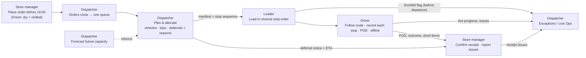

# Waypoint Operations — Designathon Requirements Audit & Gap-Fix Plan

| | |
|---|---|
| **Source brief** | Tech-Triathlon 2026 Challenge Booklet (33 pages) |
| **Design file** | Figma `nfP1ZRvqcF2cJ4cWeZqyvT` — pages `Planning`, `Redesign v2`, `Driver App` |
| **Audit date** | Mon 28 Sep 2026 |
| **Designathon deadline** | **Tue 29 Sep 2026, 11:59 PM Sri Lanka time — about 1.5 days after this audit** |
| **Status** | Plan only. No Figma changes have been made for this plan yet. |

---

## 0. Summary

**What is already strong**

- 56 screens across all four roles (Dispatcher 21, Driver 21, Store Manager 8, Loader 6), plus a cover page, a UX rationale board and a component library.
- The dispatcher planning wizard is complete: confirm orders, generate the plan, review allocation, resolve exceptions, confirm and send. Deferred Orders, Live Operations and Exceptions screens also exist.
- The driver app covers the full delivery loop, with proof of delivery (photo, signature, recipient), issue reporting and an offline sync screen.
- Some cross-role links already exist. The dispatcher's Exceptions screen lists issues reported by loaders and drivers, and "Plan sent" shows that the loader acknowledged the plan.

**What puts the score at risk** (ordered by judging weight)

1. **Mandatory deliverables are missing.** There are no personas (0 of 4), no named degradation scenario with a rationale, and no AI tool disclosure. The brief requires a rationale paragraph for every screen, but one exists only for dispatcher step 1. These gaps limit Problem framing (25%), User context (20%) and Degradation (15%).
2. **Two workflow stages have no screens.** Stage 6, *Confirm receipt* (store manager), and Stage 7, *Plan future capacity* (forecasting), are not designed. The store manager deferral notice and the loader's stop-sequence loading view are also missing.
3. **Mandatory operating constraints are not shown anywhere.** These are: fuel quotas, weight limits (only m³ is shown), the limit of 2 trips per vehicle with one brand and one district per trip, trip time budgets, mall access windows, dock types, and the history of skipped outlets.
4. **Some data contradicts the brief:**
   - The plan is for a **Sunday**, but Waypoint operates Monday to Saturday.
   - **Fresh deliveries happen at 10:00 and 14:00**, but Fresh must arrive before 08:00.
   - The screens say "60 vehicles at Peliyagoda", but 60 is the fleet across both depots.
   - An order placed after the 4 PM cutoff is planned for the next day.
   - A driver trip crosses two districts.
5. **The same trip looks different in each role.** Each role shows a different vehicle, driver, date, ID format and route, so a judge cannot follow one order from store manager to dispatcher to loader to driver and back.
6. **One screen is visibly broken.** The Live Operations frame is clipped to 312 px, so its vehicle list, map and detail panel are cut off.

**Scorecard**

| Area | Status | Main gap |
|---|---|---|
| Dispatcher flow | Mostly covered | Constraints not shown (fuel, weight, trips, time budgets); no forecasting; Live Ops broken; deferral reasons cannot be entered |
| Loader flow | Partial | No stop-sequence loading order; no handling of plan changes; no shortfall form; tablet only (Hackathon judges the loader on a phone) |
| Driver flow | Mostly covered | Data errors; offline appears on one screen only, with no reconcile step; no unloading or dock information |
| Store manager flow | Partial | No receipt confirmation; no deferral notice; no 4 PM cutoff; no live ETA; desktop only |
| Designathon deliverables | 1 of 6 complete, 2 partial | Personas, AI disclosure and per-screen rationale missing; degradation scenario not named |

---

## 1. What the brief requires

### 1.1 Facts to design against

| Brand | Outlets | Goods | Delivery schedule |
|---|---|---|---|
| Waypoint Fresh | 80 | Groceries, chilled and frozen goods | Daily, **before stores open at 08:00** |
| Waypoint Style | 25 | Hanging garments, cartons (fill volume before weight) | Weekly, seasonal peaks; **about half are in malls with fixed windows** |
| Waypoint Tech | 15 | Appliances, electronics: heavy, fragile, high-value | As needed, often a single large item |

- **Network:** 120 outlets (`OUT001`–`OUT120`) in 12 districts. There are two depots: the **Peliyagoda** distribution center and the **Kandy** regional hub.
- **Fleet:** 60 vehicles (`VEH001`–`VEH060`): 12 refrigerated trucks, 40 dry-box trucks and 8 vans, of which 4 are refrigerated. That gives **16 chilled-capable vehicles**. Each vehicle works only from its home depot.
- **Timeline:** Orders for the next day **close at 16:00**, and later orders wait for the following run. The fleet operates **Monday to Saturday**.
- **Fresh ordering:** A Fresh outlet orders dry goods and chilled goods separately, so it can have **two orders for the same delivery day**.

### 1.2 Problems the solution must address

| ID | Problem (brief p.4) | What the design must show |
|---|---|---|
| P1 | Planning is fragmented and depends on one person | One order queue and a guided, explainable plan |
| P2 | Delivery progress is hard to track | Live view of progress and problems after departure |
| P3 | Deferrals have no record, and the same outlet can be skipped repeatedly | Deferral reason, audit trail, and "skipped before" flag |
| P4 | No feedback loop: no proof of delivery, no loading shortfall flag | Proof of delivery (POD), loader shortfall before departure, receipt confirmation |
| P5 | Demand is hard to anticipate (paydays, festivals) | Demand forecast used for vehicle, driver and refrigerated-capacity planning |
| P6 | Service time and lateness are not predicted | Predicted service time and late risk, shown before a problem happens |
| P7 | Field connectivity is unreliable | Offline work plus reconciliation when the connection returns |

### 1.3 Operating constraints

| ID | Constraint |
|---|---|
| C1 | Each vehicle has a **weight AND a volume** limit; a load must satisfy both |
| C2 | Chilled or frozen goods only go on refrigerated vehicles; refrigerated vehicles may also carry ambient goods |
| C3 | Each vehicle has a **weekly fuel quota**, and route distance uses it up |
| C4 | A vehicle runs at most **2 trips per day** |
| C5 | The fleet operates **Monday to Saturday** |
| C6 | Each vehicle has one driver; drivers are not a separate constraint |
| C7 | Every outlet has a delivery window; **Fresh arrives before 08:00** |
| C8 | **Mall outlets** accept deliveries only in the mall's fixed access window (`mall_dock`) |
| C9 | `van_only` outlets can only be served by vans |
| C10 | Unloading differs by outlet: **rear dock, street (curb), or mall bay** |
| C11 | Paydays, festivals, weekends and monsoon change demand or travel time (`calendar.csv`) |
| C12 | When demand exceeds capacity, the dispatcher chooses the deferrals and **records the reason** |
| C13 | Coverage drops in the hill country, the Kandy corridor and rural areas; work must continue offline and reconcile later |
| C14 | Data reference: **a trip serves one brand in one district**, from the vehicle's home depot, with whole orders only. **Fresh trips have a 270-minute budget (03:30–08:00); Style and Tech trips share a 480-minute budget.** Trip time = outbound travel + inter-stop travel × (stops − 1) + service allowance per stop |
| C15 | Orders received after the 16:00 cutoff move to the following run |

### 1.4 What each role needs

| Role | Where and on what device | Needs from the brief |
|---|---|---|
| **Dispatcher** | Large screen, Peliyagoda planning office, stable connection | Build the daily plan · see progress and problems after vehicles leave · explain deferral decisions · **identify outlets that were already skipped** |
| **Loader** | Peliyagoda **or Kandy** dock, **shared tablet or terminal**; printed lists go out of date when plans change | **Stop sequence, so goods are loaded in the order that supports unloading** · flag missing or damaged items **before the vehicle leaves** |
| **Driver** | On the road, personal phone; today uses a paper run sheet and phone calls | **Interactions for use only when safely stopped** · record outcomes and proof of delivery · **work offline and sync later** |
| **Store manager** | Outlet counter, **desktop or phone**; orders by phone today with no confirmation | **Expected arrival time** to schedule receiving staff · **clear notice when an order is deferred** · **confirm receipt** and report issues |

### 1.5 End-to-end workflow

| Stage | Role | System requirement (brief p.7) |
|---|---|---|
| W1 Place order | Store manager | Capture and confirm the order before the cutoff |
| W2 Close orders | Dispatcher | Bring confirmed orders into one queue |
| W3 Plan and allocate | Dispatcher | Assign served orders to vehicles and trips; identify deferred orders |
| W4 Load | Loader | Load in planned stop sequence and flag shortfalls |
| W5 Deliver | Driver | Follow the route and record each stop, including while offline |
| W6 Confirm receipt | Store manager | Confirm what arrived and report issues |
| W7 Plan future capacity | Dispatcher | Use demand forecasts to plan vehicles, drivers and refrigerated capacity |

Connecting requirement (p.9): *"A dispatcher's decision should reach the loader, and a driver's delivery record should give the store manager information they can act on."*

### 1.6 Designathon deliverables and judging

| Deliverable | Required? |
|---|---|
| One persona per role (4), grounded in the brief | Mandatory |
| Screen flows for each role, with **a one-paragraph rationale for every screen** | Mandatory |
| At least one **fully designed degradation (failure) screen**, named, with a short rationale paragraph | Mandatory |
| High-fidelity prototype | Mandatory |
| Demo video, 3–5 minutes, unlisted YouTube | Mandatory (made outside Figma) |
| AI tool disclosure | Mandatory |
| Core tradeoff explanation (one page or one diagram) | Optional |
| Style guide | Optional |
| One design file with **distinct pages**, exported as `TeamName_Designathon.zip` | Mandatory |

Judging weights: Problem framing **25%** · Understanding of user context **20%** · Degradation screen quality **15%** · Scope and prioritization **15%** · Visual and interaction design, including consistency across roles **15%** · Domain accuracy **10%**. The brief also says judges assess **prioritization and restraint**.

### 1.7 Why the Hackathon affects design choices now

- The Designathon design becomes the implementation spec, and judges score **fidelity to the Day 5 design** (10%).
- **Judges assess the driver and loader on phone-sized screens.** The loader is currently designed for tablet only.
- Plans must respect capacity, temperature, access, windows **and fuel quotas**, and must handle **a day when demand exceeds capacity**. The design should show all of these so the build can follow it.

---

## 2. Target user flows (derived from the brief)

### 2.1 End-to-end service flow

### 2.2 Dispatcher target flow

1. **Dashboard:** today's status, open issues, and a forecast warning for the coming weeks.
2. **Orders closed (16:00):** one queue for the depot, with late orders moved to the next run.
3. **Review orders:** filter by brand, district, window, temperature, access (van only, mall), and "skipped last run".
4. **Generate the plan:** the system proposes vehicles, trips and deferrals under all constraints.
5. **Plan result on an over-capacity day:** capacity shortfall, the prioritization policy, and the proposed deferrals.
6. **Review allocation:** per vehicle, Trip 1 and Trip 2, each showing brand, district, kg, m³, minutes used against budget, fuel quota, and late risk.
7. **Resolve exceptions and decide deferrals:** each deferral needs a **reason**, shows its **consequence**, and **notifies the store**.
8. **Confirm and send:** manifests and stop sequences go to the loader; the plan is locked before loading starts.
9. **Live operations:** progress, predicted lateness, offline vehicles, and issues from loaders and drivers.
10. **Deferred orders:** history, skipped outlets, and next-run priority.
11. **Capacity forecast:** 10 weeks by depot and brand, total and chilled m³, compared with fleet capacity.

### 2.3 Loader target flow

1. Quick sign-in on the shared device (name and PIN), and choose the depot (Peliyagoda or Kandy).
2. See today's trips by bay and departure time.
3. Open a trip to see the **load order**: reverse stop sequence, zones (refrigerated or ambient, front or rear), and kg and m³.
4. Load each order and confirm it, by scan or by tapping.
5. **Flag a shortfall or damage** (item, quantity, photo, and whether it blocks departure). The dispatcher is notified before departure.
6. **When the plan changes:** a banner shows what changed and asks the loader to acknowledge it.
7. Mark the trip loaded and hand over to the driver.

### 2.4 Driver target flow

1. Sign in on a personal phone and see today's Trip 1 and Trip 2.
2. Start the trip. **While driving, only the next stop and its ETA are shown**; details unlock when stopped.
3. Arrive at a stop: see the window, **dock type, mall window and parking notes**, and the orders (Fresh may have two).
4. Record the outcome for each order (delivered, partial or failed), with **proof of delivery** (photo, signature, recipient).
5. Report issues such as missing, damaged, refused or customer unavailable.
6. **If offline:** every action is saved on the phone, with a visible queue. **When the connection returns:** records reconcile, and any conflicts are shown.
7. Complete the stop, then the trip, then submit to the dispatcher.

### 2.5 Store manager target flow

1. Place an order for the next run, with a **visible 16:00 cutoff** and the outlet's **fixed** delivery window. Fresh orders **split into dry and chilled**.
2. Get a confirmation: *received, confirmed for the Tuesday run*.
3. After planning, see either **scheduled with a window**, or a **deferred notice with the reason and the new date**.
4. On delivery day, see a **live ETA** ("arriving 06:10, 2 stops away") and any late risk.
5. On arrival, **confirm receipt** against the driver's proof of delivery: confirm line by line, and flag any discrepancy.
6. Report and track issues.

### 2.6 Cross-role handoffs (what must visibly travel between roles)

| From → To | Information | Must appear on | Current status |
|---|---|---|---|
| Store manager → Dispatcher | Confirmed order, fixed window, dry/chilled split | Dispatcher 1A queue | Partial (no split, no cutoff) |
| Dispatcher → Loader | Manifest, **stop sequence**, bay, departure time, plan changes | Loader Trip, plan-change banner | Partial (no sequence, no changes) |
| Dispatcher → Store manager | **Deferral notice + reason**, scheduled window, ETA | Store manager Home, Orders, Notifications | Missing |
| Loader → Dispatcher | Shortfall or damage before departure | Dispatcher Exceptions | Covered (`ORD-1164`) |
| Loader → Store manager | Short-shipped items | Store manager receipt screen | Missing |
| Driver → Dispatcher | Progress, issues, offline state | Live Ops, Exceptions | Partial (Live Ops clipped) |
| Driver → Store manager | POD (photo, signature, time), outcome, short items | Store manager Confirm Receipt | Missing |
| Store manager → Dispatcher | Receipt discrepancy or issue | Dispatcher Exceptions | Partial (store manager issue exists; not shown to dispatcher) |

---

## 3. What is currently in the Figma file

### 3.1 Pages

| Page | Contents |
|---|---|
| `Planning` (0:1) | The original, untouched screen "Planning – Confirmed Orders" (3:2) and its components (4:2). This is the "before" reference. |
| `Redesign v2` (16:330) | Library, Cover and UX rationale, all **Dispatcher**, **Store Manager** and **Loader** screens |
| `Driver App` (52:330) | All **Driver** screens, plus responsive alternates for iPhone SE and Pro Max |

### 3.2 Dispatcher: desktop, 1536 px wide (21 screens)

| Frame | Node | What it shows |
|---|---|---|
| 1A · Confirmed Orders | 21:598 | 186 orders, filters, chips, table, include toggles; "Tomorrow 27 Sep 2026 (Sun)" |
| 1B · Selection & bulk actions | 22:1297 | Exclude and undo, bulk bar |
| 1C · Map split view | 23:2019 | Map with order popover (van-only note) |
| 2A · Generating plan | 25:2465 | 4 stat cards ("60 vehicles at Peliyagoda"), 5-stage progress, planning summary |
| 2B · Plan ready | 26:2690 | 14 routes, 180/186 allocated, 6 need attention, route list |
| 3A · Review allocation | 28:2936 | Vehicle cards (m³ only), route map, day timeline |
| 3B · Drag to rebalance | 29:3165 | Drag order between vehicles with live m³ preview |
| 3C · Vehicle plan review (drawer) | 81:6155 | Vehicle drawer |
| 3D · Change vehicle (modal) | 81:6674 | Swap vehicle |
| 4A · Exceptions triage | 30:3416 | 6 exceptions with ranked fix, Apply / Choose vehicle / Defer |
| 4B · All exceptions resolved | 31:3824 | 185/186 allocated, 1 deferred "to Monday 28 Sep", resolution log |
| 5A · Confirm & send | 33:4738 | Manifests, notify loader, SMS drivers, "editable until 05:00" |
| 5A+ · Send confirmation (modal) | 32:4061 | Confirmation modal |
| 5B · Plan sent | 33:4336 | Timeline: sent, SMS, loader acknowledged, loading 04:00, first departure 04:30 |
| 6 · Deferred Orders | 48:4944 | 5 deferred orders with system reason and feasible options; "15 Sep 2026" |
| Dashboard | 74:5232 | KPIs, orders and trips needing attention, planning status |
| Orders | 74:5535 | All orders with status |
| Order Detail | 74:5850 | ORD-1189, "Submitted Sat 26 Sep 4:12 PM" |
| Live Operations | 76:5697 | **Broken: frame clipped at 312 px** |
| Exceptions | 76:6013 | System, loader and driver issues with suggested fix |
| Profile | 76:6354 | Account |
| 00 · Cover / 00 · UX Rationale | 34:4830 / 36:4833 | Cover says "Planning module · 12 screens, one flow". Rationale covers dispatcher step 1 only |

### 3.3 Store manager: desktop, 1536 px wide (8 screens)

| Frame | Node | What it shows |
|---|---|---|
| SM · Home | 87:6649 | KPIs, recent orders, next delivery "Today 14:00–16:00, Nimal Perera", open issue |
| SM · Place Order — Catalog | 87:7036 | Dairy, bakery, frozen and beverages in **one** order |
| SM · Place Order — Review | 87:7508 | **"Preferred window 14:00–16:00"** can be chosen |
| SM · Order Confirmation | 87:7895 | "Estimated delivery: Tomorrow, 08:00–10:00" |
| SM · Orders | 89:7063 | Status tabs, including "Deferred", but no deferral detail |
| SM · Deliveries | 89:7490 | Deliveries with driver and window |
| SM · Issues | 89:7890 | Issue list and detail |
| SM · Profile | 89:8266 | Account |

### 3.4 Loader: tablet, 1024 × 768 (6 screens)

| Frame | Node | What it shows |
|---|---|---|
| Loader · Home | 93:7502 | 3 trips, progress |
| Loader · Trip | 93:7636 | Order manifest `ORD-1101N…` with **no stop or load sequence** and no weight |
| Loader · Order Loading | 93:7810 | Items, scan, Report Issue, Confirm Loaded |
| Loader · Trip Completion | 94:7621 | 16/16 loaded, ready for driver |
| Loader · Issues | 94:7720 | Issues reported, with detail |
| Loader · Profile | 94:7860 | Account |

### 3.5 Driver: phone, 402 × 874 (iPhone 16 Pro) (21 screens)

| Frame | Node | What it shows |
|---|---|---|
| Home / Hero Collapsed / Trip Expanded | 55:5282 / 172:859 / 158:8135 | Today's trip, Trip 1 and Trip 2, collapsible header, bottom sheet; "Tue, 16 Sep 2026" |
| Trip Overview | 56:5295 | Next stop, 6-stop sequence (Colombo → … → Beruwala) |
| Route | 56:5398 | Navigation and ETA |
| Stop Details | 58:5317 | **Window 10:00–11:00 AM** for Fresh; 2 orders |
| Order Delivery | 58:5393 | Items check |
| Delivery Confirmation | 58:5464 | Delivered / partial / failed, photo, signature, **recipient "Kasun Perera" (the driver's own name)** |
| Report Issue / Issue Recorded | 59:5378 / 59:5434 | Issue types, quantity, photo |
| Stop Completed / Trip Completed / Trip Submitted | 60:5390 / 60:5432 / 60:5468 | Completion states |
| Deliveries / Delivery Details | 61:5417 / 61:5543 | History and record |
| Profile / Login / Notifications | 61:5602 / 62:5501 / 62:5578 | Account and alerts |
| Offline Sync | 62:5536 | "No connection · 3 actions saved · waiting to sync". This is the only offline screen. |
| Home alternates | 65:5553 / 65:5650 | iPhone SE/13 mini and Pro Max |

---

## 4. Gap analysis

Status key: **Covered**, **Partial**, **Missing**, **Contradicts** (the screen states something the brief rules out).

### 4.1 Requirement traceability

| Req | Current coverage | Status | Gap |
|---|---|---|---|
| W1 Place and confirm before cutoff | SM Catalog, Review, Confirmation | Partial | No 16:00 cutoff or countdown; confirmation doesn't name the run; the store can choose a window; no Fresh dry/chilled split |
| W2 Close orders into one queue | 1A | Partial | No "orders closed 16:00" state; no handling of late orders; table lacks district, dock type, mall window and skipped flag |
| W3 Plan and allocate, including deferred | 2A–5B, 6 | Partial | Trips are not modelled (one route per vehicle); no brand and district per trip; no time budget; m³ only; no fuel; the showcase day has only 1 deferral |
| W4 Load by stop sequence, flag shortfall | Loader Trip, Order Loading, Issues | Partial | Manifest is not in load order; no shortfall form; no plan-change handling |
| W5 Deliver, record each stop, offline | Driver screens | Partial | Loop is complete, but offline is one screen with no reconcile step; data errors |
| W6 Confirm receipt | SM Deliveries, Issues | **Missing** | No receipt confirmation against POD |
| W7 Plan future capacity | None | **Missing** | No forecast screen |
| P1 Fragmented planning | Wizard + queue | Covered | — |
| P2 Progress tracking | Live Ops | Partial | Frame clipped; no predicted lateness; no offline or last-seen state |
| P3 Deferral record and repeat skips | 6 Deferred, 4B log | Partial | Dispatcher can't enter a reason; no consequence; no "skipped yesterday / days since served"; store not notified |
| P4 Feedback loop | Driver POD, loader issues | Partial | POD never reaches the store manager; no receipt confirmation |
| P5 Anticipate demand | None | **Missing** | No forecast, and no payday, festival or monsoon context |
| P6 Predict service time and lateness | 3A shows "1 stop may miss its window" | Partial | Only a reactive warning; no predicted service time or late probability |
| P7 Offline and reconcile | Driver Offline Sync | Partial | No in-flow offline state, no reconcile or conflict screen, no dispatcher view of an offline vehicle |
| C1 Weight and volume | m³ for dispatcher and loader, kg for driver | Partial | Weight capacity never compared with the limit |
| C2 Temperature | Refrigerated badges, reefer vehicles, exception type | Covered | — |
| C3 Weekly fuel quota | None | **Missing** | Not on any vehicle card or exception |
| C4 Two trips per day | Driver Home (Trip 1 and 2) | Partial | Dispatcher and loader show one route per vehicle |
| C5 Monday to Saturday | 1A–5B "27 Sep (Sun)" | **Contradicts** | The plan is for a Sunday |
| C7 Fresh before 08:00 | Driver 10:00–11:00; SM 08:00–10:00 and 14:00–16:00 | **Contradicts** | Fresh windows after 08:00 |
| C8 Mall windows | None | **Missing** | Style mall outlets not represented |
| C9 Van only | Chips, exceptions, van routes | Covered | — |
| C10 Dock type | None | **Missing** | No rear dock, street or mall bay information for driver or dispatcher |
| C11 Calendar demand drivers | None | **Missing** | No payday, festival or monsoon context |
| C12 Deferral decision and reason | 4A "Defer" button, 6 system reasons | Partial | No reason-capture step; consequence not explained |
| C13 Offline | Driver Offline Sync | Partial | See P7 |
| C14 One brand and district per trip; time budgets | Driver Trip 1 crosses Colombo and Kalutara; 3A has a 16-stop Fresh route to Galle | **Contradicts** | Breaks the one-district rule; 16 Fresh stops cannot fit a 270-minute budget |
| C15 Cutoff | Order Detail "submitted 4:12 PM", planned for next day | **Contradicts** | Should roll to the following run |
| Dispatcher: identify skipped outlets | None | **Missing** | — |
| Loader: stop sequence | None | **Missing** | Core loader need |
| Loader: shared device | No sign-in | Partial | — |
| Loader: outdated lists when plans change | None | **Missing** | Named problem in the brief |
| Loader: Kandy depot | Peliyagoda only | Partial | — |
| Driver: use only when safely stopped | None | **Missing** | No driving-lock or glance mode |
| SM: expected arrival time | Window only | Partial | No live ETA |
| SM: deferral notice | "Deferred" tab only | **Missing** | No notice, reason or new date |
| SM: desktop or phone | Desktop only | Partial | — |

### 4.2 Designathon deliverables checklist

| Deliverable | Required | Current | Status |
|---|---|---|---|
| 4 personas | Yes | None | **Missing** |
| Screen flows, with a rationale paragraph for **every** screen | Yes | Screens exist; rationale only for dispatcher step 1; no flow diagrams | Partial |
| Degradation screen, named, with rationale | Yes | Offline Sync screen exists but is not named or explained | Partial |
| High-fidelity prototype | Yes | Wired per role | Covered (verify starting points) |
| Demo video | Yes | Made outside Figma | Team-owned |
| AI tool disclosure | Yes | None | **Missing** |
| Core tradeoff | Optional | None | Recommended |
| Style guide | Optional | Library section (icons, components, patterns) and 2 token collections | Partial — move to its own page |
| One file with distinct pages | Yes | 3 pages; roles mixed on `Redesign v2` | Partial |

### 4.3 Domain accuracy errors to fix

| # | Where | Current | Why it is wrong | Fix |
|---|---|---|---|---|
| 1 | 1A–5B header, 4A, 4B, 5B | "Tomorrow · 27 Sep 2026 (Sun)", defer "to Monday 28 Sep" | Operates Monday to Saturday (p.5) | Plan for **Tue 29 Sep 2026**; defer to **Wed 30 Sep** |
| 2 | Driver Home | "Tue, 16 Sep 2026" | 16 Sep 2026 is a Wednesday, and it doesn't match the plan date | "Tue, 29 Sep 2026" |
| 3 | 6 · Deferred Orders | "Today 15 Sep 2026" | Doesn't match other screens | Mon 28 Sep / Tue 29 Sep |
| 4 | Driver Stop Details, Order Delivery, Deliveries | Fresh window 10:00–11:00, arrivals 09:45–11:20 | Fresh arrives before 08:00 | For example, window 05:30–07:30, arrival 05:48 |
| 5 | SM Review | Store picks "Preferred window 14:00–16:00" | Windows are fixed per outlet; Fresh is before 08:00 | Show the fixed window, read-only |
| 6 | SM Confirmation | "Estimated delivery Tomorrow 08:00–10:00" at submission time | ETA is unknown until the plan is built after cutoff | "Confirmed for Tue 29 Sep run · window 05:30–07:30 · ETA sent once the plan is ready" |
| 7 | SM Home, Deliveries | Fresh outlet delivery "Today 14:00–16:00 · Nimal Perera" | Fresh rule; Nimal drives Galle North in the dispatcher screens | Align to the shared demo data (§5.2) |
| 8 | 2A | "Available vehicles 60 at Peliyagoda Depot" | 60 is the fleet across both depots; vehicles serve only their home depot | Per-depot count, workshop count, and refrigerated count |
| 9 | Dispatcher Order Detail | "Submitted Sat 26 Sep, 4:12 PM", planned for next day | After the 16:00 cutoff | Change the time, or show an "After cutoff → next run" badge (a useful edge case) |
| 10 | 2B, 3A | "WP LB-4521 · Galle North · 16 stops · departs 04:30", no brand shown | One brand and district per trip; 16 Fresh stops exceed the 270-minute budget | Show brand and district per trip, minutes against budget, and split into trips |
| 11 | Driver Trip 1 | Colombo 08 → … → Panadura, Kalutara, Beruwala | A trip serves one district | Trip 1 uses Colombo district stops only |
| 12 | All roles | Vehicle "WP LB-4521" (dispatcher, loader), "VEH021" (deferred), "VEH-014" (driver) | Dataset IDs are `VEH001`–`VEH060` | Lead with `VEH014`, with the plate as secondary |
| 13 | Dispatcher, SM, driver | Outlets named "Fresh Mart", "Style Foods", "City Super", "Green Grocer", "Fresh Point" | Outlets are Waypoint's own brand stores (`OUT001`–`OUT120`); "Style Foods" contradicts Style = garments | "Waypoint Fresh · Colombo 07 (OUT023)" |
| 14 | All roles | ORD-10xx (dispatcher), ORD-1101N (loader), ORD-1163 (driver), ORD-2091 (SM) | No single order can be traced | One ID scheme; one order appears in all four roles |
| 15 | Driver Delivery Confirmation | Recipient "Kasun Perera" is the driver | Recipient is outlet staff | Store manager persona or outlet staff name |
| 16 | SM Catalog | Dairy, frozen and bakery in one order | Fresh places dry and chilled orders separately (p.4) | Auto-split into ambient and chilled orders |
| 17 | 5A, 5B | "Editable until 05:00", loading starts 04:00, first departure 04:30 | The plan must lock before loading | Lock at loading start; later edits go to the loader as plan changes |
| 18 | Loader Trip | "16 orders · 38 m³" | 38 m³ is the capacity, not the load | "34.2 / 38 m³ · 2,840 / 3,000 kg" |
| 19 | Cover | "Planning module · 12 screens, one flow · 0 data points removed" | Out of date | Whole system, 4 roles, starting points |
| 20 | Driver, loader, SM | Only Fresh appears | Style (mall windows, volume-bound) and Tech (fragile, high-value) are absent outside the dispatcher | Add at least one Style and one Tech touchpoint |

### 4.4 Cross-role consistency

Following the "same" trip across the file today:

- **Dispatcher:** Kasun *Silva* drives WP LC-2231, Galle Fort, 15 stops.
- **Driver app:** Kasun *Perera* drives VEH-014, Colombo → Beruwala, 6 stops, on "Tue 16 Sep".
- **Loader:** Trip 1 is WP LB-4521 with orders `ORD-1101N…`.
- **Store manager:** the next delivery is by Nimal Perera at 14:00–16:00.

A judge cannot follow one decision from dispatcher to loader, or one delivery record from driver to store manager. That link is the explicit goal on p.9 and is part of the 15% consistency criterion. **Fix:** one shared demo dataset (§5.2) that every role uses.

### 4.5 Quality defects

- **Live Operations (76:5697) is clipped at 1536 × 312.** The vehicle list, map and detail panel are cut off. This is the dispatcher's main after-departure screen.
- The Cover and UX Rationale describe only the old planning module.
- Desktop screens use the "Waypoint Gold" tokens and the driver app uses "Driver Mobile" tokens. The palette is consistent, but the style guide should document both.
- The loader is tablet-only, but the Hackathon assesses the loader on a phone.
- **Scope and restraint:** the four Profile screens and the 3C/3D variants add little. Mark them as supporting screens in the flows, not core screens.

---

## 5. Fix and improvement plan

### 5.1 Principles

1. **Fix contradictions before adding screens.** Wrong domain data costs points on every screen it appears.
2. **One shared demo day across every role.** A judge should be able to follow one order from end to end.
3. **Reuse existing components and tokens.** No new visual language.
4. **Restraint.** Add a screen only if it closes a mandatory requirement. Write each screen's rationale paragraph while building it.
5. **Keep every screen buildable,** because it is the Hackathon spec.

### 5.2 Shared demo data (proposed)

| Entity | Value | Appears in |
|---|---|---|
| Today and cutoff | Mon 28 Sep 2026, orders close 16:00 | Store manager, Dispatcher |
| Plan and delivery day | **Tue 29 Sep 2026** | All roles |
| Deferral target | Wed 30 Sep 2026 | Dispatcher, Store manager |
| Depot | Peliyagoda (Kandy appears in the depot switcher, loader sign-in and the degradation scenario) | All |
| Demand | 186 orders · 412.5 m³ (unchanged). **Over capacity: 174 served, 12 deferred** (recommended) | Dispatcher |
| Dispatcher persona | Dilani Mendis (matches the existing "DM" avatar) | Dispatcher |
| Vehicle | **VEH014** · refrigerated truck · plate WP LB-4521 | All |
| Trip 1 | **Fresh · Colombo district · 6 stops** · departs 04:10 · uses 213/270 Fresh minutes | Dispatcher, Loader, Driver |
| Trip 2 | **Style · Gampaha district · 4 stops (1 mall bay 09:00–11:00)** | Dispatcher, Loader, Driver |
| Driver | Kasun Perera (DRV-014) | Driver, Dispatcher, Store manager |
| Loader | Kamal Jayawardena · Peliyagoda · Bay 2 | Loader, Dispatcher 5B |
| Store manager and outlet | Shanika Munasinghe · **Waypoint Fresh Colombo 07 (OUT023)** · window 05:30–07:30 · street (curb) unloading | Store manager, Driver Stop 2 |
| Orders at OUT023 | **ORD-1163 chilled** (dairy) and **ORD-1165 ambient** (dry). Both on VEH014 Trip 1, Stop 2 | All four roles |
| Loader shortfall | ORD-1163 Fresh Milk 1 L **short by 2**, flagged at 04:05 before departure. This goes to a dispatcher exception, then appears on the store manager's receipt screen as "2 short-shipped". | Loader, Dispatcher, Store manager |
| Deferral | ORD-1204 · Waypoint Fresh Nugegoda (OUT031) → Wed 30 Sep. Reason: no refrigerated space on Colombo Fresh trips. **Also skipped on Saturday**, so it is flagged "2nd skip — protect next run". The store is notified. | Dispatcher, Store manager |
| Degradation trip | VEH052 · Kandy depot · Fresh · Nuwara Eliya district (hill country) · driver Ruwan Fernando | Driver, Dispatcher |

> The IDs, capacities and windows above are placeholders consistent with the brief. If the dataset CSVs (`outlets.csv`, `vehicles.csv`, `calendar.csv`) are shared, replace them with real values. That directly improves Domain accuracy (10%).

### 5.3 Workstreams and tasks

Priority key: **P0** must be done before the deadline · **P1** strongly recommended · **P2** optional polish.
Size key: **S** under 30 min · **M** 30–90 min · **L** over 90 min (Figma work through the MCP).

#### WS-A — Domain and consistency fixes (edit existing frames) · P0

| ID | Task | Frames | Size |
|---|---|---|---|
| A1 | Dates: plan Tue 29 Sep, defer Wed 30 Sep, today Mon 28 Sep; fix weekday labels | 1A–5B, 6, Dashboard, Order Detail, Driver Home ×4, Store manager | M |
| A2 | Fresh windows before 08:00 and matching arrival times | Driver Stop Details, Order Delivery, Deliveries, Delivery Details, Store manager Home, Deliveries, Review, Confirmation | M |
| A3 | IDs: `VEH0xx` first with plate second; `OUT0xx` with Waypoint-brand outlet names; one `ORD` scheme | All roles | L |
| A4 | Apply the shared demo data from §5.2: driver Trip 1 and 2, loader Trip 1 = VEH014, store manager next delivery = VEH014 / Kasun, dispatcher 3A first card = VEH014 | Driver, Loader, Store manager, 3A–3D, 5A, 5B | L |
| A5 | Fleet facts per depot (available, in workshop, refrigerated-capable) | 2A, 2B, Dashboard | S |
| A6 | Cutoff fix and edge case | Order Detail, 1A | S |
| A7 | Recipient name, loader load vs capacity labels, plan lock time | Driver Confirmation, Loader Trip, 5A, 5B | S |

*Acceptance:* no screen contradicts C5, C7, C14 or C15, and orders ORD-1163/1165 can be followed through all four roles.

#### WS-B — Dispatcher

| ID | Pri | Task | Size |
|---|---|---|---|
| B1 | P0 | **Repair Live Operations (76:5697).** Restore the full height so the list, map and detail are visible. Add predicted ETA and late risk per vehicle, and an "Offline · last seen 38 min ago" state for the degradation scenario. | M |
| B2 | P0 | **Show the real constraints in allocation.** Edit the 3A vehicle card and the 3C drawer: Trip 1 and Trip 2, each with a brand and district chip; **kg and m³ bars**; **minutes used against the Fresh 270 / Style-Tech 480 budget**; **weekly fuel quota left** (for example "142 of 380 L left"). Add exception types to 4A: fuel quota, time budget, mall window. | L |
| B3 | P0 | **Deferral decision record.** Add a Defer modal to 4A and 6 with: a required reason (list plus note); the consequence ("OUT031 will be skipped two runs in a row"); "Notify store manager" on by default; and next-run priority. Add these columns to 6: *Skipped last run*, *Days since last served*, *Reason entered by*, *Store notified*. | M |
| B4 | P0 | **Over-capacity day in 2B.** "Refrigerated capacity short by 38 m³ · 12 orders can't be served", plus a **prioritization policy** panel: (1) outlets skipped last run, (2) chilled Fresh before opening, (3) mall windows, (4) Tech high-value, (5) defer non-peak Style first. Update 4A, 4B, 5A and 5B counts to match. | M |
| B5 | P0 | **New Capacity Forecast screen (W7, P5).** 10 weeks by depot and brand, total and chilled m³, compared with fleet capacity. Show payday, festival and monsoon markers and recommendations, for example "Week 42: chilled demand exceeds refrigerated capacity by 18%, hire 2 refrigerated trucks". Add a Forecast nav item. | L |
| B6 | P1 | Predictions in planning: predicted service time and **late probability** per stop in the 3A timeline; 2B "On-time" uses the prediction. | M |
| B7 | P1 | Orders-closed banner in 1A ("Orders closed 16:00 · 186 confirmed · 7 late moved to Wed"). Add columns for district, dock type, mall window and a skipped flag. | M |
| B8 | P2 | Kandy in the depot switcher; forecast widget on the Dashboard. | S |

#### WS-C — Loader

| ID | Pri | Task | Size |
|---|---|---|---|
| C1 | P0 | **Load-order view** in Loader · Trip: reverse stop sequence ("Load 1st → Stop 6, unloads last"), stop numbers, zones (refrigerated compartment or ambient, front or rear), kg and m³ per order, fragile and Tech flags. Uses VEH014 from the demo data. | M |
| C2 | P0 | **Report shortfall form:** order, item, quantity short, missing or damaged, photo, "blocks departure?". Trip state: "Departing with 1 shortfall — store notified". | M |
| C3 | P1 | **Plan-changed banner and diff:** "Plan updated 03:52 — ORD-1188 moved to VEH021; stops 4–5 re-sequenced · Acknowledge". | M |
| C4 | P1 | **Phone variants (402 × 874)** of Loader Home, Trip (load order), Order Loading and Report shortfall, because the Hackathon judges the loader on a phone. | L |
| C5 | P2 | Shared-device quick sign-in (name, 4-digit PIN, choice of Peliyagoda or Kandy). | S |

#### WS-D — Driver

| ID | Pri | Task | Size |
|---|---|---|---|
| D1 | P0 | Data fixes from WS-A: date, Fresh windows, single-district Trip 1, VEH014, recipient name. | M |
| D2 | P0 | **Unloading information in Stop Details:** dock type (street, rear dock or mall bay), mall access window, parking note, chilled handling. | S |
| D3 | P0 | **Offline states inside the flow (degradation):** an "Offline — saved on this phone · 3 queued" banner on Stop Details, Delivery Confirmation and Stop Completed; POD saved locally. | M |
| D4 | P0 | **Reconnect and reconcile screen (degradation):** "4 records synced · 1 needs review: dispatcher moved Stop 5 to VEH021 while you were offline — your delivery record is kept and the dispatcher is notified". | M |
| D5 | P1 | **Safe-use driving mode:** while moving, show only the next stop, ETA and a large "I've stopped" button; details unlock when parked. | M |
| D6 | P1 | Failed-delivery path (reason, then return goods to depot); quantities for a partial delivery. | S |
| D7 | P2 | Trip 2 Style mall-bay touchpoint (mall check-in window). | S |

#### WS-E — Store manager

| ID | Pri | Task | Size |
|---|---|---|---|
| E1 | P0 | **New Confirm Receipt screen (W6):** the driver's POD (photo, signature, 05:52, Kasun, VEH014), and a line-by-line comparison of delivered against ordered (for example "Fresh Milk 1 L: 22 of 24 — short-shipped at loading"). The manager confirms each line or flags it, which creates an issue for the dispatcher. Reached from Deliveries and from a notification. | M |
| E2 | P0 | **Deferral notice:** a banner and notification, and the order status "Deferred to Wed 30 Sep", with the reason and what happens next, on Home and Orders. | M |
| E3 | P0 | **Order placement fixes:** cutoff countdown ("Orders close 16:00 · 3 h 12 m left"), run date, fixed outlet window shown read-only, automatic dry/chilled split; confirmation reads "Received · confirmed for Tue 29 Sep run". | M |
| E4 | P1 | **Live ETA card:** "Arriving 06:10 (±10 min) · 2 stops away · VEH014 Kasun", plus a late-risk message. | S |
| E5 | P1 | **Phone variants** of Store manager Home (ETA), Confirm Receipt and Report Issue. | L |
| E6 | P2 | Brand-specific ordering hints: Style's weekly scheduled day; Tech single fragile item. | S |

#### WS-F — Designathon deliverable pages · P0 unless noted

| ID | Task | Size |
|---|---|---|
| F1 | **Personas page:** 4 cards. Each has name, role, location and device, a day timeline, goals, frustrations (from the brief), needs from other roles, and the design implications linked to screens. | M |
| F2 | **Flows and rationale page:** a service blueprint (4 role swimlanes × 7 stages), one flow diagram per role, and **a one-paragraph rationale card for every screen** (about 60). Also place each card next to its frame on the role pages. | L |
| F3 | **Degradation page:** the named scenario, its rationale paragraph, and the fully designed screens (D3, D4, the B1 offline vehicle, and the store manager ETA in a degraded state). Scenario B is optional (§5.4). | M |
| F4 | **AI tool disclosure page:** which work was AI-assisted (Figma construction with Claude and the Figma MCP, layout generation, copy drafts), which was human (problem framing, prioritization, review, decisions), and how the output was checked. **The team must review and edit this so it is accurate.** | S |
| F5 | *(Optional, recommended)* **Core tradeoff:** "Assisted allocation versus full automation". The system proposes an allocation, validates the constraints and records the reasons, while the dispatcher keeps authority over deferrals because they must explain them. One diagram. | S |
| F6 | *(Optional)* **Style guide page:** move the Library here and document both token sets, the type scale and the components. | M |
| F7 | **Reorganize the file into distinct pages:** 00 Cover & Index · 01 Problem & Personas · 02 Flows & Rationale · 03 Dispatcher · 04 Loader · 05 Driver · 06 Store Manager · 07 Degradation · 08 Style Guide · 09 Tradeoff & AI Disclosure · 99 Original (before). **Move each role's sections together, because Figma prototype links only work within one page.** Re-verify the links and set a starting point for each role. | M |
| F8 | **Update the Cover** to describe the whole system: 4 roles, screen count and prototype starting points. | S |

#### WS-G — Team-owned work outside Figma

- The 3–5 minute demo video, uploaded unlisted to YouTube.
- Export and zip `TeamName_Designathon`, then submit the form with the prototype and video links.

### 5.4 Degradation scenario (draft)

**Primary scenario — "Signal lost in the hill country"**

> *Draft rationale:* Kandy-depot drivers serving Nuwara Eliya lose mobile coverage for long stretches before 08:00. That is exactly when Fresh deliveries must land. Today a missed call means the dispatcher learns about problems only after the fact, and a paper note is the only proof of delivery. If the app stops working without a signal, drivers go back to paper and the delivery record is lost. The design keeps every action on the phone and shows the driver what is safely stored. On reconnect it reconciles records and explains any conflict. Meanwhile the dispatcher sees "last seen" and a predicted position instead of a false "on time". This protects proof of delivery, store trust and the audit trail, which are three of the brief's named problems (P4, P6, P7).

Screens: D3 (driver offline in-flow), Offline Sync (existing, upgraded), D4 (reconcile), B1 (dispatcher offline vehicle), and the store manager ETA showing "live tracking paused — last ETA 06:40".

**Secondary scenario (P1) — "Truck pulled into the workshop at 03:50"**
The plan changes during loading. The dispatcher reallocates (B3/B4), the loader sees the plan-change diff (C3), the affected store is notified of the deferral (E2), and the driver's Trip 1 is updated. This shows the brief's "printed lists become outdated" problem being solved across all four roles.

### 5.5 Order of work to meet the deadline

| Step | Work | Why this order |
|---|---|---|
| 1 | WS-A (A1–A7) + B1 | Fixes data every later screen depends on; removes the broken frame |
| 2 | F7 page structure, then F1 personas | Sets up the file for the new pages |
| 3 | B2, B3, B4, B5 · C1, C2 · D2, D3, D4 · E1, E2, E3 | Closes every mandatory requirement gap |
| 4 | F3 degradation page · F2 rationale (written as each screen is touched) · F4 AI disclosure · F8 cover | Completes the mandatory deliverables |
| 5 | P1: C4 loader phone, E4, B6, C3, D5, then the others | Adds Hackathon continuity and extra quality |
| 6 | QA: click through each role's prototype, screenshot every frame, check §6 | Final verification |

**Workload:** P0 is about 20 tasks, touching around 35 frames, plus 5 documentation pages.

**If time runs short, cut in this order:** B5 (reduce to a single forecast card on the Dashboard), then B4 policy details, then A3 ID changes on low-traffic screens. **Never cut:** F1, F2, F3 + D3/D4, F4, A1/A2/A4, E1, E2, C1, B1, B3.

### 5.6 Decisions needed before building

1. **Demo day:** approve Tue 29 Sep 2026 and the shared demo data and persona names in §5.2.
2. **Over-capacity showcase:** change the planning day to 174 served / 12 deferred? *(Recommended; it is the core story of the brief.)*
3. **Datasets:** can you share `outlets.csv`, `vehicles.csv` and `calendar.csv`? Real IDs, capacities and windows improve Domain accuracy.
4. **Primary degradation scenario:** offline (recommended), over capacity, or plan change?
5. **Loader form factor:** keep tablet as primary and add phone variants *(recommended)*, or switch to phone-first?
6. **Team name** for the export filename.
7. **Page reorganization (F7):** OK to move frames between pages? Prototype links will be re-verified afterwards.

---

## 6. Definition of done (mapped to the judging criteria)

- [ ] **Problem framing (25%):** personas and the service blueprint name P1–P7; every screen's rationale says which problem it addresses; the core tradeoff is explained.
- [ ] **User context (20%):** each persona reflects its device and environment (office, dock and shared tablet, road and personal phone, counter and desktop or phone); driving-mode and shared-device behaviors are designed or explained.
- [ ] **Degradation (15%):** at least one named scenario with its rationale, designed across the affected roles, showing the recovery step.
- [ ] **Domain accuracy (10%):** no screen contradicts C1–C15; IDs, dates, windows and fleet facts match the brief (and the datasets if provided).
- [ ] **Scope and prioritization (15%):** core and supporting screens are marked; nothing is added without a requirement; the page index explains the scope.
- [ ] **Visual and interaction consistency across roles (15%):** one component library, one demo dataset across all 4 roles, and the §2.6 handoffs visible on both sides.
- [ ] **Prototype:** a starting point for each role; every link resolves; the Live Ops frame is fixed.
- [ ] **Deliverables:** personas, flows with per-screen rationale, degradation, AI disclosure, and (optionally) the style guide and tradeoff, all in one file with distinct pages.
