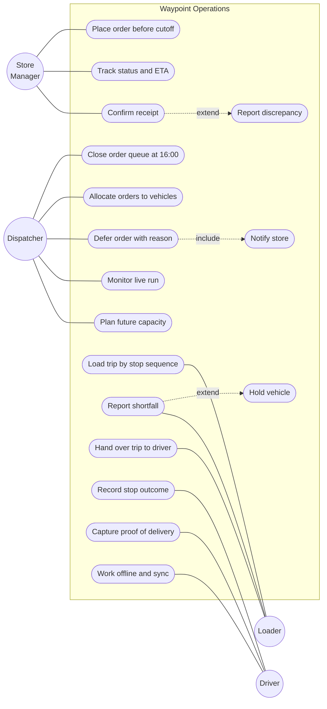
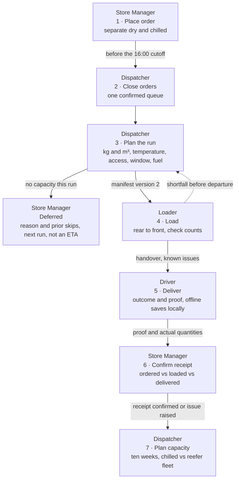
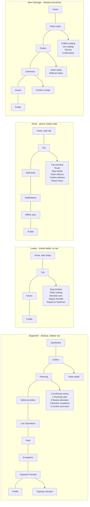
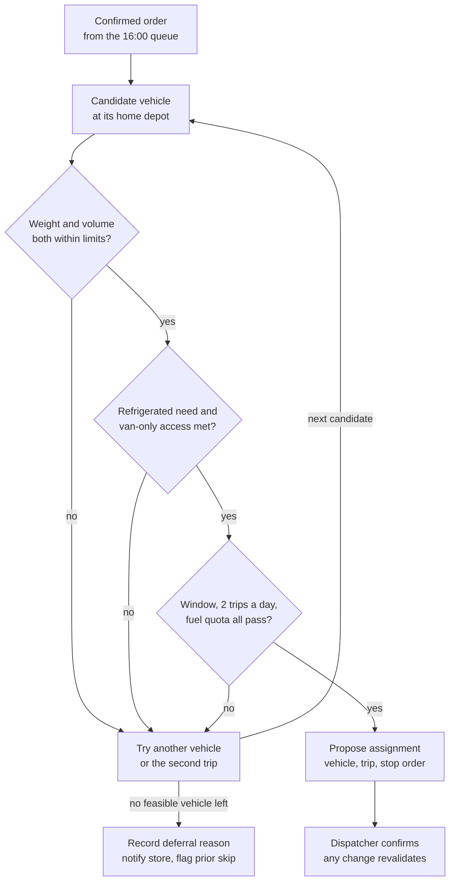
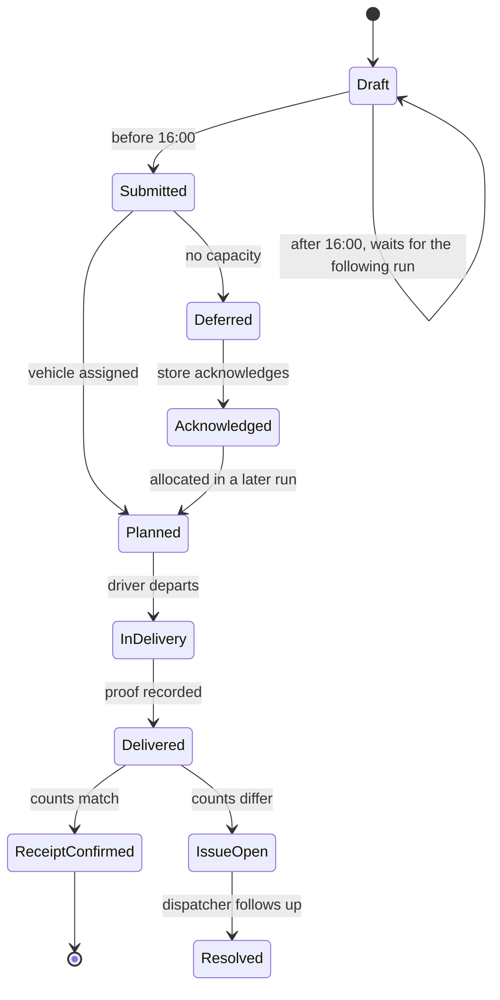

# Waypoint Operations — Design Rationale, Diagrams, AI Disclosure, Tradeoff & Style Guide

| | |
|---|---|
| **Covers** | Designathon deliverables 4–8: rationale, diagrams, AI tool disclosure, core tradeoff, style guide |
| **Prototype** | [Waypoint Operations (Figma)](https://www.figma.com/design/nfP1ZRvqcF2cJ4cWeZqyvT/Waypoint-Operations-%E2%80%93-Planning--Confirmed-Orders-?node-id=412-8555) |
| **Basis** | Tech-Triathlon 2026 Challenge Booklet pp. 3–10; design tokens read from the Figma `Waypoint Gold` and `Driver Mobile` variable collections |
| **Shared demo day** | Tue 29 Sep 2026 · order `ORD-1163` at `OUT023` on `VEH014` traceable across all four roles |
| **Companion doc** | https://claude.ai/code/artifact/8bc81dab-5083-4792-bfa7-acba57842d6f (same content, rendered diagrams) |

Sample IDs, names and forecast figures are illustrative design data, not real records or a built prediction model.

---

## 1. Design rationale

Every screen answers two questions: what state is this decision in, and what is the next safe action for me. The failures named in the brief are failures of record and handoff — a deferral nobody wrote down, a printed list that went stale, a delivery nobody can prove — so the interface is built to make state visible and decisions attributable, not to look busy.

### 1.1 Four principles

1. **Assisted allocation, human accountability.** The system proposes and validates; the dispatcher chooses and records. A person must be able to explain a deferral to a store manager.
2. **State before decoration.** Confirmed, planned, loading, deferred, in delivery, delivered, receipt confirmed and waiting-to-sync are distinct, labelled states — never merged into one "done".
3. **Show the next safe action.** Tablet shows the next stop to load, phone shows the next stop to deliver, counter shows the next order to receive. One primary action per screen.
4. **One event, four views.** A manifest change, a shortfall or an offline record appears in every role it affects, with the same numbers.

### 1.2 Navigation

The dispatcher gets a persistent dark sidebar with nine destinations, and planning lives inside one of them as a five-step linear flow rather than five nav items. Planning is a single session that ends in an irreversible release, so the flow needs a visible position and a gate — a half-built plan must never read as current.

The loader gets no sidebar at all. A shared dock tablet is used standing, at speed, sometimes with gloves, so the hierarchy is three levels deep at most: Home → Trip → Order, with one gold primary button per screen and a persistent back path.

The driver gets a bottom tab bar within thumb reach, and the route itself is one vertical stack. The store manager gets flat destinations, because a counter user arrives with one errand — order, check, or receive — and should not navigate a planning tool.

### 1.3 Layout, per device and environment

| Role | Frame | Layout decision | Problem it solves |
|---|---|---|---|
| Dispatcher | 1280–1536 desktop | List and map side by side; a vehicle opens in a right drawer, not a new page | Geographic clusters and access limits are spatial facts; the drawer keeps the allocation overview while one route is inspected (P1) |
| Loader | 1024 × 768 tablet | Vertical six-step timeline, Stop 6 first | The list mirrors the physical load order: last stop loads at the rear, first stop at the front because it unloads first (P4) |
| Driver | 402 × 874 phone | One card equals one decision; large targets; no side-by-side comparisons | Interactions happen when safely stopped, in daylight glare, one-handed (P7) |
| Store Manager | Desktop and phone | Same components at both widths; receipt comparison is a two-column ordered-vs-delivered table | The counter may be a phone; the comparison must survive the narrow width (P4) |

### 1.4 Components

Status is carried by a labelled chip, never by colour alone, and the same chip renders identically in all four roles. Temperature, access and vehicle type share one token set — `type/fridge`, `type/normal`, `type/van` — so a reefer looks the same to the dispatcher, the loader and the driver.

Capacity is always a pair of bars, kilograms and cubic metres, because a load is legal only if both limits pass. A single "utilisation" figure would hide the Style-versus-Tech difference the brief describes: garments fill volume, appliances hit weight.

Three components exist purely to carry accountability: the **manifest version badge** on every loader and driver screen, the **decision record card** that shows who deferred an order and why, and the **prior-skip flag** on an outlet that was already passed over.

### 1.5 Notifications

Notifications are consequences addressed to a role, and the ones that change what somebody is physically doing require an acknowledgement rather than a badge. A dispatcher manifest update blocks further loading until the loader acknowledges it; a deferral notice asks the store manager to acknowledge; a sync conflict asks the driver to review.

Routine success is deliberately quiet. There is no push for an order that simply planned normally, because a feed that announces everything trains people to dismiss the one message that mattered.

### 1.6 Interactions

Bulk selection and exclusion are reversible and show a live selected count, so a fast planning edit never silently removes demand. Drag-to-rebalance previews the changed load and re-runs the constraint checks; an invalid drop is refused with the rule it broke, not just rejected.

The one hard stop in the product is the defer modal: a reason is required before the order can move. That single piece of friction is the design's answer to the brief's repeated-skip problem, and it is what makes the store's deferral notice possible.

Barcode scanning is an accelerator, never a dependency — every item can also be tapped, because a scanner fails more often than a finger does. Offline never disables the task: the banner states that work is saved on this phone, the queue shows how many actions are pending, and reconciliation reports what synced and what needs review.

### 1.7 Truthfulness rules the copy obeys

- **Order received** is not **vehicle assigned**; no ETA is shown before allocation.
- **Deferred to the next run** is not a promise; the date stays labelled awaiting allocation.
- **Driver delivered** is not **store accepted**; receipt confirmation is a separate event.
- **Tracking paused** shows a last-seen time, never a stale value styled as live.
- **Ordered, loaded and delivered** are three separate quantities; a shortfall never collapses into the ordered figure.

---

## 2. Diagrams

### 2.1 Use case diagram

Four actors, one system boundary. Deferring always includes notifying the store, which is why the reason field is mandatory.

### 2.2 User flow / cross-role service blueprint

Stages 1–7. Every arrow is labelled with what actually travels; the deferral branch is the one that used to go unrecorded.

### 2.3 Information architecture

Top level in bold; screens inside a flow are indented. The dispatcher carries nine destinations, the loader four and the driver six.

`Offline sync` is the named degradation screen: reachable from any stop, never buried in Profile.

### 2.4 System workflow — allocation and deferral gates

Gates run in the order that eliminates candidates fastest. When no vehicle survives, the flow leaves the machine and lands on a person who has to type a reason.

### 2.5 Order lifecycle state model

Delivered is not received: the store confirmation is its own state.

### 2.6 Sequence — the named degradation, "signal lost during delivery"

The dashed messages are the honest ones: a last-seen time and a paused-tracking state, never a stale position styled as live.

### 2.7 AI interaction flow

The assisted lane never reaches a store on its own. Step 5 publishes only what a person accepted in step 4.

**Never automated:** which store waits, the words of the reason, and the store's receipt confirmation.

---

## 3. Core tradeoff

**We chose assisted allocation over full automation: the system does the constraint arithmetic, but a named human owns every deferral.** That costs clicks on a 186-order day and it means the plan is only as fast as the dispatcher reviewing it.

The brief says that when demand exceeds capacity, the dispatcher decides who waits and records why. An optimiser could pick the same orders in a second, but nobody could then tell a store manager in Nugegoda why their chilled order was skipped twice in a row. Accountability, not throughput, is the failing part of the current process.

| | Full automation | Assisted allocation (chosen) |
|---|---|---|
| Plan produced in | Seconds, unattended | Seconds, then a review pass |
| Who owns a deferral | Nobody nameable | The dispatcher, by name and timestamp |
| Store explanation | "The system decided" | Reason code, prior-skip count, next planning run |
| Handles the unmodelled | Poorly — a vehicle in the workshop, a new mall rule | The dispatcher overrides, and the override is validated |
| Cost | — | Review time on every run; a slower path on a quiet day |

What we kept from automation: the generated candidate plan, the constraint gate that blocks an infeasible assignment, the ranked suggested fix on every exception, and the revalidation that runs after any human change. The dispatcher never does arithmetic — they do judgement.

**Two smaller tradeoffs.** *Loader on a tablet, not a phone:* a shared dock tablet fits the shared, stationary, gloved reality of the dock and makes the six-step timeline legible at arm's length; the cost is that the Hackathon judges the loader at phone width, so phone states exist in the file as exploration. *A quiet dispatcher release gate:* confirm-and-send needs an extra deliberate confirmation showing totals, manifest version and recipients, which slows the last step of a long session — exactly where an unfinished plan would otherwise be broadcast as current.

---

## 4. AI tool disclosure

AI tools were used throughout this Designathon, as design and documentation assistants under human direction. Every screen, number and decision in the submission was reviewed by a team member.

| Tool | What it was used for |
|---|---|
| **OpenAI Codex** | Booklet analysis, flow and rationale drafting, copy refinement, cross-checking screens against the brief's constraints |
| **Claude Code + Figma MCP** | Reading and editing the Figma file programmatically: building and correcting frames, applying design tokens, auditing all screens against the brief, and generating this document and its diagrams |
| **Figma agent** | In-canvas design generation and layout assistance while building screens |

**What the humans did.** The team framed the problem, chose the four roles and the scope, set the visual direction and the charcoal-white-gold palette, chose the loader's tablet-first layout, decided the core tradeoff, and picked which screens were worth designing and which were not. Every AI-produced frame, label and figure was inspected in Figma and corrected where it drifted from the brief.

**How the output was checked.** AI-assisted work was verified against the Challenge Booklet constraint by constraint — operating days, the 16:00 cutoff, the Fresh before-08:00 window, weight and volume limits, refrigerated-vehicle rules, van-only access, two trips a day and weekly fuel quotas. Where the prototype's data is still illustrative, notably the ten-week forecast, it is labelled as such rather than presented as a model output.

> **Before submitting:** confirm this list matches what the team actually used, add any tool this misses, and remove any it names wrongly. An inaccurate disclosure is worse than a modest one.

---

## 5. Style guide

Two token collections cover the system: **Waypoint Gold** for the three desktop and tablet roles, and **Driver Mobile** for the phone. They share the type scale and the spacing step, and differ only where the phone needs deeper contrast outdoors. Values below are read from the Figma variable collections.

### 5.1 Colour — Waypoint Gold (Dispatcher, Loader, Store Manager)

| Token | Hex | Use |
|---|---|---|
| `brand/primary` | `#ffc20e` | Primary actions, the current step, live status |
| `brand/primary-soft` | `#fff6dc` | Selected rows, active pill background |
| `brand/primary-border` | `#f5d573` | Border on soft brand surfaces |
| `text/on-brand` | `#111111` | Text on gold |
| `text/brand` | `#8a5a00` | Brand-coloured text that must pass contrast |
| `bg/sidebar` | `#151515` | Dispatcher navigation |
| `bg/sidebar-raised` | `#202020` | Raised sidebar surfaces |
| `border/sidebar` | `#2b2b2b` | Sidebar dividers |
| `bg/surface` | `#ffffff` | Cards, tables, modals |
| `bg/subtle` | `#f6f6f8` | Page background |
| `bg/muted` | `#e6e7eb` | Progress tracks, disabled fills |
| `text/primary` | `#111827` | Body text |
| `text/secondary` | `#6b7280` | Labels, metadata |
| `text/tertiary` | `#9aa1ac` | Placeholders, timestamps |
| `text/on-dark` | `#e8e8e8` | Sidebar text |
| `text/on-dark-muted` | `#a3a3a3` | Sidebar secondary text |
| `border/default` | `#e4e6eb` | Card and table borders |
| `border/strong` | `#d9dce2` | Inputs, emphasised dividers |

### 5.2 Colour — Driver Mobile

| Token | Hex | Use |
|---|---|---|
| `brand/yellow` | `#ffc400` | Primary action, current stop |
| `brand/navy` | `#101820` | App bar, trip header |
| `text/on-yellow` | `#101820` | Text on the primary button |
| `text/on-navy` | `#ffffff` | Header text |
| `text/on-navy-muted` | `#9aa5b1` | Header secondary text |
| `surface/white` | `#ffffff` | Cards |
| `surface/bg` | `#f7f8fa` | Screen background |
| `surface/muted` | `#eef0f3` | Inactive segments |
| `border/default` | `#e5e7eb` | Card borders |
| `status/info` | `#2563eb` | Sync and information states |

### 5.3 Semantic and domain colour

Domain colour is fixed across roles, so a refrigerated load reads the same to the dispatcher, the loader and the driver. Colour never carries meaning alone — every chip also carries its word.

| Token | Hex | Meaning |
|---|---|---|
| `status/success` | `#22c55e` | Loaded, delivered, receipt confirmed |
| `status/warning` | `#b45309` | Window risk, shortfall, needs review |
| `status/warning-soft` | `#fef0dc` | Warning banner background |
| `status/danger` | `#ef4444` | Failed delivery, blocked departure, hold |
| `type/fridge` / `-soft` | `#1e8e4a` / `#daf3e1` | Chilled and frozen |
| `type/normal` / `-soft` | `#1a73e8` / `#e0edff` | Ambient, dry-box |
| `type/van` / `-soft` | `#d93025` / `#fde6e6` | Van-only access |
| `route/2`, `route/4`, `route/6` | `#0d9488`, `#db2777`, `#b45309` | Route identity on maps and timelines |

### 5.4 Typography

Plus Jakarta Sans carries display and heading weight; Geist carries the interface; Geist Mono carries every identifier, so `ORD-1163`, `VEH014` and `OUT023` are never mistaken for prose.

| Style | Family | Size / line | Weight | Tracking |
|---|---|---|---|---|
| Display/L | Plus Jakarta Sans | 32 / 40 | 800 | −2 |
| Heading/L | Plus Jakarta Sans | 22 / 30 | 700 | −1 |
| Heading/S | Geist | 15 / 22 | 600 | 0 |
| Body/M, Body/M Medium | Geist | 14 / 20 | 400, 500 | 0 |
| Body/S, Medium, Strong | Geist | 13 / 18 | 400, 500, 600 | 0 |
| Caption, Caption Medium | Geist | 12 / 16 | 400, 500 | 0 |
| Overline | Geist | 11 / 16 | 600 | +6 |
| Button/M, Button/L | Geist | 14 / 20, 16 / 24 | 600 | 0 |
| Mono/S | Geist Mono | 12 / 18 | 500 | 0 |

### 5.5 Spacing, radius, elevation

Spacing runs on a 2-based step: 2, 4, 6, 8, 10, 12, 16, 20, 24, 28. Desktop cards use 20–24 padding, tablet 24, phone 16.

Radii are `xs` 6, `sm` 8, `md` 12, `lg` 16 and `full` 999 on desktop; the phone runs softer at `sm` 10 and `md` 14. Elevation is one token only — `Elevation/1`, two stacked shadows at `0 1 2` and `0 1 3` — because depth is used for overlays, never for decoration. Focus is a 3 px ring at `#E0A800` 25%.

### 5.6 Buttons

| Variant | Fill | Text | Where |
|---|---|---|---|
| Primary | `brand/primary` | `text/on-brand` | One per screen: Generate plan, Load Stop 1, Confirm Delivery, Submit Order |
| Secondary | `bg/surface` + `border/strong` | `text/primary` | Cancel, Back, Choose vehicle |
| Ghost | none | `text/secondary` | Table row actions, tertiary links |
| Destructive | `status/danger` | white | Hold vehicle, Defer order |
| Driver primary | `brand/yellow` | `text/on-yellow` | Full-width, 56 px tall, thumb reach |

### 5.7 Icons

One 20 px outline set at 1.5 px stroke, inheriting the text colour beside it. Icons are neutral by default; gold is reserved for actions and current state, so an icon never competes with the primary button for attention. Every icon-only control carries a label or an accessible name.

### 5.8 Components

Status chip · temperature and access badge · dual capacity bar (kg and m³) · vehicle card · stop timeline step · order line row with quantity check · manifest version badge · decision record card · prior-skip flag · offline banner · sync queue row · proof block (photo, signature, recipient, time) · ordered-versus-delivered comparison row.

### 5.9 States

Every interactive component ships with default, hover, focus, active, selected, disabled, loading, empty, error and offline. Three states are mandatory on any screen that records an outcome: **pending** (nothing recorded yet), **recorded locally** (saved on the device, not synced) and **confirmed** (the server holds it). Collapsing those three is what loses a delivery record, so the design keeps them visually distinct.
