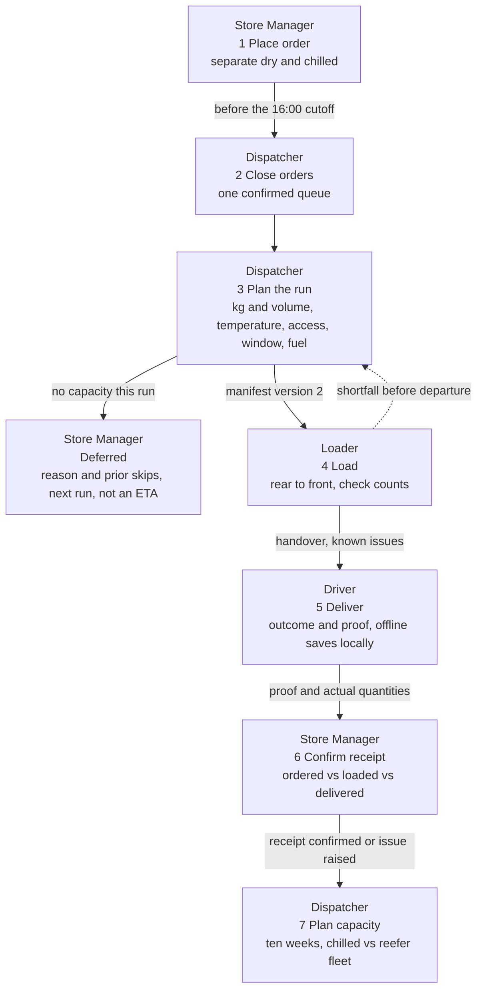
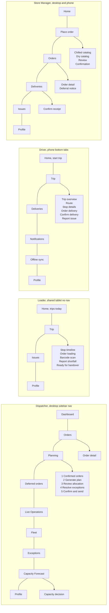
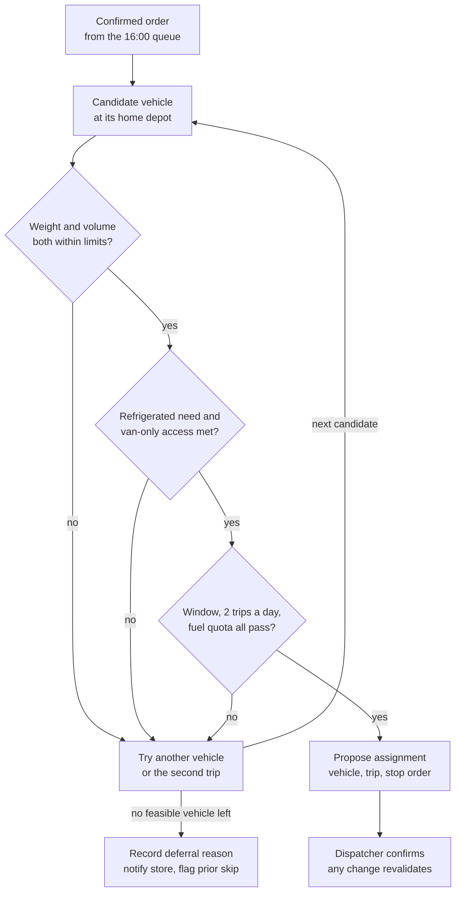
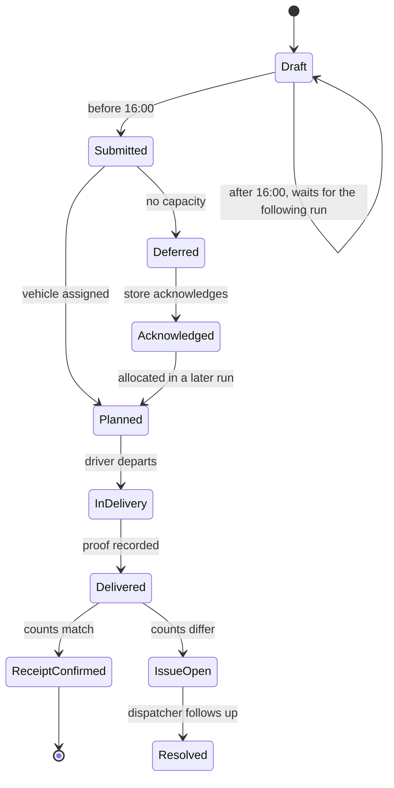
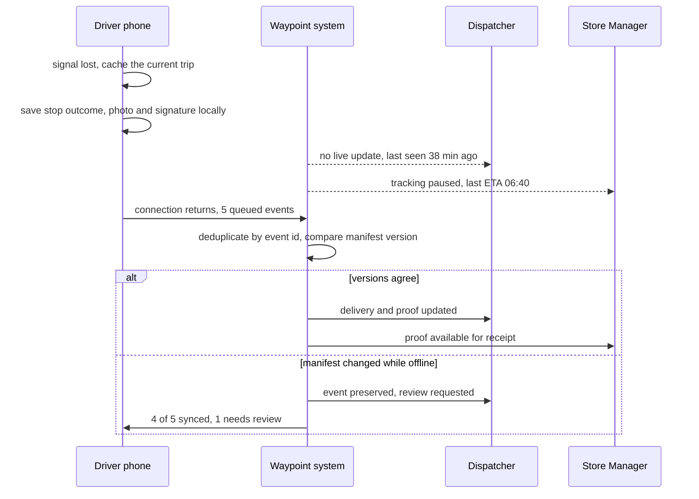
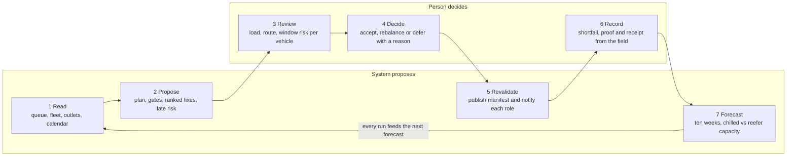

# Waypoint Operations - Designathon submission companion

| | |
|---|---|
| **What this is** | The written half of the Tech-Triathlon 2026 Day 5 Designathon submission:- personas, screen flows with a rationale per screen, the named degradation scenario, diagrams, AI tool disclosure, the core tradeoff and the style guide |
| **Prototype** | [Waypoint Operations (Figma)](https://www.figma.com/design/nfP1ZRvqcF2cJ4cWeZqyvT/Waypoint-Operations-%E2%80%93-Planning--Confirmed-Orders-?node-id=412-8555) |
| **Basis** | Challenge Booklet pp. 3-10; design tokens read from the Figma `Waypoint Gold` and `Driver Mobile` variable collections |
| **Shared demo day** | Tue 29 Sep 2026, orders closed Mon 28 Sep at 16:00 |
| **Traceable example** | `ORD-1163` chilled and `ORD-1165` dry at `OUT023`, on `VEH014` Trip 1, Stop 2 |
| **Rendered version** | https://claude.ai/code/artifact/8bc81dab-5083-4792-bfa7-acba57842d6f |

Sample IDs, names and forecast figures in the prototype are illustrative design data, not real customer records and not the output of a built prediction model.

---

## 1. Scope and basis

The design is one connected system:- a single confirmed-order queue produces a constraint-checked plan, dispatch records every decision, loading follows the current manifest, the driver records each outcome even offline, and the store confirms what actually arrived.

### 1.1 Prototype entry points

| Role | Start here | Device frame |
|---|---|---|
| Dispatcher | [1A Confirmed Orders](https://www.figma.com/design/nfP1ZRvqcF2cJ4cWeZqyvT/Waypoint-Operations?node-id=21-598) | Desktop, 1280 to 1536 px |
| Loader | [Loader Home](https://www.figma.com/design/nfP1ZRvqcF2cJ4cWeZqyvT/Waypoint-Operations?node-id=93-7502) | Tablet, 1024 x 768 |
| Driver | [Driver Home](https://www.figma.com/design/nfP1ZRvqcF2cJ4cWeZqyvT/Waypoint-Operations?node-id=55-5282) | Phone, 402 x 874 |
| Store Manager | [Store Home](https://www.figma.com/design/nfP1ZRvqcF2cJ4cWeZqyvT/Waypoint-Operations?node-id=87-6649) | Desktop and phone |

---

## 2. Problems the design answers

The brief names seven failures. Each one has a screen that answers it, and no screen exists that answers none of them.

| | Problem in the brief | What the design does | Where it shows |
|---|---|---|---|
| P1 | Planning is fragmented across calls, messages and spreadsheets | One confirmed queue, an assisted plan, validated constraints and recorded overrides | Dispatcher 1A to 5B |
| P2 | Nobody can see progress after vehicles leave | Live Operations with trip state and last update, fed by driver stop outcomes | Live Operations, Exceptions |
| P3 | Deferrals are unrecorded and the same outlet is skipped repeatedly | A reason is required, the decision is logged, prior skips are flagged and the store is told | Defer modal, Deferred Orders, store Deferral Notice |
| P4 | No feedback loop:- no proof of delivery, no shortfall flag | Predeparture shortfall, proof of delivery, line-by-line receipt confirmation | Loader Report Shortfall, Driver Delivery Confirmation, Store Confirm Receipt |
| P5 | Demand is hard to anticipate around paydays and festivals | Ten-week depot and brand forecast against fleet and chilled capacity | Capacity Forecast, Capacity Decision |
| P6 | Service time and lateness are not predicted | Window risk and predicted lateness shown beside the real delivery window | Review allocation, Live Operations |
| P7 | Field connectivity is unreliable | Local capture, a visible sync queue, honest last-seen labels and reconciliation | Driver Offline Sync, Sync Reconciled |

---

## 3. Operating constraints the design respects

**The network.** 120 outlets in 12 districts (`OUT001` to `OUT120`), two depots - the Peliyagoda distribution centre and the Kandy regional hub - and 60 vehicles (`VEH001` to `VEH060`). The fleet is 12 refrigerated trucks, 40 dry-box trucks and 8 vans of which 4 are refrigerated, so only 16 vehicles can carry chilled goods. Waypoint Fresh has 80 outlets, Style 25 and Tech 15.

| Constraint | How the interface shows it |
|---|---|
| Weight **and** volume must both fit | Two bars on every vehicle card and loader trip, never a single utilisation figure |
| Chilled and frozen need a refrigerated vehicle; a reefer may carry ambient | Temperature badge on the order, the vehicle and the loading zone |
| `van_only` outlets cannot take a truck | Access chip in the queue, and van-only alternatives in Change vehicle |
| Unloading differs:- rear dock, curb or shared mall bay | Access instructions on the driver Stop Details before unloading |
| Every outlet has a fixed window; Fresh arrives before 08:00 | Window shown read-only to the store, and as risk on the dispatcher timeline |
| Mall outlets accept goods only in the mall's own window | Mall window on the stop and as an exception type in triage |
| A vehicle works only from its home depot | Depot named on the vehicle card and in the alternatives list |
| At most two routes a day per vehicle | Trip 1 and Trip 2 on the vehicle card, the loader home and the driver home |
| Weekly fuel quota limits route distance | Quota remaining on the vehicle card and as an exception reason |
| The fleet runs Monday to Saturday | Plan dates and the next-run date never land on a Sunday |
| Orders close at 16:00; later orders wait for the following run | Cutoff banner on the queue and a countdown on the store order |
| Fresh orders dry and chilled separately for the same day | Two separate orders, two IDs, two temperature paths |
| When demand exceeds capacity the dispatcher picks and records | Required reason, consequence preview and prior-skip count |
| Coverage drops in the hill country and rural districts | Offline capture, sync queue and last-seen labels instead of false live status |

---

## 4. Personas

One persona per role, built from the brief's description of the work rather than from invented biography. The names and shifts are prototype detail; the environment, device and pressure are what the design is built against.

### Dilani Mendis - Dispatcher

Large screen, Peliyagoda planning office, stable connection. After the 16:00 cutoff she consolidates the day's orders and balances 60 vehicles against volume, weight, temperature, access, windows and fuel, then watches the run once trucks leave. Her hardest moment is an over-capacity day, when she has to choose who waits and answer for it later. She needs the previous-skip history in front of her before she defers anything, and a record that survives the phone call the next morning.

**Design response:-** one queue, a five-step flow with a release gate, constraint warnings in place, a required deferral reason, and Live Operations that admits when a vehicle has gone quiet.

### Kamal Jayawardena - Loader

Shared tablet at the Peliyagoda dock, standing, at speed, often in the dark before the Fresh run. His printed list goes out of date the moment dispatch changes the plan, and a missing case only becomes visible at the store. He needs the current manifest, the stop sequence that tells him what to load first, and a way to flag a short or damaged item before the vehicle pulls out.

**Design response:-** a manifest version he must acknowledge, a six-step rear-to-front timeline, quantity checks per line, and a shortfall report that reaches dispatch while the truck is still on the bay.

### Kasun Perera - Driver

Personal phone, on the road, Colombo district before dawn and the Kandy corridor later. He interacts only when safely stopped, in glare, one-handed. Today he carries a paper run sheet and makes phone calls when something goes wrong, and coverage drops for long stretches exactly when Fresh deliveries are due. He needs the next stop, the window and access instructions, and confidence that what he records is not lost.

**Design response:-** large single-decision cards, access and window on the stop before unloading, proof capture with photo, signature, recipient and time, and an offline queue that says in plain words what is saved and what still needs review.

### Shanika Munasinghe - Store Manager

Counter at Waypoint Fresh Colombo 07 (`OUT023`), desktop or phone, serving customers while she orders. She places a dry and a chilled order for the same delivery day and needs both confirmed before the cutoff. On delivery morning she must roster receiving staff, so a credible arrival time matters more than a precise one, and when an order is deferred she needs a reason she can repeat to her own team.

**Design response:-** a cutoff countdown, a read-only outlet window, confirmation without an invented ETA, a deferral notice with reason and next run, and a receipt screen comparing ordered, loaded and delivered line by line.

---

## 5. Design rationale

Every screen answers two questions:- what state is this decision in, and what is the next safe action for me. The failures named in the brief are failures of record and handoff - a deferral nobody wrote down, a printed list that went stale, a delivery nobody can prove - so the interface is built to make state visible and decisions attributable, not to look busy.

### 5.1 Four principles

1. **Assisted allocation, human accountability.** The system proposes and validates; the dispatcher chooses and records. A person must be able to explain a deferral to a store manager.
2. **State before decoration.** Confirmed, planned, loading, deferred, in delivery, delivered, receipt confirmed and waiting-to-sync are distinct, labelled states, never merged into one "done".
3. **Show the next safe action.** Tablet shows the next stop to load, phone shows the next stop to deliver, counter shows the next order to receive. One primary action per screen.
4. **One event, four views.** A manifest change, a shortfall or an offline record appears in every role it affects, with the same numbers.

### 5.2 Navigation

The dispatcher gets a persistent dark sidebar with nine destinations, and planning lives inside one of them as a five-step linear flow rather than five nav items. Planning is a single session that ends in an irreversible release, so the flow needs a visible position and a gate. A half-built plan must never read as current.

The loader gets no sidebar at all. A shared dock tablet is used standing, at speed, sometimes with gloves, so the hierarchy is three levels deep at most:- Home, then Trip, then Order, with one gold primary button per screen and a persistent back path.

The driver gets a bottom tab bar within thumb reach, and the route itself is one vertical stack. The store manager gets flat destinations, because a counter user arrives with one errand, order or check or receive, and should not have to navigate a planning tool.

### 5.3 Layout, per device and environment

| Role | Frame | Layout decision | Problem it solves |
|---|---|---|---|
| Dispatcher | 1280 to 1536 desktop | List and map side by side; a vehicle opens in a right drawer, not a new page | Geographic clusters and access limits are spatial facts; the drawer keeps the allocation overview while one route is inspected (P1) |
| Loader | 1024 x 768 tablet | Vertical six-step timeline, Stop 6 first | The list mirrors the physical load order, because the last stop loads at the rear and the first stop at the front where it unloads first (P4) |
| Driver | 402 x 874 phone | One card equals one decision; large targets; no side-by-side comparisons | Interactions happen when safely stopped, in daylight glare, one-handed (P7) |
| Store Manager | Desktop and phone | Same components at both widths; receipt comparison is a two-column ordered-versus-delivered table | The counter may be a phone; the comparison must survive the narrow width (P4) |

### 5.4 Components

Status is carried by a labelled chip, never by colour alone, and the same chip renders identically in all four roles. Temperature, access and vehicle type share one token set, `type/fridge`, `type/normal` and `type/van`, so a reefer looks the same to the dispatcher, the loader and the driver.

Capacity is always a pair of bars, kilograms and cubic metres, because a load is legal only if both limits pass. A single utilisation figure would hide the Style-versus-Tech difference the brief describes:- garments fill volume, appliances hit weight.

Three components exist purely to carry accountability:- the **manifest version badge** on every loader and driver screen, the **decision record card** that shows who deferred an order and why, and the **prior-skip flag** on an outlet that was already passed over.

### 5.5 Notifications

Notifications are consequences addressed to a role, and the ones that change what somebody is physically doing require an acknowledgement rather than a badge. A dispatcher manifest update blocks further loading until the loader acknowledges it; a deferral notice asks the store manager to acknowledge; a sync conflict asks the driver to review.

Routine success is deliberately quiet. There is no push for an order that simply planned normally, because a feed that announces everything trains people to dismiss the one message that mattered.

### 5.6 Interactions

Bulk selection and exclusion are reversible and show a live selected count, so a fast planning edit never silently removes demand. Drag-to-rebalance previews the changed load and re-runs the constraint checks; an invalid drop is refused with the rule it broke, not just rejected.

The one hard stop in the product is the defer modal:- a reason is required before the order can move. That single piece of friction is the design's answer to the brief's repeated-skip problem, and it is what makes the store's deferral notice possible.

Barcode scanning is an accelerator, never a dependency, because every item can also be tapped and a scanner fails more often than a finger does. Offline never disables the task:- the banner states that work is saved on this phone, the queue shows how many actions are pending, and reconciliation reports what synced and what needs review.

### 5.7 Truthfulness rules the copy obeys

- **Order received** is not **vehicle assigned**; no ETA is shown before allocation.
- **Deferred to the next run** is not a promise; the date stays labelled awaiting allocation.
- **Driver delivered** is not **store accepted**; receipt confirmation is a separate event.
- **Tracking paused** shows a last-seen time, never a stale value styled as live.
- **Ordered, loaded and delivered** are three separate quantities; a shortfall never collapses into the ordered figure.

---

## 6. Screen flows and screen rationales

Every designed screen and why it exists, role by role. Variants with a filter open, a tab selected or a confirmation showing are interaction states of the screen above them, not separate screens.

### 6.1 Dispatcher flow

1. After 16:00 the order window closes and confirmed orders arrive in one queue.
2. Generate a candidate plan; the system validates both capacities, temperature, depot, access, window, trips and fuel.
3. Review the allocation per vehicle and rebalance where a route is uneven or at risk.
4. Resolve exceptions:- apply a suggested fix, split a delivery, or defer with a recorded reason.
5. Confirm and send, which publishes the manifest to the dock and the status to each store.
6. Watch the run in Live Operations and close exceptions as they arrive.
7. Review the ten-week forecast and record a capacity decision for peak weeks.

| Dispatcher screen | Why it exists |
|---|---|
| 1A Confirmed Orders | One post-cutoff queue replaces calls and spreadsheets; the cutoff banner and prior-skip flags say which orders are in scope and which decisions need care. |
| 1B Selection and bulk actions | Bulk include and exclude is visible, counted and undoable, so a fast planning edit never silently removes demand. |
| 1C Map split view | A linked list and map expose geographic clusters, distant outliers and access limits while the filters and the primary action stay in view. |
| 2A Generating plan | Named stages and running counts explain what the allocator is checking, and the dispatcher can cancel before accepting a result. |
| 2B Plan ready | Totals lead with what is unplaced and at risk, so attention goes to unresolved work rather than to successful routine assignments. |
| 3A Review allocation | Vehicle, route and day timeline sit together with weight, volume, distance and window risk, so feasibility is judged in one place. |
| 3B Drag to rebalance | A proposed move previews its effect on both capacities and still has to pass the gates, giving human control without silent invalid assignments. |
| 3C Vehicle plan drawer | One vehicle's stops can be inspected without losing the overall allocation behind it. |
| 3D Change vehicle | Alternatives are offered only when they pass capacity, temperature, access and home-depot rules, so a swap cannot create a new violation. |
| 4A Exceptions triage | Every unplaced order carries a reason, a ranked fix and its impact, so assign, split and defer can be compared instead of the order being quietly dropped. |
| 4A+ Defer order, reason required | The required reason, the original window, the next run and the repeat-skip count make the decision explainable and supply the text of the store's notice. |
| 4B All exceptions resolved | The resolution log is a final read of every applied fix and deferral before anything is sent. |
| 5A Confirm and send | A release gate showing totals, manifest version and recipients stops an unfinished plan being communicated as current. |
| 5A+ Send confirmation | The irreversible communication step gets one explicit confirmation. |
| 5B Plan sent | Sent and acknowledged states close the handoff and establish which manifest version the dock is working from. |
| 6 Deferred Orders | Reasons, feasible options and prior skips stay visible after the planning session, which is what prevents silent repeat non-service. |
| Dashboard | Shift priorities, open exceptions and planning status are visible before any detailed task is opened. |
| Orders | One searchable operational list across every status, for questions that arrive mid-shift. |
| Order Detail | One order's cutoff, status, assignment and decision history, so a store's question is answered without reopening the planning wizard. |
| Live Operations | After departure, progress and last update per vehicle, with an offline last-seen state instead of a false live position. |
| Fleet | Availability, temperature type, capacity and remaining quota, which is what makes a manual reassignment a decision rather than a guess. |
| Exceptions | Loader and driver reports tracked with an owner and a next action once the plan is released. |
| Capacity Forecast | Ten weeks of total and chilled demand against depot fleet capacity, labelled illustrative until checked against the supplied datasets. |
| Capacity Decision | A peak-week recommendation turned into an action with an owner and a date, rather than treating forecast volume as a guaranteed vehicle count. |
| Profile | Shift and account context, supporting the role without competing with planning. |

### 6.2 Loader flow

1. Open Home and pick the assigned trip; next departure, bay and progress lead.
2. Confirm the current manifest version before trusting anything printed.
3. Read the six-step timeline and load rear to front.
4. Check each product line by tap or barcode.
5. Report a missing, damaged or wrong item before departure, holding the vehicle if it is unsafe to leave.
6. Complete every stop, review final weight and volume, mark the trip loaded and hand it to the driver.
7. Follow open issues until dispatch closes them.

| Loader screen | Why it exists |
|---|---|
| Home | Trips assigned, orders to load, orders loaded and open issues, resolving into one Continue Loading action for a shared tablet. |
| Trip timeline | Six connected steps show the physical loading order; Stop 6 loads first because it unloads last, and only the current step is gold. |
| Order loading | Product lines, checked and pending counts, barcode verification and the shortfall action live in the same context as the stop. |
| Barcode scan | A faster verification path that never becomes the only path, because a scanner fails more often than a finger. |
| Report shortfall | Item, problem type, short quantity, optional photo and a hold decision produce a usable predeparture event, with a preview of what dispatch and the store will see. |
| Shortfall recorded | The order shows the actual available quantity, so a reported issue is never mistaken for a complete load. |
| All items checked | The loader can see that every line is accounted for before a stop is marked done. |
| Ready for handover | Six of six stops, final weight and volume and the current manifest version, reviewed in one place before the driver takes the trip. |
| Trip completion | Records the loader-to-driver handoff and departure readiness, with known exceptions attached. |
| Issues | Reported, open and resolved counts with the dispatcher owner and the next action, so an early shortfall cannot disappear. |
| Manifest update | A new version is shown and must be acknowledged, so an outdated printed list cannot silently govern loading. |
| Vehicle hold | A blocking shortfall visibly stops a normal departure until dispatch gives instructions. |
| Profile | Depot, shift and shared-device account context, which matters most at handover. |

### 6.3 Driver flow

1. Sign in and inspect the handed-over trip, vehicle, stop count and any known loading shortfall.
2. Start the trip and follow the next-stop view; open navigation when moving.
3. At the outlet, when safely stopped, read the window and access instructions and mark arrival.
4. Check the order lines and record delivered, partly delivered or failed.
5. Capture proof:- photo, signature, recipient name and time.
6. Report a missing item, damage, refusal or absent customer as its own issue.
7. Complete the stop, move to the next, then submit the finished trip.
8. If signal drops, keep working; everything is saved locally and reconciled on reconnection.

| Driver screen | Why it exists |
|---|---|
| Login | A personal account ties every route action to the right driver and vehicle. |
| Home | Trip 1, Trip 2 and one obvious Start Trip action orient the driver before departure, with everything else secondary. |
| Trip Overview | The next stop and the full sequence give orientation without asking a driver to parse every order detail on the road. |
| Route | Large navigation and ETA answer the only question that matters while moving; detailed tasks wait until the driver is stopped. |
| Stop Details | Window, dock type, mall access, parking note, order count and chilled handling are known before unloading starts, and the offline banner sits here without removing the task. |
| Order Delivery | Actual lines and quantities are checked per order, so arriving at a stop is never mistaken for delivering everything correctly. |
| Delivery Confirmation | Outcome, photo, signature, recipient and timestamp form the proof the store and the dispatcher can inspect later. |
| Report Issue | A problem is captured against its own order and stop with a specific reason, instead of becoming a phone call nobody logged. |
| Issue Recorded | Confirmation that the record was saved or sent, so the driver can move on without chasing it. |
| Stop Completed | An explicit milestone that the stop is recorded, and what comes next. |
| Trip Completed | All stops and exceptions summarised before anything is submitted. |
| Trip Submitted | Dispatch is told the finished trip record is available. |
| Deliveries | Past outcomes stay findable rather than depending on memory. |
| Delivery Details | One delivery's proof, for the dispute that arrives two days later. |
| Notifications | Route updates, issues, receipts and sync results in one reviewable feed the driver can acknowledge before acting. |
| Offline Sync | The named degradation screen:- it promises local safety, names the count of saved actions and shows the last successful sync. |
| Sync Reconciled | Reconnection reports what synced and explains the one record that needs review, keeping the conflict as evidence. |
| Profile | Driver and vehicle account context, available without crowding the route. |

### 6.4 Store Manager flow

1. Before the 16:00 cutoff, build a chilled order and, where needed, a separate dry order for the same delivery day.
2. Review products, quantities, total and the outlet's fixed window, then submit.
3. Read the confirmation:- order ID, items and the run it is confirmed for, with no invented ETA.
4. After planning, see Planned with a window and ETA, or a Deferred notice with a reason and the next run.
5. On delivery morning, use the ETA to roster receiving staff, with a paused-tracking state when the driver's position is stale.
6. On arrival, compare ordered, loaded and delivered line by line against the driver's proof.
7. Confirm receipt, or report a discrepancy and follow it to resolution.

| Store Manager screen | Why it exists |
|---|---|
| Home | The next delivery, open orders and any unresolved issue take priority on a busy counter, so the manager can tell at a glance whether action is needed. |
| Chilled Catalog | Familiar product groups and a running total make the next-run order explicit, on the temperature path it belongs to. |
| Chilled Review | Quantities, total and the read-only outlet window are verified before the cutoff; the window is not something a store should silently change. |
| Chilled Confirmation | Order ID, item count and the confirmed run reassure the manager without promising an arrival time nobody has planned yet. |
| Dry Catalog | A separate ambient order reflects how Fresh actually orders, rather than blending incompatible temperature requirements. |
| Dry Review | The dry order is checked independently, so a temperature mistake cannot hide inside a combined basket. |
| Dry Confirmation | A separate ID and confirmation for the dry request, matching how it will be planned and loaded. |
| Orders | Submitted, Planned, In Delivery, Delivered, Issue and Deferred are distinguishable, so the store can plan around a specific order. |
| Order Detail | One order's products, window and changing status, traceable from submission to receipt. |
| Deliveries | Driver, vehicle, window and record after completion give the receiving team a credible operational view. |
| Delivery Route | Route progress and this outlet's ETA, with a last-update time, so a paused signal is never shown as live movement. |
| Confirm Receipt | Photo, signature, recipient and delivery time sit above a line-by-line ordered-versus-delivered comparison, with the loader's shortfall already flagged. |
| Receipt Confirmed | Acceptance is its own recorded event, which is what closes the loop back to dispatch. |
| Deferral Notice | The original window, the specific reason, the next planning run and staffing advice explain a disruptive decision without promising an unallocated ETA. |
| Issues | An outlet can report a mismatch and watch a dispatcher-owned resolution instead of restarting a phone call each morning. |
| Issue Report | Product, quantity and reason are captured against a particular delivery. |
| Issue Reported | Confirmation and a traceable open status, so the store knows the report exists. |
| Profile | Outlet and account identity, which keeps orders and confirmations attached to the right location. |

---

## 7. Named degradation scenario

**Signal lost during delivery.**

**Why this failure.** Mobile coverage drops for long stretches on the Kandy corridor and in rural districts, and that is exactly when the Fresh run is out, before outlets open at 08:00. Today a lost signal means a missed phone call and a paper note, so the delivery record is whatever somebody remembers. If the app simply stopped working without a connection, drivers would go back to paper and the proof would be gone.

**What the design does.** Every action is captured on the phone and the driver is told, in plain words, what is safely stored. Nothing is disabled:- the stop still opens, the order lines still check off, the photo, signature and recipient are still recorded. The banner says the work is saved on this phone, and the queue names how many actions are waiting and when the last sync succeeded.

| Role | What they see while the phone is offline |
|---|---|
| Driver | Offline banner on Stop Details and Delivery Confirmation, actions saved locally, a visible queue count, and a reconcile screen on reconnection |
| Dispatcher | The vehicle marked offline with a last-seen time, not a stale position styled as live |
| Store Manager | Tracking paused with the last known ETA, so receiving staff are not rostered against a number nobody is updating |

**The recovery.** On reconnection the queue syncs, and the reconcile screen reports what landed and what did not:- four of five records synced, one needs review. The one that needs review is the conflict case, where the plan moved while the driver was dark. In the prototype, `ORD-1204` was reassigned to `VEH021` during the blackout; the driver's record is preserved, flagged and escalated to the dispatcher rather than overwritten.

**The rule behind it.** Store a local event ID and a device timestamp for every action, sync idempotently so a retry cannot duplicate a delivery, compare the recorded manifest version against the server's current version, and keep a conflicting event as evidence for a person to judge. Proof is never deleted to make a sync succeed.

**What it protects.** The proof of delivery, the store's trust in what it was told, and the audit trail behind a disputed quantity, which are three of the failures the brief names (P4, P6 and P7).

**Secondary degradations designed as states, not full flows.** A plan change during loading, where the loader must acknowledge a new manifest version before continuing, and an over-capacity day, where the planner shows the shortfall and the prioritisation policy instead of silently trimming demand.

---

## 8. Scope and prioritisation

The brief judges restraint, so the scope was chosen against the seven workflow stages and nothing else.

**Designed in full:-** the order-to-receipt path across all four roles, the constraint-checked planning flow, the deferral decision record, the loader shortfall loop, proof of delivery, receipt confirmation, the ten-week capacity view, and the offline degradation with its recovery.

**Deliberately not designed,** because no stage of the brief needs them:- returns and reverse logistics, invoicing and payments, driver rostering and HR, customer-facing tracking, vehicle maintenance scheduling beyond a status, admin screens for creating outlets and vehicles, and any chat or messaging surface. Adding them would have cost screens without answering P1 to P7.

**Marked as supporting, not core:-** the four Profile screens, the notification feeds, search and filter states, and the modal confirmations. They exist so every interactive element in the prototype resolves, and they should not be read as product modules.

---

## 9. Diagrams

Mermaid sources below; rendered versions are in the companion document. Colons inside Mermaid blocks are syntax and are left as they are.

### 9.1 Use case diagram

Four actors, one system boundary. Deferring always includes notifying the store, which is why the reason field is mandatory.

### 9.2 User flow and cross-role service blueprint

Stages 1 to 7. Every arrow is labelled with what actually travels; the deferral branch is the one that used to go unrecorded.

### 9.3 Information architecture

The dispatcher carries nine destinations, the loader four and the driver six. `Offline sync` is the named degradation screen:- reachable from any stop, never buried in Profile.

### 9.4 System workflow, allocation and deferral gates

Gates run in the order that eliminates candidates fastest. When no vehicle survives, the flow leaves the machine and lands on a person who has to type a reason.

### 9.5 Order lifecycle state model

Delivered is not received:- the store confirmation is its own state.

### 9.6 Sequence diagram, offline capture and recovery

The dashed messages are the honest ones:- a last-seen time and a paused-tracking state, never a stale position styled as live.

### 9.7 AI interaction flow

The assisted lane never reaches a store on its own. Step 5 publishes only what a person accepted in step 4.

**Never automated:-** which store waits, the words of the reason, and the store's receipt confirmation.

---

## 10. Core tradeoff

**We chose assisted allocation over full automation:- the system does the constraint arithmetic, but a named human owns every deferral.** That costs clicks on a 186-order day and it means the plan is only as fast as the dispatcher reviewing it.

The brief says that when demand exceeds capacity, the dispatcher decides who waits and records why. An optimiser could pick the same orders in a second, but nobody could then tell a store manager in Nugegoda why their chilled order was skipped twice in a row. Accountability, not throughput, is the failing part of the current process.

| Dimension | Full automation | Assisted allocation (chosen) |
|---|---|---|
| Plan produced in | Seconds, unattended | Seconds, then a review pass |
| Who owns a deferral | Nobody nameable | The dispatcher, by name and timestamp |
| Store explanation | The system decided | Reason code, prior-skip count, next planning run |
| Handles the unmodelled | Poorly, whether it is a vehicle in the workshop or a new mall rule | The dispatcher overrides, and the override is validated |
| Cost | Cheap until a decision has to be explained | Review time on every run, and a slower path on a quiet day |

What we kept from automation:- the generated candidate plan, the constraint gate that blocks an infeasible assignment, the ranked suggested fix on every exception, and the revalidation that runs after any human change. The dispatcher does not do arithmetic; they do judgement.

**Two smaller tradeoffs.** *Loader on a tablet, not a phone:-* a shared dock tablet fits the shared, stationary, gloved reality of the dock and makes the six-step timeline legible at arm's length; the cost is that the Hackathon judges the loader at phone width, so phone states exist in the file as exploration. *A quiet dispatcher release gate:-* confirm-and-send needs an extra deliberate confirmation showing totals, manifest version and recipients, which slows the last step of a long session, exactly where an unfinished plan would otherwise be broadcast as current.

---

## 11. AI tool disclosure

AI tools were used throughout this Designathon, as design and documentation assistants under human direction. Every screen, number and decision in the submission was reviewed by a team member.

| Tool | What it was used for |
|---|---|
| **OpenAI Codex** | Booklet analysis, flow and rationale drafting, copy refinement, and cross-checking screens against the brief's constraints |
| **Claude Code with the Figma MCP** | Reading and editing the Figma file programmatically, which covered building and correcting frames, applying design tokens, auditing every screen against the brief, and generating this document and its diagrams |
| **Figma agent** | In-canvas design generation and layout assistance while building screens |

**What the humans did.** The team framed the problem, chose the four roles and the scope, set the visual direction and the charcoal-white-gold palette, chose the loader's tablet-first layout, decided the core tradeoff, and picked which screens were worth designing and which were not. Every AI-produced frame, label and figure was inspected in Figma and corrected where it drifted from the brief.

**How the output was checked.** AI-assisted work was verified against the Challenge Booklet constraint by constraint, covering operating days, the 16:00 cutoff, the Fresh before-08:00 window, weight and volume limits, refrigerated-vehicle rules, van-only access, two trips a day and weekly fuel quotas. Where the prototype's data is still illustrative, notably the ten-week forecast, it is labelled as such rather than presented as a model output.

---

## 12. Style guide

Two token collections cover the system:- **Waypoint Gold** for the three desktop and tablet roles, and **Driver Mobile** for the phone. They share the type scale and the spacing step, and differ only where the phone needs deeper contrast outdoors. Values below are read from the Figma variable collections, not approximated.

### 12.1 Colour - Waypoint Gold (Dispatcher, Loader, Store Manager)

| Token | Hex | Use |
|---|---|---|
| `brand/primary` | `#ffc20e` | Primary actions, the current step, live status |
| `brand/primary-soft` | `#fff6dc` | Selected rows, active pill background |
| `brand/primary-border` | `#f5d573` | Border on soft brand surfaces |
| `text/on-brand` | `#111111` | Text on gold |
| `text/brand` | `#8a5a00` | Brand-coloured text that must pass contrast |
| `bg/sidebar` | `#151515` | Dispatcher navigation |
| `bg/sidebar-raised` | `#202020` | Raised sidebar surfaces |
| `border/sidebar` | `#2b2b2b` | Sidebar dividers |
| `bg/surface` | `#ffffff` | Cards, tables, modals |
| `bg/subtle` | `#f6f6f8` | Page background |
| `bg/muted` | `#e6e7eb` | Progress tracks, disabled fills |
| `text/primary` | `#111827` | Body text |
| `text/secondary` | `#6b7280` | Labels, metadata |
| `text/tertiary` | `#9aa1ac` | Placeholders, timestamps |
| `text/on-dark` | `#e8e8e8` | Sidebar text |
| `text/on-dark-muted` | `#a3a3a3` | Sidebar secondary text |
| `border/default` | `#e4e6eb` | Card and table borders |
| `border/strong` | `#d9dce2` | Inputs, emphasised dividers |

### 12.2 Colour - Driver Mobile

| Token | Hex | Use |
|---|---|---|
| `brand/yellow` | `#ffc400` | Primary action, current stop |
| `brand/navy` | `#101820` | App bar, trip header |
| `text/on-yellow` | `#101820` | Text on the primary button |
| `text/on-navy` | `#ffffff` | Header text |
| `text/on-navy-muted` | `#9aa5b1` | Header secondary text |
| `surface/white` | `#ffffff` | Cards |
| `surface/bg` | `#f7f8fa` | Screen background |
| `surface/muted` | `#eef0f3` | Inactive segments |
| `border/default` | `#e5e7eb` | Card borders |
| `status/info` | `#2563eb` | Sync and information states |

### 12.3 Semantic and domain colour

Domain colour is fixed across roles, so a refrigerated load reads the same to the dispatcher, the loader and the driver. Colour never carries meaning alone, because every chip also carries its word.

| Token | Hex | Meaning |
|---|---|---|
| `status/success` | `#22c55e` | Loaded, delivered, receipt confirmed |
| `status/warning` | `#b45309` | Window risk, shortfall, needs review |
| `status/warning-soft` | `#fef0dc` | Warning banner background |
| `status/danger` | `#ef4444` | Failed delivery, blocked departure, hold |
| `type/fridge` and `-soft` | `#1e8e4a`, `#daf3e1` | Chilled and frozen |
| `type/normal` and `-soft` | `#1a73e8`, `#e0edff` | Ambient, dry-box |
| `type/van` and `-soft` | `#d93025`, `#fde6e6` | Van-only access |
| `route/2`, `route/4`, `route/6` | `#0d9488`, `#db2777`, `#b45309` | Route identity on maps and timelines |

### 12.4 Typography

Plus Jakarta Sans carries display and heading weight; Geist carries the interface; Geist Mono carries every identifier, so `ORD-1163`, `VEH014` and `OUT023` are never mistaken for prose.

| Style | Family | Size / line | Weight | Tracking |
|---|---|---|---|---|
| Display/L | Plus Jakarta Sans | 32 / 40 | 800 | -2 |
| Heading/L | Plus Jakarta Sans | 22 / 30 | 700 | -1 |
| Heading/S | Geist | 15 / 22 | 600 | 0 |
| Body/M, Body/M Medium | Geist | 14 / 20 | 400, 500 | 0 |
| Body/S, Medium, Strong | Geist | 13 / 18 | 400, 500, 600 | 0 |
| Caption, Caption Medium | Geist | 12 / 16 | 400, 500 | 0 |
| Overline | Geist | 11 / 16 | 600 | +6 |
| Button/M, Button/L | Geist | 14 / 20, 16 / 24 | 600 | 0 |
| Mono/S | Geist Mono | 12 / 18 | 500 | 0 |

### 12.5 Spacing, radius, elevation

Spacing runs on a 2-based step:- 2, 4, 6, 8, 10, 12, 16, 20, 24, 28. Desktop cards use 20 to 24 padding, tablet 24, phone 16.

Radii are `xs` 6, `sm` 8, `md` 12, `lg` 16 and `full` 999 on desktop; the phone runs softer at `sm` 10 and `md` 14. Elevation is one token only, `Elevation/1`, two stacked shadows at `0 1 2` and `0 1 3`, because depth is used for overlays and never for decoration. Focus is a 3 px ring at `#E0A800` 25%.

### 12.6 Buttons

| Variant | Fill | Text | Where |
|---|---|---|---|
| Primary | `brand/primary` | `text/on-brand` | One per screen:- Generate plan, Load Stop 1, Confirm Delivery, Submit Order |
| Secondary | `bg/surface` with `border/strong` | `text/primary` | Cancel, Back, Choose vehicle |
| Ghost | none | `text/secondary` | Table row actions, tertiary links |
| Destructive | `status/danger` | white | Hold vehicle, Defer order |
| Driver primary | `brand/yellow` | `text/on-yellow` | Full-width, 56 px tall, thumb reach |

### 12.7 Icons

One 20 px outline set at 1.5 px stroke, inheriting the text colour beside it. Icons are neutral by default; gold is reserved for actions and current state, so an icon never competes with the primary button for attention. Every icon-only control carries a label or an accessible name.

### 12.8 Components

Status chip, temperature and access badge, dual capacity bar (kg and volume), vehicle card, stop timeline step, order line row with quantity check, manifest version badge, decision record card, prior-skip flag, offline banner, sync queue row, proof block (photo, signature, recipient, time), and the ordered-versus-delivered comparison row.

### 12.9 States

Every interactive component ships with default, hover, focus, active, selected, disabled, loading, empty, error and offline. Three states are mandatory on any screen that records an outcome:- **pending** (nothing recorded yet), **recorded locally** (saved on the device, not synced) and **confirmed** (the server holds it). Collapsing those three is what loses a delivery record, so the design keeps them visually distinct.

---

## 13. Submission checklist

### 13.1 Deliverable coverage

| Deliverable | Required | Where it is |
|---|---|---|
| One persona per role, four in total | Mandatory | Section 4 |
| Screen flows per role | Mandatory | Section 6 |
| A rationale paragraph for every screen | Mandatory | The four tables in section 6 |
| At least one fully designed degradation screen, named, with a rationale | Mandatory | Section 7, plus Driver Offline Sync and Sync Reconciled in the prototype |
| High-fidelity prototype | Mandatory | Figma, entry points in section 1.1 |
| Demo video, 3 to 5 minutes, unlisted on YouTube | Mandatory | Team task, plan in 13.4 |
| AI tool disclosure | Mandatory | Section 11 |
| Core tradeoff, one page or one diagram | Optional | Section 10 |
| Style guide | Optional | Section 12 |
| One design file with distinct pages, exported and zipped | Mandatory | Team task, 13.3 |

### 13.2 How this answers the judging criteria

| Criterion | Weight | Where it is answered |
|---|---|---|
| Problem framing | 25% | Sections 2, 5.1 and 10 |
| Understanding of user context | 20% | Sections 4 and 5.3 |
| Degradation quality | 15% | Sections 7 and 9.6 |
| Scope and prioritisation | 15% | Section 8 |
| Visual and interaction consistency | 15% | Section 12, one component set and one shared demo day across four roles |
| Domain accuracy | 10% | Section 3 |

### 13.3 Packaging and deadline

- Organise the Figma file into distinct pages:- cover and index, problem and personas, flows and rationale, the four role pages, degradation, style guide, tradeoff and AI disclosure.
- Export with the team name as the base filename, `TeamName_Designathon`, and compress it to `TeamName_Designathon.zip`.
- Submit the zip, a shareable prototype link and the unlisted video link through the Designathon form at <https://forms.gle/H6dqUZP6pXdGC8Go8>.
- Deadline:- Tue 29 Sep 2026, 23:59 Asia/Colombo.

### 13.4 Demo video plan, 3 to 5 minutes

| Time | Show | Say why |
|---|---|---|
| 0:00 to 0:25 | The problem and the four roles | 120 outlets, two depots, a constrained fleet, one shared plan and one feedback loop |
| 0:25 to 1:05 | Store order and confirmation | Separate dry and chilled orders, the 16:00 cutoff, confirmation without an invented ETA |
| 1:05 to 1:50 | Dispatcher queue, allocation, exception, deferral | Both capacities, temperature, access, window, trips and fuel, then a human reason and the prior-skip history |
| 1:50 to 2:30 | Loader manifest, timeline, shortfall | Rear to front loading, the current version, and a shortfall that reaches dispatch before departure |
| 2:30 to 3:15 | Driver next stop, outcome, proof | Safe stopped use, access and window, photo, signature and recipient |
| 3:15 to 3:55 | Offline degradation and recovery | Saved local actions, an honest last-seen ETA, and a conflict kept for review |
| 3:55 to 4:30 | Store receipt and the forecast decision | 24 ordered against 22 delivered, confirmed by the store; then the chilled capacity review |
| 4:30 to 5:00 | Tradeoff and assumptions | Assisted allocation, illustrative sample data, AI disclosure |

### 13.5 Before you export

- [ ] Every role's prototype entry point opens and the back path works.
- [ ] One order, `ORD-1163`, is followable from store to dispatcher to loader to driver and back to the store.
- [ ] The shortfall example stays 24 requested, 22 available, 2 short at every handoff.
- [ ] The deferral example uses one consistent order ID in the narration.
- [ ] No screen shows a Sunday plan date, a Fresh window after 08:00, or an ETA before allocation.
- [ ] Forecast figures are still labelled illustrative.
- [ ] A judge without edit access can open the prototype and the video links.
- [ ] The AI disclosure matches what the team actually used.
